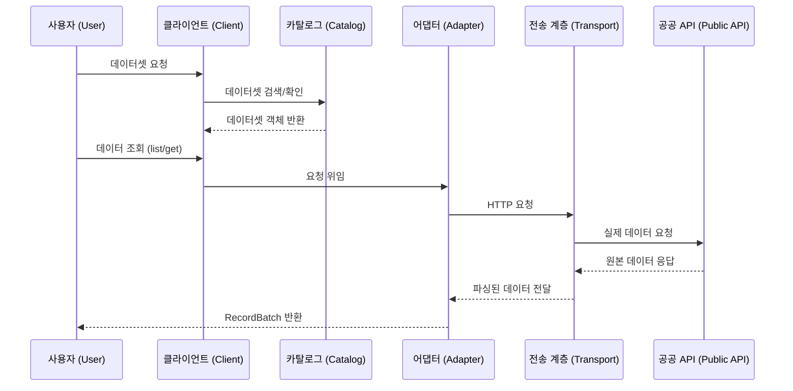
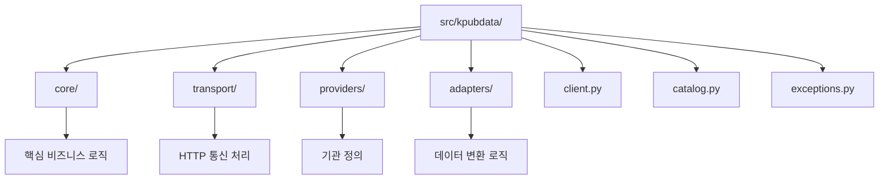
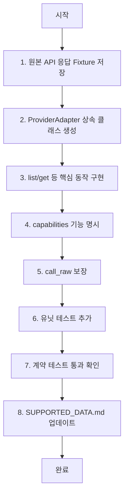

# AGENTS.md

## 목적

이 저장소는 에이전트 중심 코딩과 Codex 비중이 큰 개발을 위해 구축되었다.

이 프로젝트는 작고 안정적인 공개 API와 Provider별 어댑터를 갖춘 Python 3.10+ 프레임워크다.

## 먼저 읽을 문서

1. `VALIDATION.md`
2. `PRD.md`
3. `ARCHITECTURE.md`
4. `CANONICAL_MODEL.md`
5. `PROVIDER_ADAPTER_CONTRACT.md`
6. `API_SPEC.md`
7. `PACKAGING.md`

## 작업 원칙

- 공개 API는 작게 유지한다.
- Provider별 특이사항을 가짜 범용 의미론으로 바꾸지 않는다.
- raw 비상구를 제거하지 않는다.
- 테스트로 증명되기 전에는 capability를 지원된다고 표시하지 않는다.
- Provider 복잡성은 Provider 어댑터 내부에 유지한다.
- 모든 동작 변경 시 테스트와 문서를 함께 갱신한다.
- `SUPPORTED_DATA.md`는 지원 Provider/Dataset 현황의 단일 기준 문서(single source of truth)다.
- Provider/Dataset의 지원 상태 또는 검증 수준이 바뀌면, 같은 PR에서 `SUPPORTED_DATA.md`를 반드시 업데이트한다.
- `지원`은 fixture/unit/contract 테스트가 통과했을 때만 표시한다.
- `실API 검증`은 실 API integration 테스트가 존재하고 통과했을 때만 표시한다. 그 전에는 `테스트 검증`으로 유지한다.

## 언어 정책

- **Documentation**: 기본적으로 한국어로 작성한다. 영어 확장은 향후 릴리스에서 계획한다.
- **Code**: 모든 코드(변수명, 함수명, 주석, docstring)는 한국어 우선을 따른다.
- **Commit messages**: Always in English.
- **Issue / PR titles and descriptions**: 한국어를 사용해도 되며, 영어도 괜찮다.

## 데이터셋 게시 규칙

> **참고**: 데이터셋 게시(HuggingFace/Kaggle 업로드)는 [kpubdata-builder](https://github.com/yeongseon/kpubdata-builder)에서 관리한다. 이 저장소(kpubdata)는 데이터 수집과 정규화만 담당한다. 게시 규칙은 kpubdata-builder의 AGENTS.md를 참고한다.

## 브랜치 규칙

- 기본 브랜치는 `main`이다. **절대로 `main`에 직접 push하지 않는다.**
- 항상 기능 브랜치에서 작업하고 PR을 연다.
- 브랜치 이름 규칙: `feat/issue-<number>-<short-description>`, `fix/issue-<number>-<short-description>`, `docs/<short-description>`
- `main`에는 절대로 force-push하지 않는다. `main`을 삭제하지 않는다.
- 자신이 만들지 않은 브랜치를 이름 변경하거나 삭제하지 않는다.
- git 작업이 확실하지 않다면 **추측하지 말고 먼저 묻는다.**

## 계획을 작성해야 할 때

여러 파일에 걸치거나 아키텍처에 영향을 주는 작업 전에는 로컬 계획 파일에 작업 계획을 생성하거나 갱신한다.

계획에는 다음이 포함되어야 한다:

- 범위
- 영향 받는 모듈
- 위험 요소
- 검증 단계

## 품질 게이트

작업 완료로 표시하기 전에 다음을 실행한다:

```bash
uv sync --extra dev
uv run ruff check .
uv run ruff format --check .
uv run mypy src
uv run pytest
uv run python -m build
mkdocs build --strict
```

## 어댑터 작업 규칙

Provider 어댑터를 추가할 때:

- fixture 응답을 추가한다.
- unit 테스트를 추가한다.
- contract 테스트를 추가한다.
- capability를 정직하게 문서화한다.
- `call_raw`가 계속 동작하게 유지한다.

## 공개 API 변경 규칙

공개 메서드, 공개 모델, 또는 정규 예외가 변경되면:

- `API_SPEC.md`를 갱신한다.
- 요구사항이 바뀌었다면 `PRD.md`를 갱신한다.
- 릴리스 노트/변경 이력 항목을 추가한다.

---

## 이 프로젝트 이해하기

KPubData는 한국 공공데이터(data.go.kr 등)라는 거대한 도서관에서 책을 찾아주는 **똑똑한 사서**와 같습니다. 도서관마다 책을 분류하는 방식이 제각각이지만, 사서는 여러분에게 항상 동일한 방식으로 책을 찾아다 줍니다.

### 핵심 개념 용어 사전

| 용어 | 설명 |
| :--- | :--- |
| **Provider** | 데이터를 제공하는 기관 (예: 공공데이터포털, 기상청 등) |
| **Adapter** | 각 기관의 서로 다른 API 규칙을 KPubData 표준에 맞게 변환해주는 통역사 |
| **Dataset** | 실제 데이터의 집합 (예: 동네예보, 대기오염정보 등) |
| **Query** | 데이터를 찾기 위해 던지는 질문 (검색 조건) |
| **RecordBatch** | 검색 결과로 돌아온 데이터 뭉치 |
| **Canonical Model** | 기관마다 다른 데이터 형식을 하나로 통일한 표준 모델 |
| **Raw Escape Hatch** | 표준화된 방식 대신 원본 API를 그대로 쓰고 싶을 때 사용하는 비상구 (`call_raw`) |

### 이 프로젝트의 코드가 실행되는 흐름

```text
[User] -> [Client] -> [Dataset] -> [Adapter] -> [Transport] -> [Public Data API]
                                     ^              |
                                     |              v
[User] <- [RecordBatch] <----------- [Parser] <--- [Raw Response]
```



## AI 에이전트 코딩 가이드

에이전트(Copilot, Cursor 등)를 사용하여 개발할 때 다음 규칙을 준수하세요.

### 좋은 프롬프트 예시
- "`datago` 어댑터에 새로운 `Dataset`인 `air_quality`를 추가해줘. `PROVIDER_ADAPTER_CONTRACT.md`를 참고해서 구현하고, `tests/fixtures`에 응답 샘플도 추가해."
- "`RecordBatch` 모델에 `to_pandas()` 메서드를 추가하고 관련 유닛 테스트를 작성해줘."

### 에이전트 금지 사항
- **Any 타입 남발 금지**: `typing.Any`를 사용하지 말고 명확한 타입을 정의하세요.
- **type: ignore 금지**: 타입 오류를 해결하지 않고 무시하지 마세요.
- **테스트 코드 삭제 금지**: 기존 테스트를 지우지 마세요.
- **Fake universal semantics 금지**: 특정 기관에만 있는 기능을 모든 기관이 지원하는 것처럼 속이지 마세요.

### 에이전트 결과물 검증 체크리스트
- [ ] `mypy` 검사를 통과했는가?
- [ ] `pytest`가 모두 성공하는가?
- [ ] `src/` 외부의 파일을 수정하지 않았는가?
- [ ] `API_SPEC.md`에 정의되지 않은 public 메서드를 추가하지 않았는가?

## 파일 구조 가이드

```text
src/kpubdata/
├── core/            # 핵심 비즈니스 로직 및 추상 클래스
├── transport/       # HTTP 통신 처리
├── providers/       # 데이터 제공 기관 정의
├── adapters/        # 기관별 데이터 변환 로직 (가장 자주 수정하게 될 곳)
├── client.py        # 사용자가 처음 만나는 입구
├── catalog.py       # 사용 가능한 데이터셋 목록 관리
└── exceptions.py    # 공통 에러 정의
```



### 이 파일을 수정해야 할 때
- **새로운 데이터 기관을 추가하고 싶을 때**: `adapters/`에 새 디렉토리를 만들고 `core/`의 추상 클래스를 구현합니다.
- **데이터 조회 방식을 개선하고 싶을 때**: `core/query.py`나 `core/record.py`를 수정합니다.

## 어댑터 개발 가이드

### 개발 시작부터 완료까지 체크리스트
1. [ ] 원본 API의 응답 예시(XML/JSON)를 `tests/fixtures/<provider>/<dataset>.json`에 저장
2. [ ] `ProviderAdapter` 추상 클래스를 상속받아 클래스 생성
3. [ ] `list()`, `get()` 등 필요한 동작 구현
4. [ ] `capabilities` 속성에 지원하는 기능 명시
5. [ ] `call_raw`가 항상 원본 데이터를 반환하도록 보장
6. [ ] `tests/unit/adapters/`에 유닛 테스트 추가
7. [ ] `tests/contract/`에 계약 테스트(Contract Test) 추가
8. [ ] `SUPPORTED_DATA.md` 업데이트 (`상태`, `검증`, `인증`, `공식 문서`, `비고`)



### 핵심 추상 클래스 설명
- **ProviderAdapter**: 모든 어댑터의 부모입니다. 인증, 요청 생성, 응답 파싱을 담당합니다.
- **DatasetRef**: 특정 데이터셋을 가리키는 주소 정보입니다.
- **Query**: 데이터 필터링 조건을 담는 객체입니다.
- **RecordBatch**: 표준화된 데이터 레코드들의 묶음입니다.

### 테스트 작성 가이드
- **Fixture 기반 테스트**: 가짜 서버를 띄우는 대신, 미리 저장해둔 응답 파일(`fixture`)을 사용하여 어댑터가 올바르게 파싱하는지 확인합니다.
- **Contract 테스트**: 어댑터가 KPubData의 표준 규약(Contract)을 잘 지키고 있는지 확인하는 테스트입니다. 모든 어댑터는 동일한 인터페이스를 통과해야 합니다.

---

## 관련 문서

### 이 저장소 내 문서
| 문서 | 설명 |
| :--- | :--- |
| [CONTRIBUTING.md](./CONTRIBUTING.md) | 프로젝트 기여 가이드 |
| [ARCHITECTURE.md](./ARCHITECTURE.md) | 시스템 아키텍처 설계 |
| [PROVIDER_ADAPTER_CONTRACT.md](./PROVIDER_ADAPTER_CONTRACT.md) | 어댑터 구현 규약 |
| [CANONICAL_MODEL.md](./CANONICAL_MODEL.md) | 표준 데이터 모델 정의 |
| [VALIDATION.md](./VALIDATION.md) | 아키텍처 타당성 검증 |
| [API_SPEC.md](./API_SPEC.md) | 파이썬 API 명세 |
| [PRD.md](./PRD.md) | 제품 요구사항 정의 |
| [PACKAGING.md](./PACKAGING.md) | 패키징 및 배포 전략 |
| [SUPPORTED_DATA.md](./SUPPORTED_DATA.md) | 지원 공공데이터 현황 및 진행 상태 |

### KPubData Product Family
| 저장소 | 문서 | 설명 |
| :--- | :--- | :--- |
| [kpubdata-builder](https://github.com/yeongseon/kpubdata-builder) | [AGENTS.md](https://github.com/yeongseon/kpubdata-builder/blob/main/AGENTS.md) | Builder 에이전트 가이드 |
| [kpubdata-studio](https://github.com/yeongseon/kpubdata-studio) | [AGENTS.md](https://github.com/yeongseon/kpubdata-studio/blob/main/AGENTS.md) | Studio 에이전트 가이드 |
