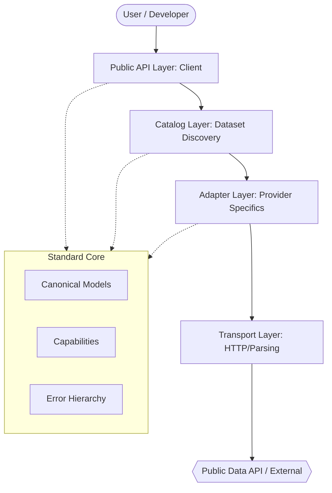
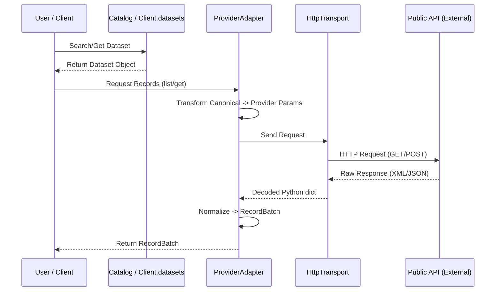
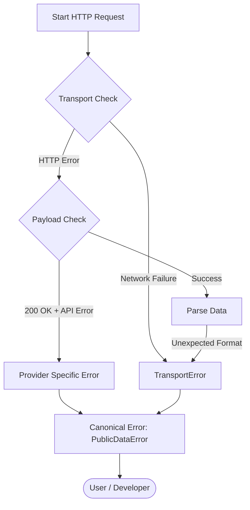
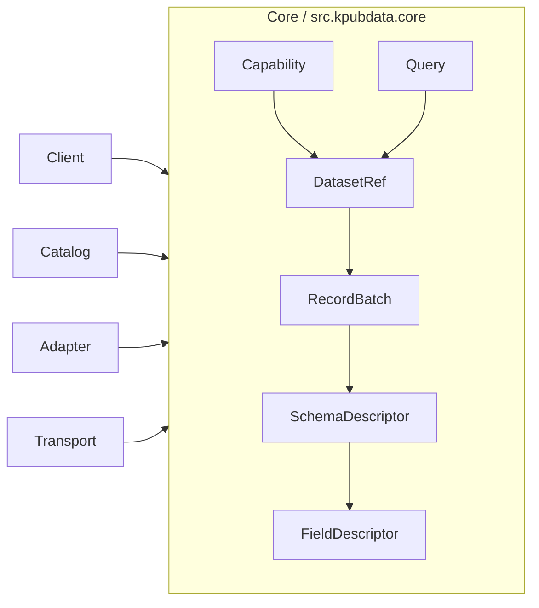
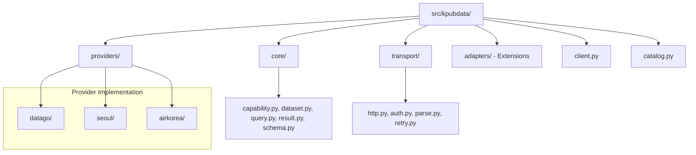

# Architecture — KPubData

## 1. Architectural style

KPubData uses a **dialect-inspired layered architecture**.



It borrows the philosophy of systems like SQLAlchemy:

- keep a small and stable core
- isolate backend-specific behavior in adapters/dialects
- offer a uniform developer-facing entry point
- preserve an escape hatch to lower-level behavior

It does **not** try to recreate SQL itself or a universal query language.

## 2. Core idea



```text
Client
  -> Catalog / discovery
  -> Dataset binding
  -> ProviderAdapter
  -> Transport
  -> Parse / normalize
  -> Canonical result
```

## 3. 왜 이런 구조인가? (초보자를 위한 비유)

KPubData의 구조는 **대형 은행의 통합 창구**와 비슷합니다.

여러분이 국민은행, 신한은행, 우리은행에 각각 계좌가 있다고 가정해 봅시다. 예전에는 각 은행마다 가서 서로 다른 양식의 종이에 입금 신청을 해야 했습니다. 어떤 은행은 이름을 먼저 쓰고, 어떤 은행은 계좌번호를 먼저 써야 하죠.

KPubData는 이 모든 은행을 대신 처리해주는 **"통합 키오스크"**를 만드는 것과 같습니다.

- **SQLAlchemy 비유**: 데이터베이스마다 SQL 언어가 조금씩 다르지만(MySQL, PostgreSQL 등), SQLAlchemy를 쓰면 하나의 파이썬 코드로 모든 데이터베이스를 다룰 수 있습니다. 공공데이터 API도 마찬가지입니다. 기관마다 데이터 주는 방식은 다르지만, 사용자는 KPubData라는 공통 언어로 데이터를 요청합니다.
- **핵심 비유 (은행 창구)**:
  - **사용자**: "나 입금하고 싶어"라고 요청합니다.
  - **통합 창구 (Client)**: "어느 은행인가요?"라고 묻고 해당 은행의 전용 양식을 꺼냅니다.
  - **전용 양식 (Adapter)**: 각 은행마다 다른 서류 칸(API 파라미터)에 맞춰 정보를 채워 넣습니다.
  - **입금 행위**: 은행마다 절차는 다르지만, 결과적으로 "내 통장에 돈이 들어온다"는 결과는 같습니다.

## 4. 각 레이어 상세 설명

### 4.1 Core (핵심부)
*   **이 레이어가 하는 일**: 전체 시스템에서 사용하는 표준 규격을 정의합니다. 비유하자면, 모든 은행에서 공통으로 사용하는 "화폐 단위(원)"나 "계좌"라는 개념을 정의하는 곳입니다.
*   **핵심 파일**: `core/models.py`, `core/capability.py`
*   **수정 상황 예시**: 모든 데이터셋에 "데이터의 신뢰도 점수"라는 새로운 표준 정보를 추가하고 싶을 때.
*   **코드 예시**:
    ```python
    # 모든 데이터는 이 형태(RecordBatch)로 포장되어 사용자에게 전달됩니다.
    @dataclass
    class RecordBatch:
        items: list[dict]
        total_count: int | None
    ```

### 4.2 Catalog (도서 목록)
*   **이 레이어가 하는 일**: 어떤 데이터셋이 어디에 있는지 목록을 관리합니다. 도서관의 "도서 검색 키오스크" 같은 역할입니다.
*   **핵심 파일**: `catalog.py`, `registry.py`
*   **수정 상황 예시**: "미세먼지"라고 검색했을 때 어떤 데이터셋들을 보여줄지 결정하는 로직을 바꿀 때.
*   **코드 예시**:
    ```python
    # 사용자가 키워드로 데이터셋을 찾을 수 있게 도와줍니다.
    datasets = client.datasets.search("forecast")
    ```

### 4.3 Provider Adapter (통역사)
*   **이 레이어가 하는 일**: 기관별로 제각각인 API 요청 방식을 KPubData 표준 방식으로 변환합니다. 한국어를 영어로, 영어를 한국어로 바꿔주는 통역사와 같습니다.
*   **핵심 파일**: `providers/datago/adapter.py`, `providers/seoul/adapter.py`
*   **수정 상황 예시**: 기상청 API의 주소가 바뀌었거나, 결과 데이터의 이름이 `nx`에서 `grid_x`로 변경되었을 때.
*   **코드 예시**:
    ```python
    # 기상청의 복잡한 요청 파라미터를 만드는 곳입니다.
    def _build_params(self, query):
        return {"base_date": query.filters["date"], "nx": 55}
    ```

### 4.4 Transport (운송팀)
*   **이 레이어가 하는 일**: 실제로 인터넷을 통해 데이터를 주고받는 일을 합니다. 택배 기사님처럼 목적지까지 안전하게 데이터를 배달합니다.
*   **핵심 파일**: `transport/http.py`
*   **수정 상황 예시**: 인터넷이 불안정할 때 자동으로 재시도(Retry)하는 횟수를 늘리고 싶을 때.

### 4.5 Public API (창구 직원)
*   **이 레이어가 하는 일**: 사용자가 가장 처음 만나는 인터페이스입니다. 친절한 창구 직원처럼 사용자의 요청을 받아 적절한 레이어로 전달합니다.
*   **핵심 파일**: `client.py`
*   **수정 상황 예시**: 사용자가 `client.get_weather()` 처럼 더 편한 방식으로 데이터를 부르게 하고 싶을 때.

## 5. 데이터 흐름 상세 (Data Flow)

사용자가 `client.dataset("datago.village_fcst").list(date="20250401")`을 호출할 때의 여정입니다.

1.  **1단계: 데이터셋 찾기 (Discovery)**
    - `Client`가 `Catalog`에게 "datago.village_fcst"가 있는지 물어봅니다.
    - `Catalog`는 등록된 어댑터들 중 `datago` 어댑터를 찾아 해당 데이터셋 정보를 가져옵니다.
2.  **2단계: 요청 변환 (Adapter Translation)**
    - `Dataset` 객체의 `list()` 함수가 호출되면, 내부적으로 `DataGoAdapter.query_records()`를 호출합니다.
    - 어댑터는 사용자가 준 `date="20250401"`을 공공데이터포털이 이해하는 `base_date=20250401` 형태로 변환합니다.
3.  **3단계: 데이터 가져오기 (Transport)**
    - 변환된 파라미터를 들고 `HttpTransport`가 실제 `https://apis.data.go.kr/...` 주소로 요청을 보냅니다.
4.  **4단계: 응답 해석 (Parsing & Normalization)**
    - 서버에서 온 XML 또는 JSON 데이터를 `transport/decode.py`가 파이썬 딕셔너리로 바꿉니다.
    - 어댑터는 이 데이터를 다시 KPubData 표준 규격에 맞게 다듬습니다.
5.  **5단계: 결과 반환 (Return)**
    - 최종적으로 예쁘게 포장된 `RecordBatch` 객체가 사용자에게 전달됩니다.

## 6. 자주 묻는 질문 (FAQ)

**Q: 새 데이터셋을 추가하려면 어디를 수정하나요?**
A: 해당 기관의 어댑터(`providers/<provider>/adapter.py`)와 데이터 목록 파일(`catalogue.json`)을 수정하면 됩니다.

**Q: XML과 JSON 응답은 어떻게 다르게 처리하나요?**
A: `transport/decode.py`에서 데이터의 겉모습을 보고 자동으로 판단합니다. 어댑터는 그저 파이썬 객체(dict)로 변환된 데이터만 다루면 되므로 걱정할 필요 없습니다.

**Q: 에러가 발생하면 어떤 순서로 처리되나요?**
A: 먼저 인터넷 문제(TransportError)인지 확인하고, 그 다음 기관 서버의 응답 코드(AuthError, RateLimitError 등)를 확인하여 KPubData 표준 에러로 변환해 사용자에게 던집니다.



**Q: 테스트는 어떤 종류가 있고 뭘 검증하나요?**
A:
- **Unit Test**: 개별 함수가 잘 작동하는지 확인합니다.
- **Fixture Test**: 가짜 API 응답 데이터를 넣어두고 파싱이 정확한지 확인합니다.
- **Contract Test**: 어댑터가 표준 규약을 잘 지키고 있는지 확인합니다.

## 7. Layers (Original)

### 3.1 Core layer

Stable contracts shared across the whole framework.



Contains:

- `DatasetRef`
- `Representation`
- `Capability`
- `Query`
- `RecordBatch`
- `SchemaDescriptor`
- `PublicDataError` hierarchy

Design rule:

- the core changes slowly
- no provider-specific hacks unless repeated across multiple adapters

### 3.2 Catalog layer

Responsible for discovering and resolving datasets.

Responsibilities:

- listing/searching descriptors
- provider-aware lookup
- binding descriptors into dataset objects

### 3.3 Provider adapter layer

Each provider family implements an adapter that understands its own conventions.

Responsibilities:

- auth injection
- request building
- parameter transformation
- response parsing
- provider-specific error interpretation
- capability declaration
- raw-call support

### 3.4 Transport layer

Shared HTTP and parsing infrastructure.

Responsibilities:

- session management
- timeouts
- retries
- content-type detection
- common XML/JSON helpers

### 3.5 Public API layer

The developer-facing surface.

Responsibilities:

- ergonomic `Client`
- dataset-oriented operations
- convenience aliases where helpful

### 3.6 Optional adapters layer

Not part of the core runtime contract.

Examples:

- pandas export
- MCP adapter
- plugin loaders

## 4. Main abstractions

### 4.1 Client

Top-level entry point.

Responsibilities:

- initialization/config
- provider registry access
- catalog access
- dataset binding

### 4.2 Dataset

A provider-aware bound object representing a queryable service/dataset.

Responsibilities:

- expose operations (`list`, `get`, `schema`, `call_raw`)
- surface capabilities
- preserve provider identity

### 4.3 ProviderAdapter

The extension point.

Responsibilities:

- compile canonical intent into provider-native requests
- parse provider-native responses into canonical results
- define supported capabilities

## 5. Why dataset-oriented instead of agency-oriented

End users usually want data like “subway arrivals” or “apartment trades,” not “the Ministry X API client.”

The public API should therefore prioritize datasets/services as the first-class mental model while still retaining provider identity for auth, debugging, and routing.

## 6. Why capabilities matter

Different datasets genuinely support different operations.

Examples:

- list only
- list + pagination
- single record lookup
- schema metadata
- raw download
- real-time feed semantics

A capability model prevents the framework from lying.

## 7. Why raw access is mandatory

Public-data APIs often:

- return errors in 200 bodies
- drift from docs
- mix XML and JSON expectations
- omit metadata in normalized forms

Therefore, every adapter must provide a raw escape hatch.

## 8. Recommended package structure



```text
src/kpubdata/
  client.py
  config.py
  catalog.py
  exceptions.py
  registry.py
  core/
    capability.py
    dataset.py
    query.py
    result.py
    schema.py
    representation.py
  transport/
    http.py
    auth.py
    parse.py
    retry.py
  providers/
    datago/
      adapter.py
      discovery.py
      mappings.py
    seoul/
      adapter.py
      discovery.py
      mappings.py
    airkorea/
      adapter.py
      discovery.py
      mappings.py
  adapters/
    pandas.py
    mcp.py
```

## 9. Execution flow

### 9.1 Discovery flow

```text
Client.datasets.search("지하철")
  -> Catalog.search()
  -> ProviderAdapter.search_datasets() or static registry metadata
  -> DatasetRef[]
```

### 9.2 Query flow

```text
client.dataset("molit.apartment_trades").list(...)
  -> Dataset.list(...)
  -> build Query
  -> ProviderAdapter.query_records(dataset_ref, query)
  -> Transport request
  -> parse / normalize
  -> RecordBatch
```

### 9.3 Raw flow

```text
dataset.call_raw(operation="list", params={...})
  -> ProviderAdapter.call_raw(...)
  -> raw payload / raw response object
```

## 10. Rules for core evolution

Promote something into the core only when at least one of these is true:

1. three or more adapters need it
2. it materially simplifies the public API
3. it improves correctness across providers

Do **not** change the core just because one adapter is weird.

## 11. Design constraints

- avoid deep inheritance trees
- prefer composition and small protocols
- keep canonical models minimal
- keep provider-specific richness in metadata and raw channels
- treat representation (`openapi`, `file`, `sheet`, `download`) as real metadata, not a footnote

---

## 관련 문서

### 이 저장소 내 문서
| 문서 | 설명 |
| :--- | :--- |
| [CANONICAL_MODEL.md](./CANONICAL_MODEL.md) | 표준 데이터 모델 정의 |
| [PROVIDER_ADAPTER_CONTRACT.md](./PROVIDER_ADAPTER_CONTRACT.md) | 어댑터 구현 규약 |
| [API_SPEC.md](./API_SPEC.md) | 파이썬 API 명세 |
| [PACKAGING.md](./PACKAGING.md) | 패키징 및 배포 전략 |
| [architecture-diagrams.md](./docs/architecture-diagrams.md) | 아키텍처 다이어그램 |
| [product-family-architecture.md](./docs/product-family-architecture.md) | **제품군 전체 시스템 아키텍처 (3개 저장소 관계도)** |

### KPubData Product Family
| 저장소 | 문서 | 설명 |
| :--- | :--- | :--- |
| [kpubdata-builder](https://github.com/yeongseon/kpubdata-builder) | [ARCHITECTURE.md](https://github.com/yeongseon/kpubdata-builder/blob/main/ARCHITECTURE.md) | Builder 아키텍처 |
| [kpubdata-studio](https://github.com/yeongseon/kpubdata-studio) | [ARCHITECTURE.md](https://github.com/yeongseon/kpubdata-studio/blob/main/ARCHITECTURE.md) | Studio 아키텍처 |

