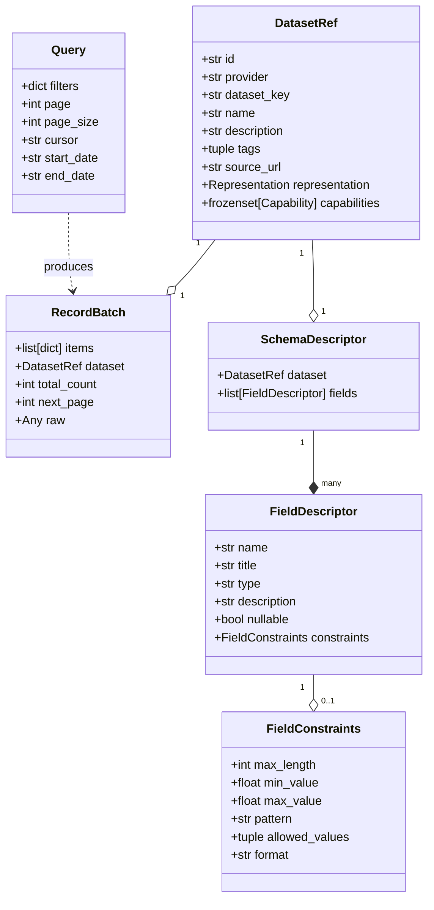
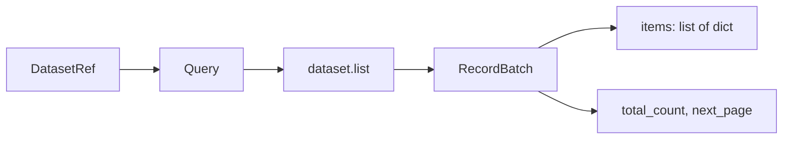
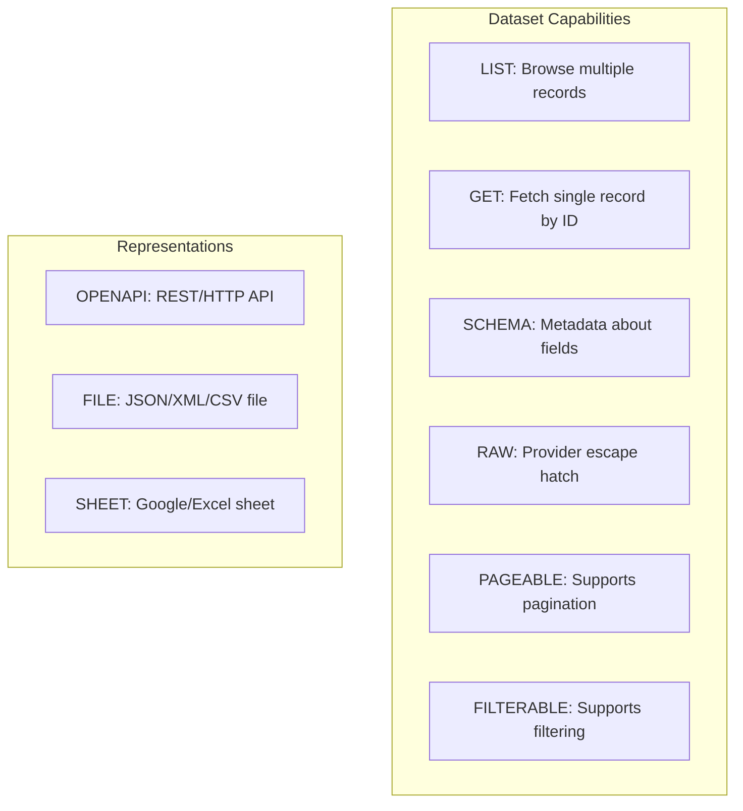

# Canonical model — KPubData

## 1. Purpose

The canonical model defines the smallest stable set of objects needed to make heterogeneous public-data services usable through one Python framework.

The model should be:

- small
- explicit
- typed
- extensible by metadata
- honest about unsupported behavior

## 2. Design rule

Canonical objects standardize the **framework contract**, not every semantic detail of every provider.



## 3. 타입별 상세 설명 (이것은 무엇인가?)

KPubData에서 사용하는 핵심 타입들을 일상적인 도서관 비유로 설명합니다.

### 3.1 DatasetRef (도서 카드)
- **비유**: 도서관의 **"도서 목록 카드"**와 같습니다. 책이 어느 서가에 있는지, 대출이 가능한지(지원하는 기능), 어떤 내용인지 알려줍니다.
- **역할**: 이 데이터셋이 어디에 있고(Provider), 고유한 이름(ID)은 무엇인지, 어떤 형식(Representation)인지 정보를 담고 있습니다. 또한 데이터셋에 대한 설명(description), 분류 태그(tags), 원본 문서 링크(source_url)를 포함할 수 있습니다.

### 3.2 Query (검색 조건)
- **비유**: 도서관에서 책을 찾을 때 쓰는 **"검색 조건"**입니다. "2024년에 나온 소설 중 서울에서 발간된 것" 같은 조건이죠.
- **역할**: 사용자가 원하는 데이터를 필터링하기 위한 조건들(날짜, 지역, 페이지 번호 등)을 한데 모아둡니다.

### 3.3 RecordBatch (검색 결과 목록)
- **비유**: 검색 결과로 나온 **"책 목록 한 뭉치"**입니다. 실제 데이터(책 내용)뿐만 아니라 "총 몇 권이 나왔는지", "다음 페이지가 있는지" 같은 정보도 함께 들어있습니다.
- **역할**: 실제 데이터 행(rows)과 메타정보를 함께 전달하는 운반체입니다.



### 3.4 SchemaDescriptor (데이터 설계도)
- **비유**: 데이터의 **"설계도" 또는 "명세서"**입니다. 이 데이터 목록의 첫 번째 칸은 '날짜'이고 숫자로 되어 있다는 것을 알려줍니다.
- **역할**: 각 칼럼(Field)의 이름, 타입, 설명 등을 정의하여 사용자가 데이터를 이해할 수 있게 돕습니다.

### 3.5 PublicDataError (에러 분류 체계)
- **비유**: 도서관에서 발생할 수 있는 **"사고 유형"**입니다. "카드가 없어요(AuthError)", "책이 없어요(DatasetNotFoundError)", "서가가 닫혔어요(ServiceUnavailableError)" 등으로 분류합니다.
- **역할**: 에러가 왜 발생했는지 구체적으로 알려주어 프로그래머가 적절히 대처할 수 있게 합니다.

## 4. 실제 사용 예시 (코드)

### 4.1 타입을 직접 만들어보는 예시
```python
from kpubdata.core.models import Query, DatasetRef
from kpubdata.core.capability import Operation
from kpubdata.core.representation import Representation

# 1. 데이터셋 정보를 직접 정의할 때 (DatasetRef)
ref = DatasetRef(
    id="datago.village_fcst",
    provider="datago",
    dataset_key="village_fcst",
    name="동네예보",
    representation=Representation.OPENAPI,
    description="Korea Meteorological Administration short-range forecast",
    tags=("weather", "forecast"),
    source_url="https://www.data.go.kr",
    operations=frozenset([Operation.LIST])
)

# 2. 검색 조건을 만들 때 (Query)
query = Query(
    filters={"base_date": "20250401", "nx": "55"},
    page=1,
    page_size=10
)
```

### 4.2 타입을 사용하는 시나리오
```python
# 사용자가 데이터를 조회하면 RecordBatch가 돌아옵니다.
batch = ds.list(nx=55, ny=127)

print(f"총 {batch.total_count}개의 데이터가 있습니다.")
for item in batch.items:
    print(item["category"], item["fcstValue"])
```

## 5. 타입 관계도 (Relationship Diagram)

```text
[ Client ]
    |
    +-- (id) --> [ Catalog ] -- (resolve) --> [ DatasetRef ] (도서 카드)
                                                   |
                                                   v
[ Dataset (Bound Object) ] <-----------------------+
    |
    +-- (list) --+--> [ Query ] (검색 조건)
    |            |
    |            +--> [ ProviderAdapter ] -- (HTTP Request) --> [ Public Data API ]
    |                                                                   |
    |            <-- (RecordBatch) <------------------- (HTTP Response) +
    |                    |
    |                    +-- [ Items (list[dict]) ] (실제 데이터)
    |                    +-- [ Metadata ] (메타정보)
    |
    +-- (schema) ----> [ SchemaDescriptor ] (데이터 설계도)
                         |
                         +-- [ FieldDescriptor ] (칼럼 정보)
                              +-- [ FieldConstraints ] (제약 조건)
```

## 6. Core types (Original)

### 3.1 Capability

```python
from enum import Enum

class Capability(str, Enum):
    LIST = "list"
    GET = "get"
    SCHEMA = "schema"
    RAW = "raw"
    PAGEABLE = "pageable"
    FILTERABLE = "filterable"
    SORTABLE = "sortable"
    TIME_RANGE = "time_range"
    DOWNLOAD = "download"
    REALTIME = "realtime"
```

### 3.2 Representation

```python
from enum import Enum

class Representation(str, Enum):
    OPENAPI = "openapi"
    FILE = "file"
    SHEET = "sheet"
    DOWNLOAD = "download"
    OTHER = "other"
```



### 3.3 DatasetRef

```python
from dataclasses import dataclass, field
from typing import Any

@dataclass(slots=True, frozen=True)
class DatasetRef:
    id: str
    provider: str
    dataset_key: str
    name: str
    representation: Representation
    description: str | None = None
    tags: tuple[str, ...] = ()
    source_url: str | None = None
    capabilities: frozenset[Capability] = frozenset()
    raw_metadata: dict[str, Any] = field(default_factory=dict)
```

Notes:

- `id` is the stable bound identifier, e.g. `molit.apartment_trades`
- `representation` matters because the same logical dataset may be offered in more than one form
- `description` is a human-readable summary of what the dataset provides
- `tags` are categorization keywords for discovery (e.g. `("weather", "forecast")`)
- `source_url` links to the original API documentation or data portal page

### 3.4 Query

```python
from dataclasses import dataclass, field
from typing import Any

@dataclass(slots=True)
class Query:
    filters: dict[str, Any] = field(default_factory=dict)
    page: int | None = None
    page_size: int | None = None
    cursor: str | None = None
    start_date: str | None = None
    end_date: str | None = None
    fields: list[str] | None = None
    sort: list[str] | None = None
    extra: dict[str, Any] = field(default_factory=dict)
```

Notes:

- `filters` covers the normal case
- `extra` exists so adapters can carry provider-native hints without contaminating the core model

### 3.5 RecordBatch

```python
from dataclasses import dataclass, field
from typing import Any

@dataclass(slots=True)
class RecordBatch:
    items: list[dict[str, Any]]
    dataset: DatasetRef
    total_count: int | None = None
    next_page: int | None = None
    next_cursor: str | None = None
    raw: Any | None = None
    meta: dict[str, Any] = field(default_factory=dict)
```

### 3.6 SchemaDescriptor

```python
from dataclasses import dataclass, field

@dataclass(slots=True)
class FieldConstraints:
    max_length: int | None = None
    min_value: float | None = None
    max_value: float | None = None
    pattern: str | None = None
    allowed_values: tuple[str, ...] | None = None
    format: str | None = None

@dataclass(slots=True)
class FieldDescriptor:
    name: str
    title: str | None = None
    type: str | None = None
    description: str | None = None
    nullable: bool | None = None
    constraints: FieldConstraints | None = None
    raw: dict[str, object] = field(default_factory=dict)

@dataclass(slots=True)
class SchemaDescriptor:
    dataset: DatasetRef
    fields: list[FieldDescriptor]
    raw: dict[str, object] = field(default_factory=dict)
```

## 4. Error model

```python
class PublicDataError(Exception): ...
class ConfigError(PublicDataError): ...
class AuthError(PublicDataError): ...
class TransportError(PublicDataError): ...
class TimeoutError(TransportError): ...
class ParseError(PublicDataError): ...
class InvalidRequestError(PublicDataError): ...
class ProviderResponseError(PublicDataError): ...
class UnsupportedCapabilityError(PublicDataError): ...
class DatasetNotFoundError(PublicDataError): ...
```

## 5. Bound Dataset object

A bound dataset object wraps `DatasetRef` plus registry/config context.

Suggested shape:

```python
class Dataset:
    ref: DatasetRef

    def list(self, **filters) -> RecordBatch: ...
    def schema(self) -> SchemaDescriptor | None: ...
    def call_raw(self, operation: str, **params) -> object: ...
```

## 6. What the model deliberately does not do

It does not attempt to fully standardize:

- every domain field
- every geographic key
- every date format
- every pagination style
- every schema guarantee

Those belong in provider-specific metadata, mappers, and raw payloads.

## 7. Normalization rule

Normalize only what is broadly useful across providers:

- paging metadata
- canonical error type
- dataset identity
- representation
- item list envelope

Do not erase provider-native detail.

---

## 관련 문서

### 이 저장소 내 문서
| 문서 | 설명 |
| :--- | :--- |
| [ARCHITECTURE.md](./ARCHITECTURE.md) | 시스템 아키텍처 설계 |
| [PROVIDER_ADAPTER_CONTRACT.md](./PROVIDER_ADAPTER_CONTRACT.md) | 어댑터 구현 규약 |
| [API_SPEC.md](./API_SPEC.md) | 파이썬 API 명세 |
| [VALIDATION.md](./VALIDATION.md) | 아키텍처 타당성 검증 |
