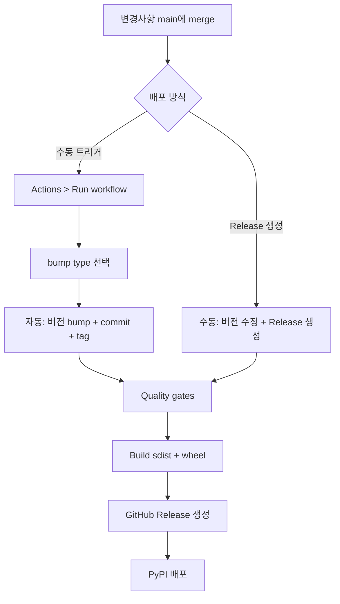

# Packaging and release strategy — KPubData

## 1. Packaging goals

- modern Python packaging
- Python 3.10+
- minimal core dependencies
- optional extras for heavier integrations
- reproducible local development for human and agentic workflows

## 2. Recommended choices

### Build backend

Use `hatchling` as the build backend.

Why:

- simple and modern
- PEP 517/518 friendly
- good fit for a typed library with `src/` layout

### Project metadata

Use PEP 621 metadata in `pyproject.toml`.

### Environment/workflow tool

Use `uv` for local sync/install/test workflows.

This keeps packaging standards-based while making developer workflows fast.

## 3. Python support policy

- minimum: Python 3.10
- tested: 3.10, 3.11, 3.12, 3.13

## 4. Dependency policy

### Core dependencies

Keep core lean.

Expected core set:

- `httpx` or `requests`-style HTTP client (choose one)
- XML parsing support only if truly needed in core
- typing/runtime helpers only when justified

### Optional extras

- `xml`
- `pandas`
- `mcp`
- `dev`
- `docs`

## 5. Recommended package structure

```text
src/
  kpubdata/
```

Reasons:

- avoids accidental import-from-project-root mistakes
- works well with modern build backends and type checking

## 6. Build and release steps

### Local

```bash
uv sync --extra dev
uv run ruff check .
uv run ruff format --check .
uv run mypy src
uv run pytest
uv run python -m build
```

### Release

GitHub Actions `Publish to PyPI` workflow를 통해 배포합니다.

#### 방법 1: 수동 트리거 (권장)

1. GitHub → Actions → **Publish to PyPI** → **Run workflow**
2. 옵션 선택:
   - **bump**: `patch` (0.1.0 → 0.1.1), `minor` (0.1.0 → 0.2.0), `pre` (0.1.0 → 0.1.1a0)
   - **dry_run**: 체크하면 PyPI 배포 없이 빌드만 확인
3. workflow가 자동으로 수행하는 작업:
   - `pyproject.toml` 버전 bump + commit + tag
   - quality gates 실행 (ruff, mypy, pytest)
   - sdist + wheel 빌드
   - GitHub Release 생성 (자동 release notes)
   - PyPI 배포 (trusted publisher / OIDC)

#### 방법 2: GitHub Release 수동 생성

1. 직접 `pyproject.toml` 버전 수정 + commit + push
2. GitHub → Releases → **Create a new release**
3. 태그: `v{version}` (예: `v0.2.0`)
4. Release 생성 시 workflow가 자동으로 빌드 + PyPI 배포

#### 배포 전 체크리스트

- [ ] main 브랜치에 모든 변경사항 merge 완료
- [ ] CI 통과 확인 (ruff, mypy, pytest)
- [ ] `SUPPORTED_DATA.md` 최신 상태

#### 배포 흐름도



#### 환경 설정

- **PyPI trusted publisher**: GitHub Actions OIDC — 별도 API 토큰 불필요
- **GitHub environment**: `pypi` (Settings → Environments)
- **Workflow 파일**: `.github/workflows/publish-pypi.yml`

## 7. Versioning policy

Use SemVer with public API discipline.

- `0.x`: fast iteration, but still document breaking changes
- `1.0`: only when the public Python API and adapter contract feel stable

## 8. Naming policy

- project name: `KPubData`
- package/import name: `kpubdata`
- repository name: preferably `kpubdata` or `kpubdata-framework`

---

## 관련 문서

### 이 저장소 내 문서
| 문서 | 설명 |
| :--- | :--- |
| [ARCHITECTURE.md](./ARCHITECTURE.md) | 시스템 아키텍처 설계 |
| [API_SPEC.md](./API_SPEC.md) | 파이썬 API 명세 |
| [VALIDATION.md](./VALIDATION.md) | 아키텍처 타당성 검증 |

