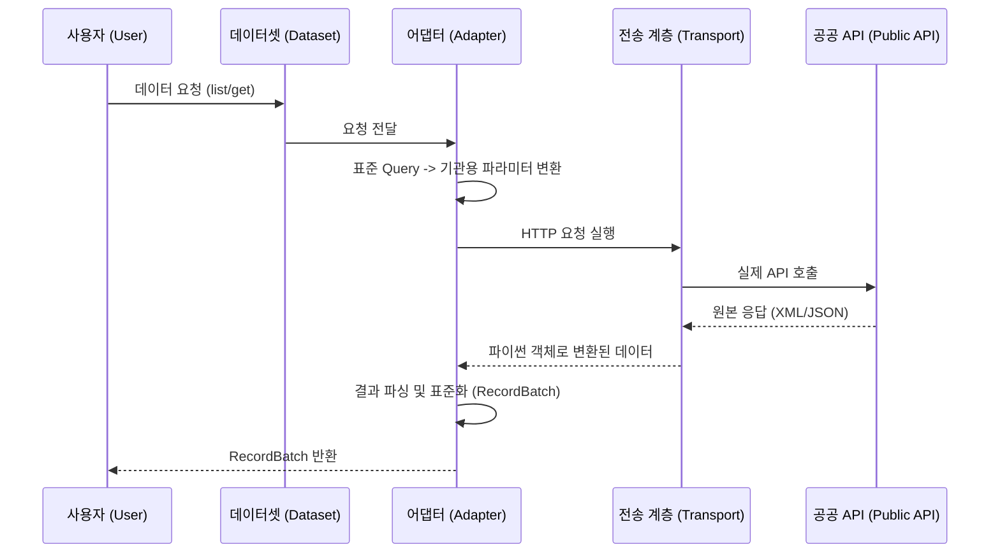
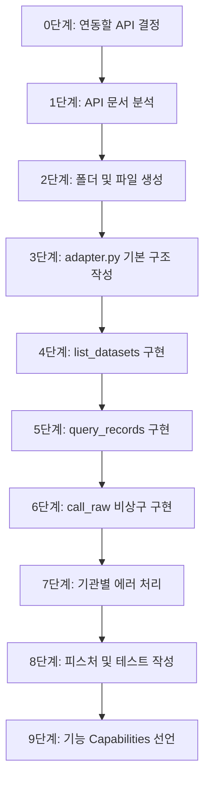
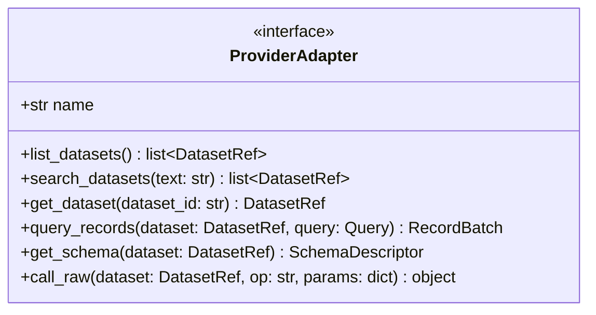
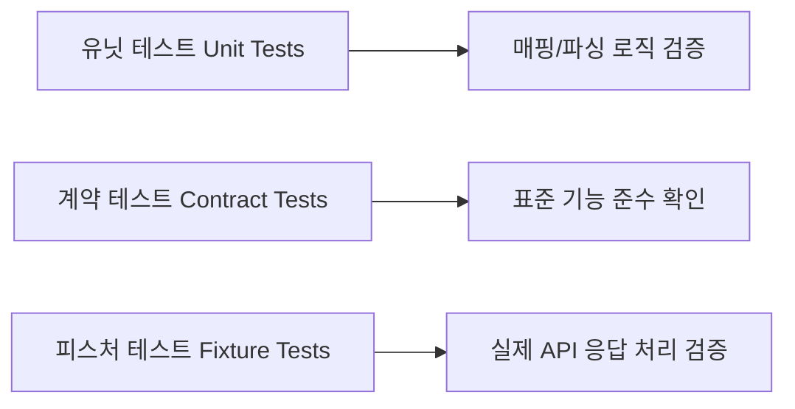

# Provider adapter contract — KPubData

## 1. Purpose

This document defines what it means to add a provider adapter to KPubData.

A provider adapter is the place where backend-specific behavior belongs.

## 2. Responsibilities

| 기능 (Capability) | 설명 | 필수 여부 |
|---|---|---|
| `list` | 목록 조회 지원 | 선택 |
| `get` | ID 기반 단건 조회 지원 | 선택 |
| `schema` | 필드 메타데이터(스키마) 제공 | 선택 |
| `raw` | 원본 API 직접 호출 (비상구) | 필수 |
| `pageable` | 페이지네이션 지원 | 선택 |
| `filterable` | 필터링(검색) 지원 | 선택 |

Every adapter must be responsible for:

- auth/key injection
- dataset discovery or dataset registration
- canonical-to-native parameter translation
- native-to-canonical result translation
- provider-specific error translation
- raw-call support
- honest capability declaration

## 3. 어댑터란 무엇인가? (초보자용 설명)

어댑터(Adapter)는 일종의 **"변압기"나 "여행용 멀티 플러그"**와 같습니다.

한국에서 쓰던 220V 가전제품을 110V를 쓰는 일본에서 쓰려면 돼지코(어댑터)가 필요하죠? 가전제품(사용자 코드)은 그대로인데, 전기 콘센트(공공데이터 API) 모양이 다르기 때문입니다.

KPubData의 어댑터는 각 기관(공공데이터포털, 서울시 등)마다 제각각인 API의 "모양"을 우리 프레임워크가 약속한 "표준 모양"으로 맞춰주는 역할을 합니다.



## 4. 새 어댑터 개발 튜토리얼 (Step-by-Step)

새로운 공공데이터 기관을 연동하고 싶다면 다음 순서대로 진행하세요.

### 0단계: 연동할 API 결정
어떤 데이터를 가져올지 정하고, 해당 API의 문서를 준비합니다. (예: `data.go.kr`의 기상청 예보 서비스)

### 1단계: API 문서 분석
- 요청 주소(URL)는 무엇인가?
- 어떤 파라미터가 필수인가? (서비스키, 페이지 번호 등)
- 응답 형식이 무엇인가? (JSON, XML)
- 에러가 나면 어떤 코드가 돌아오는가?

### 2단계: 파일 생성
`src/kpubdata/providers/` 폴더 아래에 기관 이름을 따서 폴더를 만듭니다.
```text
src/kpubdata/providers/my_provider/
├── __init__.py
├── adapter.py      # 여기에 핵심 로직 작성
└── catalogue.json  # 지원하는 데이터셋 목록
```

### 3단계: 기본 구조 작성 (adapter.py)
```python
class MyProviderAdapter:
    def __init__(self, config):
        self._config = config

    @property
    def name(self) -> str:
        return "my_provider"
```

### 4단계: `list_datasets` 구현
사용자가 `client.datasets.list()`를 했을 때 보여줄 목록을 반환합니다. 보통 `catalogue.json`에서 읽어옵니다.

### 5단계: `query_records` 구현
가장 중요한 부분입니다. 표준 `Query` 객체를 받아서 실제 API를 호출하고, 결과를 `RecordBatch`로 포장합니다.
```python
def query_records(self, dataset, query):
    # 1. 파라미터 변환 (KPubData -> 기관 API)
    params = {"ServiceKey": "...", "pageNo": query.page}
    # 2. HTTP 요청 전송 (Transport 사용)
    response = self._transport.request("GET", url, params=params)
    # 3. 결과 파싱 및 표준화
    items = self._parse_items(response.content)
    # 4. RecordBatch로 반환
    return RecordBatch(items=items, dataset=dataset)
```

### 6단계: `call_raw` 구현 (비상구)
표준화되지 않은 기능을 쓰고 싶은 사용자를 위해 원본 데이터를 그대로 돌려주는 함수입니다.
```python
def call_raw(self, dataset, operation, params):
    # 어떠한 가공도 하지 않고 원본 응답을 반환합니다.
    return self._transport.request("GET", url, params=params).json()
```

### 7단계: 에러 처리
API가 주는 에러 코드를 보고 `AuthError`, `RateLimitError` 등 KPubData가 정의한 에러로 바꿔서 던져줍니다.

### 8단계: 테스트 작성
- `tests/fixtures/`에 실제 API 응답 샘플을 저장합니다.
- 유닛 테스트(`tests/unit/`)에서 이 샘플을 잘 파싱하는지 검증합니다.

### 9단계: Capabilities(기능) 선언
이 어댑터가 페이징(`PAGEABLE`)을 지원하는지, 검색(`FILTERABLE`)이 되는지 정직하게 써줍니다.



## 5. 기존 어댑터 분석: `datago`

가장 모범적인 사례인 `datago` 어댑터를 참고하세요.

- **`src/kpubdata/providers/datago/adapter.py`**:
  - `_validate_envelope`: 응답이 깨졌는지, 에러가 들어있는지 공통으로 체크합니다.
  - `_normalize_items`: XML과 JSON에서 아이템 목록을 뽑아내는 복잡한 로직을 처리합니다.
  - `_raise_for_result_code`: 기상청 등의 에러 코드(`01`, `02` 등)를 이해하기 쉬운 이름으로 바꿉니다.

**이 파일을 복사해서 새로운 어댑터를 만들기 시작하는 것을 추천합니다!**

## 6. Minimal protocol (Original)

```python
from typing import Protocol

class ProviderAdapter(Protocol):
    name: str

    def list_datasets(self) -> list[DatasetRef]: ...
    def search_datasets(self, text: str) -> list[DatasetRef]: ...
    def get_dataset(self, dataset_id: str) -> DatasetRef: ...
    def query_records(self, dataset: DatasetRef, query: Query) -> RecordBatch: ...
    def get_schema(self, dataset: DatasetRef) -> SchemaDescriptor | None: ...
    def call_raw(self, dataset: DatasetRef, operation: str, params: dict[str, object]) -> object: ...
```



## 4. 페이지네이션 반환 규약 (Pagination Return Contract)

어댑터는 `query_records` 결과로 반환되는 `RecordBatch`에 다음 페이지 정보를 포함해야 합니다.

- **`next_page` 또는 `next_cursor` 반환**: 어댑터는 반드시 둘 중 하나를 반환하거나, 마지막 페이지인 경우 둘 다 `None`을 반환해야 합니다.
- **우선순위**: `list_all()`은 `next_cursor`가 존재할 경우 이를 우선적으로 사용하며, 없을 경우 `next_page`를 사용합니다.
- **권장 방식**: 가급적 `total_count` 기반의 정밀한 계산 방식을 선호합니다. 하지만 전체 개수 정보를 알 수 없는 경우 `len(items) == page_size` 휴리스틱을 사용하는 것도 허용됩니다.

## 5. Capability rules

- declare only what the adapter truly supports
- if an operation is unavailable, raise `UnsupportedCapabilityError`
- do not silently emulate unsupported semantics unless documented

## 5. Raw rules

- every adapter must expose a raw path
- raw paths may be inconvenient; they must still be available
- raw payloads should not be lossy-normalized

## 6. Discovery rules

Adapters may support discovery via:

- static registrations
- provider metadata API
- cached generated manifests

At minimum, the adapter must surface enough metadata to populate `DatasetRef`.

## 7. Parse and normalization rules

Normalize only the common envelope and broadly reusable metadata.

Do not destroy provider-native fields. Prefer one of these approaches:

- preserve raw payload at `RecordBatch.raw`
- preserve unmapped fields in item-level metadata

## 8. Testing requirements

Every adapter must include:

- unit tests for mapping/parsing
- contract tests for declared capabilities
- fixture-based tests for representative success/failure responses



## 9. When to extend the core instead of the adapter

Only extend the core when:

- three or more adapters need the same concept
- it improves the public contract materially
- it reduces duplication without hiding semantics

Otherwise, keep the complexity local to the adapter.

## 10. Example adapter development checklist

1. define provider config and auth requirements
2. define dataset ids and metadata
3. implement discovery
4. implement `query_records`
5. implement `call_raw`
6. map provider errors
7. add fixtures and tests
8. document capabilities and caveats

---

## 관련 문서

### 이 저장소 내 문서
| 문서 | 설명 |
| :--- | :--- |
| [ARCHITECTURE.md](./ARCHITECTURE.md) | 시스템 아키텍처 설계 |
| [CANONICAL_MODEL.md](./CANONICAL_MODEL.md) | 표준 데이터 모델 정의 |
| [API_SPEC.md](./API_SPEC.md) | 파이썬 API 명세 |
| [VALIDATION.md](./VALIDATION.md) | 아키텍처 타당성 검증 |
| [AGENTS.md](./AGENTS.md) | 어댑터 개발 가이드 및 에이전트 규칙 |
