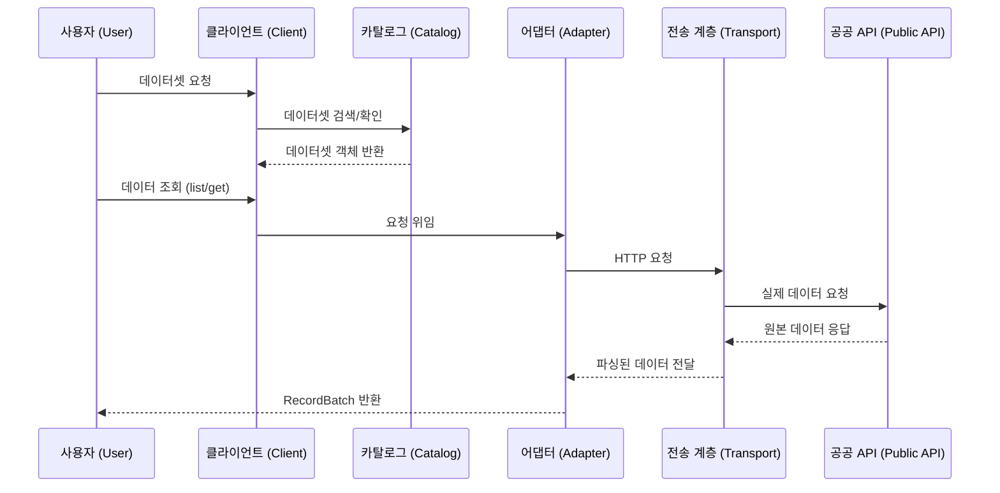

# KPubData — Korea Public Data

**KPubData (Korea Public Data)**는 한국 공공데이터라는 거대한 도서관에서 책을 찾아주는 **똑똑한 사서**와 같은 역할을 하는 [파이썬(Python)](https://docs.python.org/ko/3/tutorial/index.html) 프레임워크입니다.

공공데이터 포털의 수많은 [API](https://ko.wikipedia.org/wiki/API)(프로그램끼리 데이터를 주고받는 규칙)는 저마다 호출 방식도, 응답 형식도 제각각입니다. KPubData는 이러한 파편화된 인터페이스를 하나로 연결하여, 개발자가 일관된 방식으로 데이터를 탐색하고 수집할 수 있도록 돕습니다.

## 이 프로젝트가 존재하는 이유

한국의 공공데이터 [API](https://ko.wikipedia.org/wiki/API)(프로그램으로 데이터를 가져올 수 있는 창구)는 기관마다 다음과 같은 차이점이 있어 통합 관리가 어렵습니다.

- **인증 방식**: 기관마다 "출입증"(API 키)을 확인하는 방법이 다름
- **요청 규칙**: 같은 종류의 데이터를 요청하더라도 기관마다 사용하는 변수 이름이 제각각임
- **데이터 형식**: 어떤 기관은 [XML](https://ko.wikipedia.org/wiki/XML)(태그 형식), 어떤 기관은 [JSON](https://ko.wikipedia.org/wiki/JSON)(중괄호 형식), 또 어떤 기관은 [CSV](https://ko.wikipedia.org/wiki/CSV)(엑셀 형식)로 응답하여 형태가 혼재함
- **페이지 처리**: 데이터가 많을 때 나눠 받는 방식이 `pageNo`, `numOfRows`, 시작/종료 인덱스 등 기관마다 다양함
- **에러 처리**: 요청이 실패했을 때 알려주는 방식이 기관마다 달라서, 어떤 곳은 [HTTP](https://ko.wikipedia.org/wiki/HTTP) 상태 코드(예: 404)를, 어떤 곳은 응답 안에 별도 에러 코드를 넣어 보냄
- **데이터 구조**: 응답에 포함되는 항목(필드)이 예고 없이 변경되거나, 숫자여야 할 곳에 문자가 오는 등 불안정함

KPubData는 개발자가 매번 새로운 기관의 API 문서를 처음부터 학습해야 하는 수고를 덜어주면서도, 각 기관의 특수성을 억지로 감추지 않는 유연한 구조를 지향합니다.

## 핵심 설계 원칙

1. **데이터셋 중심, 제공 기관 인지**
   - 사용자는 "기상청"이라는 기관 이름보다 "동네예보"나 "지하철 정보" 같은 **데이터 이름**에 집중합니다. 도서관에서 책을 찾을 때 출판사보다 책 제목으로 먼저 검색하는 것과 같은 원리입니다.
2. **방언(Dialect) 기반 아키텍처**
   - 마치 사투리를 표준어로 통역해주는 것처럼, 핵심 기능(표준어)은 작고 안정적으로 유지하면서 각 기관의 고유한 방식(사투리)은 전용 어댑터(통역사)가 처리합니다.
3. **기능 우선의 정직성**
   - 지원하는 기능은 명확히 "할 수 있다"고 선언하고, 지원하지 않는 기능을 요청하면 "이건 못해요"라고 솔직하게 알려줍니다. 사용자가 "왜 안 되지?" 하고 헤매는 일이 없습니다.
4. **파이썬다운(Pythonic) API**
   - 파이썬 개발자가 익숙한 `snake_case`(단어_사이_밑줄) 이름 규칙과 직관적인 메서드명을 사용하여, 별도 학습 없이도 자연스럽게 사용할 수 있습니다.
5. **표준화와 원본 데이터의 공존**
   - 정리된 형태로 데이터를 받는 것이 기본이지만, 원본 응답이 그대로 필요할 때를 위해 비상구(`call_raw`)를 항상 열어둡니다. 번역본을 읽다가 원문이 궁금하면 언제든 원본을 볼 수 있는 것과 같습니다.

## 표준화 범위

KPubData는 모든 데이터를 하나의 틀에 억지로 끼워 맞추지 않습니다. 대신 데이터에 접근하는 **방법(입구)과 결과물을 담는 그릇(봉투)**을 통일합니다. 마치 각 나라의 우편 봉투 규격은 통일하되, 봉투 안에 들어가는 편지 내용은 자유롭게 두는 것과 같습니다.

### 통일하는 것
- 클라이언트(접속 도구)를 만드는 방식
- 데이터셋을 검색하고 찾는 방법
- 주요 동작 진입점 (`list` 목록조회, `get` 단건조회, `schema` 구조확인, `call_raw` 원본호출)
- 어댑터(통역사)의 기능 선언 방식
- 결과물을 담는 표준 형식 (`RecordBatch`)
- 에러(오류)를 알려주는 공통 규칙

### 통일하지 않는 것 (기관마다 다른 채로 두는 것)
- 각 기관이 요구하는 개별 변수 이름
- 데이터셋마다 고유한 세부 검색 조건
- 기관별로 다른 페이지 나눔 규칙
- 각 데이터 레코드의 세부 항목 구조

## 멘탈 모델

KPubData가 데이터를 처리하는 흐름은 다음과 같습니다.



데이터를 찾는 과정은 아래의 구조를 따릅니다.

```text
Client (클라이언트)
  -> Catalog (카탈로그에서 데이터셋 찾기)
  -> ProviderAdapter (기관별 통역사)
  -> Transport (실제 통신 담당)
  -> Parse / normalize (데이터 정리 및 정규화)
  -> RecordBatch or Record (표준 결과물 반환)
```

## 설치 방법

[pip](https://pip.pypa.io/en/stable/)(파이썬 패키지 설치 도구)를 사용하여 설치합니다.

```bash
pip install kpubdata
```

## 빠른 시작

### 1. API 키 설정

KPubData가 지원하는 각 기관의 API 키를 발급받아 [환경 변수](https://ko.wikipedia.org/wiki/%ED%99%98%EA%B2%BD_%EB%B3%80%EC%88%98)(운영체제에 저장하는 설정값)로 설정하거나 코드에서 직접 전달합니다.

#### 공공데이터포털 (data.go.kr) — `datago`
- **가입 URL**: [https://www.data.go.kr](https://www.data.go.kr)
- **절차**: 회원가입 → 원하는 Open API 상세 페이지에서 "활용신청" 클릭 → 신청서 작성 → 마이페이지에서 인증키 확인
- **참고**: 일부 API는 자동 승인되나, 일부는 심의 후 승인까지 1~2일이 소요될 수 있습니다.
- **환경 변수**: `KPUBDATA_DATAGO_API_KEY`

#### 한국은행 ECOS (ecos.bok.or.kr) — `bok`
- **가입 URL**: [https://ecos.bok.or.kr/api/](https://ecos.bok.or.kr/api/)
- **절차**: Open API 서비스 페이지에서 "인증키 신청" → 본인인증 및 회원가입 → 마이페이지에서 API 키 확인
- **환경 변수**: `KPUBDATA_BOK_API_KEY`

#### 통계청 KOSIS (kosis.kr) — `kosis`
- **가입 URL**: [https://kosis.kr/openapi/index/index.jsp](https://kosis.kr/openapi/index/index.jsp)
- **절차**: 로그인/회원가입 → "활용신청" → 마이페이지에서 API 키 확인
- **개발 가이드**: [KOSIS 개발자 가이드](https://kosis.kr/openapi/devGuide/devGuide_0203List.do)
- **환경 변수**: `KPUBDATA_KOSIS_API_KEY`

#### 환경 변수 설정 예시
```bash
# 공공데이터포털 (data.go.kr)
export KPUBDATA_DATAGO_API_KEY="your-datago-service-key"

# 한국은행 ECOS
export KPUBDATA_BOK_API_KEY="your-bok-api-key"

# 통계청 KOSIS
export KPUBDATA_KOSIS_API_KEY="your-kosis-api-key"
```

### 2. 클라이언트 생성

```python
from kpubdata import Client

# 환경 변수에서 키를 자동으로 읽어오기
client = Client.from_env()

# 또는 키를 직접 명시하여 생성하기
client = Client(provider_keys={
    "datago": "YOUR_DATAGO_API_KEY",
    "bok": "YOUR_BOK_API_KEY",
    "kosis": "YOUR_KOSIS_API_KEY",
})
```

### 3. 데이터셋 탐색

```python
# 사용 가능한 모든 데이터셋 목록 보기
for ds in client.datasets.list():
    print(ds.id, ds.name)

# 키워드로 데이터셋 검색하기
for ds in client.datasets.search("예보"):
    print(ds.id, ds.name, ds.operations)
```

### 4. 레코드 조회

```python
# 특정 데이터셋 가져오기 (예: 동네예보)
ds = client.dataset("datago.village_fcst")

# 데이터 조회 요청
result = ds.list(
    base_date="20250401",
    base_time="0500",
    nx="55",
    ny="127",
)

# 결과 출력
for item in result.items:
    print(item)
```

### 5. Raw API 비상구

정규화된 기능을 지원하지 않거나 원본 응답이 그대로 필요한 경우, 원본 API를 직접 호출할 수 있습니다.

```python
ds = client.dataset("datago.air_quality")

# 기관에서 정의한 원본 메서드 이름과 파라미터 사용
raw = ds.call_raw(
    "getCtprvnRltmMesureDnsty",
    sidoName="서울",
    numOfRows="5",
)
print(raw)
```

### 6. 한국은행 기준금리 조회 (BOK ECOS)

```python
ds = client.dataset("bok.base_rate")

# 기준금리 조회 (2024년)
result = ds.list(
    start_date="20240101",
    end_date="20241231",
)

for item in result.items:
    print(f"{item['TIME']} — {item['DATA_VALUE']}%")
```

### 7. 통계청 인구이동 조회 (KOSIS)

```python
ds = client.dataset("kosis.population_migration")

# 시도별 이동자수 조회
result = ds.list(
    period="2024",
    org_id="101",
    tbl_id="DT_1B26003_A01",
)

for item in result.items:
    print(f"{item['C1_NM']} — {item['ITM_NM']}: {item['DT']}")
```

## 지원 중인 공공데이터

현재 지원 현황의 상세 정보와 진행 예정 항목은 [SUPPORTED_DATA.md](./SUPPORTED_DATA.md)에서 확인할 수 있습니다.

| Provider | Dataset | 상태 |
|---|---|---|
| 공공데이터포털 (`datago`) | 단기예보 (`village_fcst`) | 지원 |
| 공공데이터포털 (`datago`) | 초단기실황 (`ultra_srt_ncst`) | 지원 |
| 공공데이터포털 (`datago`) | 대기오염정보 (`air_quality`) | 지원 |
| 공공데이터포털 (`datago`) | 버스도착정보 (`bus_arrival`) | 지원 |
| 공공데이터포털 (`datago`) | 병원정보 (`hospital_info`) | 지원 |
| 공공데이터포털 (`datago`) | 아파트매매 실거래가 (`apt_trade`) | 지원 |
| 한국은행 ECOS (`bok`) | 기준금리 (`base_rate`) | 지원 |
| 통계청 KOSIS (`kosis`) | 인구이동 (`population_migration`) | 지원 |

## 문서 가이드 (Document Guide)

KPubData의 설계 철학과 사용 방법을 안내하는 문서 목록입니다.

### 핵심 설계
- [ARCHITECTURE.md](./ARCHITECTURE.md): 시스템 전체 구조와 구성 요소 간의 상호작용 설계
- [CANONICAL_MODEL.md](./CANONICAL_MODEL.md): 다양한 API 응답을 하나로 통합하는 표준 데이터 모델 정의
- [PROVIDER_ADAPTER_CONTRACT.md](./PROVIDER_ADAPTER_CONTRACT.md): 새로운 데이터 제공 기관(Provider) 추가를 위한 어댑터 구현 규약

### API & 검증
- [API_SPEC.md](./API_SPEC.md): 사용자가 직접 사용하는 파이썬 API 명세 및 사용법
- [VALIDATION.md](./VALIDATION.md): 아키텍처 설계의 타당성 검증 및 핵심 결정 사항

### 개발 가이드
- [AGENTS.md](./AGENTS.md): AI 에이전트와 함께 개발할 때 준수해야 할 규칙 및 가이드
- [CONTRIBUTING.md](./CONTRIBUTING.md): 프로젝트 기여 방법 및 개발 환경 설정 안내
- [PACKAGING.md](./PACKAGING.md): 패키징 구조 및 배포 전략

### 프로젝트 관리
- [PRD.md](./PRD.md): 제품 요구사항 정의 및 핵심 가치
- [ROADMAP.md](./ROADMAP.md): 단계별 기능 구현 및 출시 계획
- [SUPPORTED_DATA.md](./SUPPORTED_DATA.md): 지원 공공데이터 현황 및 진행 상태

### 상세 참고 자료
- [product-family-architecture.md](./docs/product-family-architecture.md): **KPubData 제품군 전체 시스템 아키텍처** (3개 저장소 관계도)
- [architecture-diagrams.md](./docs/architecture-diagrams.md): 아키텍처 시각화 다이어그램
- [datago-api-reference.md](./docs/datago-api-reference.md): 공공데이터포털(data.go.kr) API 연동 참고 자료
- [ADRs](./docs/adrs/): 주요 기술적 결정 이력 (Architecture Decision Records)

---

## 관련 문서

### KPubData Product Family
| 패키지 | 역할 |
| :--- | :--- |
| [kpubdata](https://github.com/yeongseon/kpubdata) | 한국 공공데이터 접근 + 파싱 + 정규화 코어 |
| [kpubdata-builder](https://github.com/yeongseon/kpubdata-builder) | 데이터셋 조립 + 내보내기 파이프라인 |
| [kpubdata-studio](https://github.com/yeongseon/kpubdata-studio) | 빌드 작성 및 실행을 위한 시각적 인터페이스 |

## 초기 배포 목표

### v0.1
- 동기(Sync) 방식의 코어 로직 구현
- 표준 쿼리, 결과, 에러, 기능 선언 모델 구축
- 공공데이터포털 어댑터 구현 (6개 데이터셋 지원)
- 한국은행(ECOS) 어댑터 구현 (기준금리)
- 통계청(KOSIS) 어댑터 구현 (인구이동)
- XML 및 JSON 데이터 형식 지원
- 원본 데이터 직접 접근 경로(`call_raw`) 확보
- 테스트 및 타입 검사 환경 구축

### v0.2
- 데이터셋 메타데이터 보강
- 서드파티 제공 기관 플러그인 등록 기능
- [Pandas](https://pandas.pydata.org/docs/getting_started/intro_tutorials/index.html)(데이터 분석용 파이썬 라이브러리) 데이터프레임 변환 어댑터 추가

### v0.3
- 표준 코어를 기반으로 한 경량 [MCP](https://modelcontextprotocol.io/)(Model Context Protocol — AI 모델이 외부 도구를 사용하는 표준 규약) 어댑터 지원
