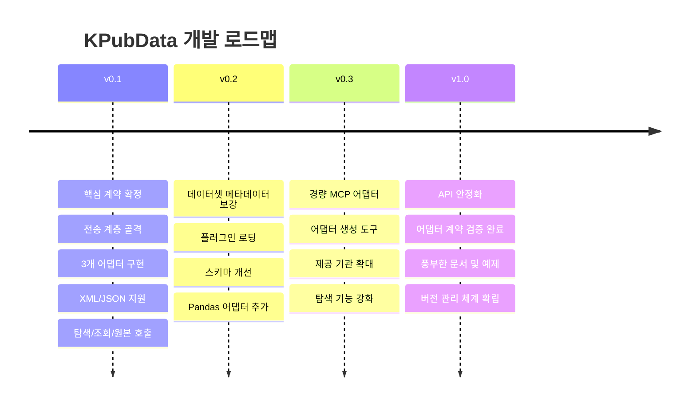

# Roadmap — KPubData

## v0.1

Foundation release.

- finalize core contracts
- implement transport skeleton
- implement 3 distinct adapters
- support XML + JSON
- support discovery + list + raw
- ship docs and contract tests

## v0.2

Stabilization and ergonomics.

- dataset metadata enrichment
- plugin loading
- schema improvements
- pandas adapter
- more examples

## v0.3

Extensibility.

- thin MCP adapter
- provider scaffolding tools
- more provider coverage
- more robust discovery

## v1.0 criteria

- public API feels stable
- adapter contract proven across multiple provider families
- docs/examples sufficient for external users
- breakage policy and versioning discipline established

---

## 관련 문서

### 이 저장소 내 문서
| 문서 | 설명 |
| :--- | :--- |
| [PRD.md](./PRD.md) | 제품 요구사항 정의 |
| [ARCHITECTURE.md](./ARCHITECTURE.md) | 시스템 아키텍처 설계 |
| [API_SPEC.md](./API_SPEC.md) | 파이썬 API 명세 |

### KPubData Product Family
| 저장소 | 문서 | 설명 |
| :--- | :--- | :--- |
| [kpubdata-builder](https://github.com/yeongseon/kpubdata-builder) | [ROADMAP.md](https://github.com/yeongseon/kpubdata-builder/blob/main/ROADMAP.md) | Builder 로드맵 |
| [kpubdata-studio](https://github.com/yeongseon/kpubdata-studio) | [ROADMAP.md](https://github.com/yeongseon/kpubdata-studio/blob/main/ROADMAP.md) | Studio 로드맵 |
