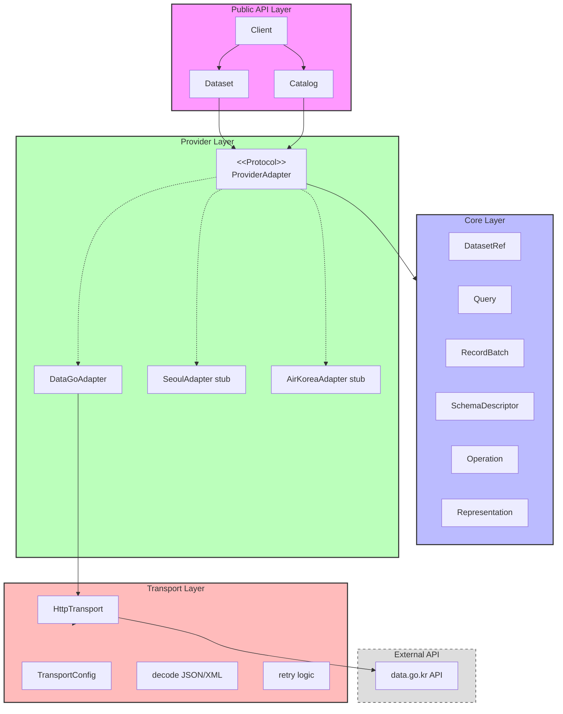
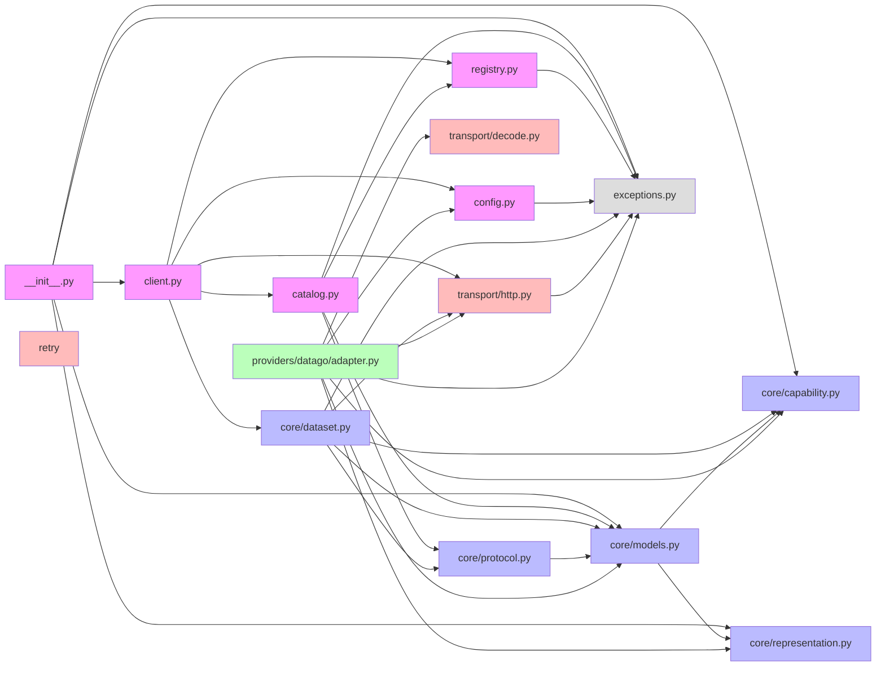
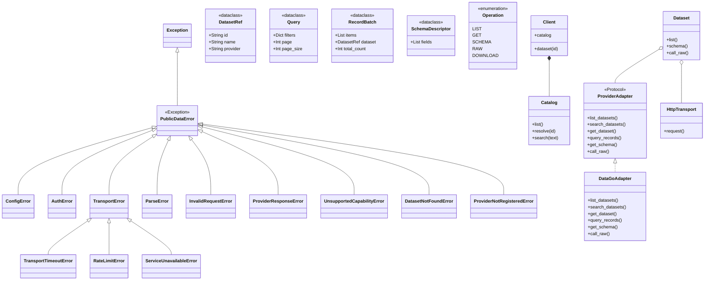
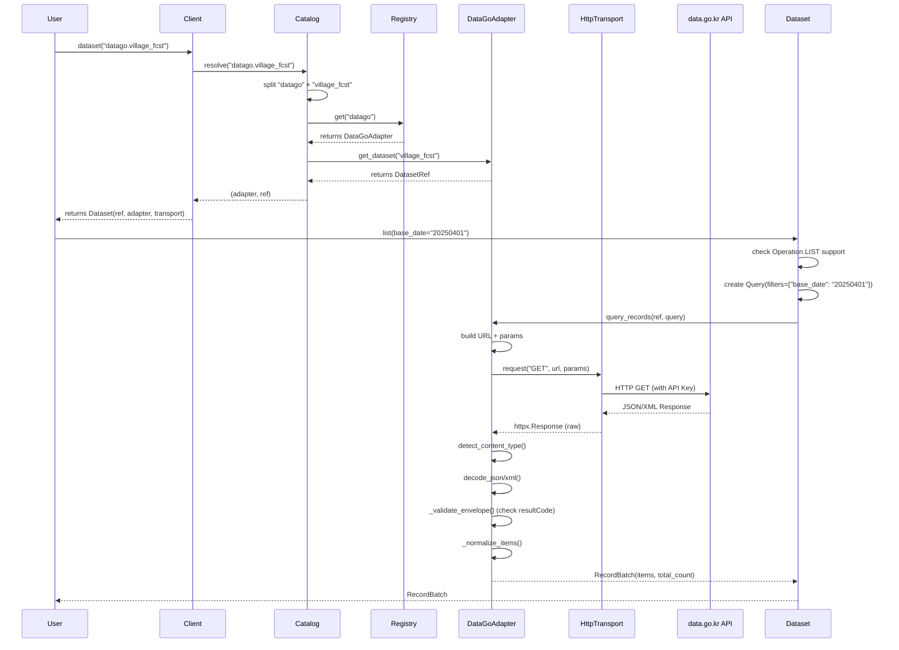
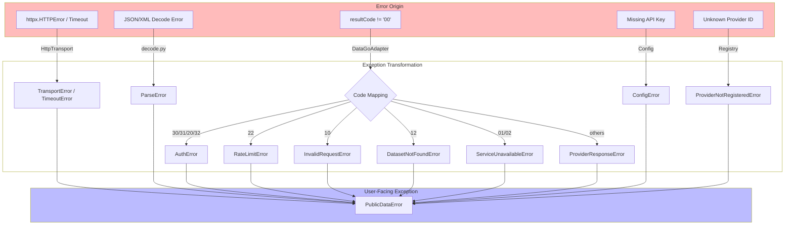
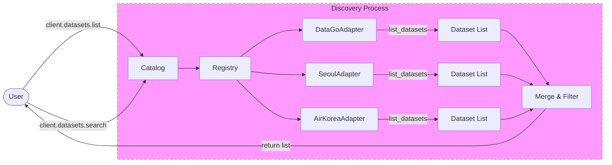
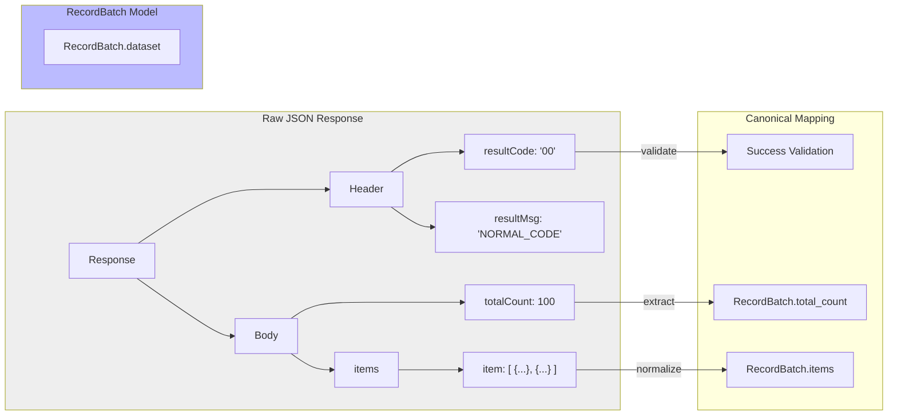
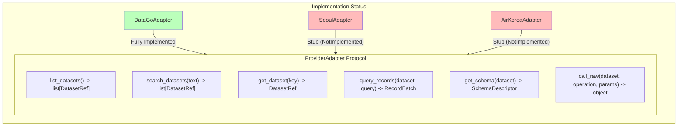

# KPubData 아키텍처 다이어그램 (Architecture Diagrams)

이 문서는 KPubData 프로젝트의 전체적인 구조와 동작 원리를 시각화된 다이어그램을 통해 설명합니다. 새로운 개발자가 프로젝트의 설계 철학을 빠르게 이해하고 기술적 세부 사항을 파악하는 데 도움을 주기 위해 작성되었습니다.

| # | 다이어그램 | 설명 |
|:---:|---|---|
| 1 | 시스템 전체 구조 | High-level 컴포넌트 관계 및 레이어드 아키텍처 |
| 2 | 모듈 의존성 그래프 | 내부 파일 및 모듈 간의 임포트 참조 관계 |
| 3 | 클래스 계층 구조 | 주요 데이터 모델 및 예외 클래스의 상속도 |
| 4 | 요청-응답 흐름 | 클라이언트 호출부터 API 응답까지의 시퀀스 |
| 5 | 에러 처리 흐름 | 외부 에러가 표준 예외로 변환되는 과정 |
| 6 | 데이터셋 발견 흐름 | 사용 가능한 데이터셋을 검색하고 나열하는 방식 |
| 7 | data.go.kr 응답 구조 | 중첩된 원본 데이터를 표준 모델로 매핑하는 구조 |
| 8 | 프로바이더 어댑터 계약 | 어댑터 인터페이스 명세 및 현재 구현 상태 |
| 9 | 재시도 및 Rate Limit 전략 | 네트워크 오류 및 호출 제한 대응 로직 |
| 10 | 패키지 구조 | 프로젝트 디렉토리 및 파일별 역할 정의 |

---

## 목차
1. [시스템 전체 구조 (High-Level System Architecture)](#1-시스템-전체-구조-high-level-system-architecture)
2. [모듈 의존성 그래프 (Module Dependency Graph)](#2-모듈-의존성-그래프-module-dependency-graph)
3. [클래스 계층 구조 (Class Hierarchy)](#3-클래스-계층-구조-class-hierarchy)
4. [요청-응답 흐름 (Request-Response Data Flow)](#4-요청-응답-흐름-request-response-data-flow)
5. [에러 처리 흐름 (Error Handling Flow)](#5-에러-처리-흐름-error-handling-flow)
6. [데이터셋 발견 흐름 (Dataset Discovery Flow)](#6-데이터셋-발견-흐름-dataset-discovery-flow)
7. [data.go.kr 응답 구조 (data.go.kr Response Envelope)](#7-datagokr-응답-구조-datagokr-response-envelope)
8. [프로바이더 어댑터 계약 (Provider Adapter Contract)](#8-프로바이더-어댑터-계약-provider-adapter-contract)
9. [재시도 및 Rate Limit 전략 (Retry & Rate Limit Strategy)](#9-재시도-및-rate-limit-전략-retry--rate-limit-strategy)
10. [패키지 구조 (Package Structure)](#10-패키지-구조-package-structure)

---

## 1. 시스템 전체 구조 (High-Level System Architecture)

KPubData는 5개의 주요 계층으로 구성된 레이어드 아키텍처를 따릅니다. 각 계층은 명확한 역할 분담을 가지고 있으며, 상위 계층은 하위 계층의 구체적인 구현을 알 필요 없이 추상화된 인터페이스를 통해 통신합니다.



---

## 2. 모듈 의존성 그래프 (Module Dependency Graph)

내부 모듈 간의 임포트(Import) 관계를 보여줍니다. 순환 참조를 방지하고 레이어 간의 경계를 유지하기 위해 하위 레이어 모듈은 상위 레이어 모듈을 참조하지 않도록 설계되었습니다.



---

## 3. 클래스 계층 구조 (Class Hierarchy)

프로젝트에서 사용되는 주요 클래스들의 상속 관계와 구조를 설명합니다. 특히 예외(Exception) 클래스들은 세분화되어 있어 구체적인 에러 상황에 대응할 수 있습니다.



---

## 4. 요청-응답 흐름 (Request-Response Data Flow)

`client.dataset("datago.village_fcst").list(base_date="20250401")` 호출 시 발생하는 내부 처리 과정을 시퀀스 다이어그램으로 추적합니다.



---

## 5. 에러 처리 흐름 (Error Handling Flow)

각 계층에서 발생하는 원천 에러가 어떻게 KPubData의 표준 예외로 변환되어 사용자에게 전달되는지 보여줍니다.



---

## 6. 데이터셋 발견 흐름 (Dataset Discovery Flow)

사용자가 사용 가능한 데이터셋을 나열하거나 검색할 때의 내부 동작 방식입니다. 등록된 모든 프로바이더로부터 정보를 수집하여 통합된 결과를 제공합니다.



---

## 7. data.go.kr 응답 구조 (data.go.kr Response Envelope)

공공데이터포털(data.go.kr)의 복잡한 중첩 응답 구조가 KPubData의 정규화된 `RecordBatch` 모델로 매핑되는 과정을 설명합니다.



---

## 8. 프로바이더 어댑터 계약 (Provider Adapter Contract)

새로운 데이터 제공처를 지원하기 위해 구현해야 하는 `ProviderAdapter` 인터페이스 명세와 현재 구현 상태입니다.



---

## 9. 재시도 및 Rate Limit 전략 (Retry & Rate Limit Strategy)

네트워크 불안정성이나 API 호출 제한(Rate Limit)에 대응하는 `HttpTransport`의 재시도 로직입니다.

```mermaid
stateDiagram-v2
    [*] --> Request: Start Attempt
    Request --> Success: HTTP 200 & Valid Body
    Request --> RetryCheck: Timeout / 429 / 5xx
    
    RetryCheck --> Delay: Attempt < Max Retries
    RetryCheck --> Failure: Attempt >= Max Retries
    
    Delay --> Request: Wait (Exponential Backoff)
    
    Success --> [*]
    Failure --> RaiseError: Raise TransportError
    RaiseError --> [*]

    note right of Delay
        delay = backoff_factor * 2^(attempt-1)
        Or use 'Retry-After' header if available
    end
```

---

## 10. 패키지 구조 (Package Structure)

프로젝트의 실제 파일 구조와 각 구성 요소의 역할입니다.

```text
src/kpubdata/
├── __init__.py          # Public API 진입점 및 주요 클래스 노출
├── client.py            # 사용자 인터페이스를 제공하는 최상위 Client 클래스
├── config.py            # API 키 및 환경 변수 설정 관리
├── catalog.py           # 데이터셋 검색 및 해결(Resolution) 담당
├── registry.py          # 프로바이더 어댑터 등록 및 관리
├── exceptions.py        # 프로젝트 전체에서 사용되는 예외 클래스 정의
├── core/
│   ├── capability.py    # 지원 가능한 연산(Operation), 페이지네이션 모드 정의
│   ├── dataset.py       # 어댑터와 연결된 데이터셋 객체 구현
│   ├── models.py        # DatasetRef, Query, RecordBatch 등 정규화된 모델
│   ├── protocol.py      # ProviderAdapter 프로토콜(인터페이스) 정의
│   └── representation.py # 데이터 표현 형식(JSON/XML) 열거형
├── transport/
│   ├── http.py          # httpx 기반의 HTTP 통신 및 재시도 로직
│   ├── decode.py        # 응답 데이터(JSON/XML) 파싱 및 정규화
│   └── retry.py         # 범용적인 재시도 유틸리티
└── providers/
    ├── datago/
    │   ├── adapter.py   # 공공데이터포털(data.go.kr) 전용 어댑터 구현
    │   └── catalogue.json # 큐레이션된 데이터셋 정의 데이터
    ├── seoul/            # 서울시 열린데이터 광장 어댑터 (스텁)
    └── airkorea/         # 에어코리아(대기오염) 어댑터 (스텁)
```
