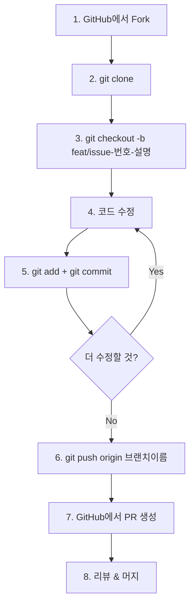

# KPubData 기여 가이드 (CONTRIBUTING.md)

KPubData 프로젝트에 관심을 가져주셔서 감사합니다! 이 프로젝트는 대학생을 포함한 모든 초보 개발자의 첫 기여를 환영합니다. 오픈소스 기여가 처음이라도 괜찮습니다. 이 가이드를 따라 차근차근 시작해 보세요.

## 1. 환영 인사 및 프로젝트 소개

KPubData는 공공데이터를 더 쉽고 표준화된 방식으로 다루기 위한 프로젝트 패밀리입니다.
- **kpubdata**: 핵심 라이브러리 (공공데이터 어댑터 엔진)
- **kpubdata-builder**: 데이터를 가공하고 내보내는 도구
- **kpubdata-studio**: 데이터를 시각화하고 관리하는 웹 대시보드

이 레포지토리(`kpubdata`)는 다양한 공공데이터 API를 하나의 표준 인터페이스로 연결하는 역할을 합니다.

## 2. 개발 환경 설정 (처음부터 끝까지)

Python 코드를 수정하고 테스트하기 위한 환경을 만들어 봅시다.

**Step 1: 필수 도구 설치**
*   **Git 설치**: [git-scm.com](https://git-scm.com)에서 설치하세요. — 설치 확인: `git --version`
*   **Python 3.10+ 설치**: [Python 공식 홈페이지](https://www.python.org/downloads/)에서 설치하세요. — 설치 확인: `python --version`
*   **uv 설치**: `uv`는 Python 패키지를 아주 빠르게 관리해 주는 도구입니다. — 설치 확인: `uv --version`
    ```bash
    curl -LsSf https://astral.sh/uv/install.sh | sh
    ```
*   **GitHub 계정 및 SSH 설정**: GitHub 계정이 필요합니다. [GitHub SSH 설정 가이드](https://docs.github.com/en/authentication/connecting-to-github-with-ssh)를 참고해 내 컴퓨터와 연결하세요.

**Step 2: 프로젝트 Fork & Clone**
```bash
# 1. GitHub 웹에서 오른쪽 상단의 'Fork' 버튼을 클릭해 내 계정으로 복사합니다.

# 2. 내 컴퓨터로 가져오기 (YOUR_USERNAME 부분을 본인 아이디로 바꾸세요)
git clone https://github.com/YOUR_USERNAME/kpubdata.git
cd kpubdata

# 3. 원본 저장소를 upstream으로 등록 (나중에 최신 코드를 받기 위해)
git remote add upstream https://github.com/yeongseon/kpubdata.git
```

**Step 3: 개발 환경 구축**
터미널에서 아래 명령어를 순서대로 입력하세요.
```bash
uv sync --extra dev    # 필요한 패키지 모두 설치
uv run pytest          # 모든 테스트 통과 확인
uv run ruff check .    # 코드 스타일 확인
uv run mypy src        # 타입 체크
```
> 이 4개 명령어가 모두 성공하면 개발 준비 끝!

## 3. 브랜치 전략과 협업 규칙

규칙은 적지만, 반드시 지킵니다. 모르는 것이 있다면 언제든 물어보세요.

### 3-1. 브랜치(Branch)란?
브랜치는 원본 코드의 안전한 복사본에서 작업하는 것입니다. 내가 마음껏 코드를 수정해도 다른 사람의 작업이나 원본 코드에는 아무런 영향을 주지 않습니다. 작업이 완료되면 '합쳐달라'고 요청(Pull Request)하면 됩니다.

### 3-2. 브랜치 전략 (Git Graph)

```mermaid
gitgraph
    commit id: "initial"
    branch feat/issue-1-add-adapter
    checkout feat/issue-1-add-adapter
    commit id: "feat: add skeleton"
    commit id: "feat: implement parser"
    checkout main
    merge feat/issue-1-add-adapter id: "PR #1 merged"
    branch fix/issue-2-typo
    checkout fix/issue-2-typo
    commit id: "fix: typo in docs"
    checkout main
    merge fix/issue-2-typo id: "PR #2 merged"
```

### 3-3. 브랜치 이름 규칙
항상 목적에 맞는 접두사를 사용하세요.

| 접두사 | 용도 | 예시 |
| :--- | :--- | :--- |
| `feat/issue-<번호>-<설명>` | 새로운 기능 추가 | `feat/issue-12-add-bus-adapter` |
| `fix/issue-<번호>-<설명>` | 버그 수정 | `fix/issue-5-fix-xml-parse` |
| `docs/<설명>` | 문서 수정 (이슈 번호 생략 가능) | `docs/update-readme` |

### 3-4. 전체 작업 흐름 (Workflow)



**실제 터미널 명령어 순서:**

```bash
# 1. 원본 저장소에서 최신 코드를 받아옵니다
git checkout main
git pull upstream main

# 2. 새로운 작업 브랜치를 만듭니다
git checkout -b feat/issue-12-add-bus-adapter

# 3. 코드를 수정하고 변경 사항을 기록(커밋)합니다
git add .
git commit -m "feat: add bus arrival adapter skeleton"

# 4. 내 GitHub 저장소로 올립니다
git push origin feat/issue-12-add-bus-adapter

# 5. GitHub 웹사이트에서 'Compare & pull request' 버튼을 눌러 PR을 생성합니다.
```

### 3-5. 커밋 메시지 규칙
커밋 메시지는 '무엇을 왜 바꿨는지' 설명합니다.

| 접두사 | 의미 | 예시 |
| :--- | :--- | :--- |
| `feat:` | 새 기능 추가 | `feat: add air quality adapter` |
| `fix:` | 버그 수정 | `fix: handle empty XML response` |
| `docs:` | 문서 수정 | `docs: update API spec` |
| `test:` | 테스트 추가/수정 | `test: add parser unit tests` |
| `refactor:` | 리팩토링 (코드 구조 개선) | `refactor: simplify transport layer` |

### 3-6. 절대 금지 사항
- **`main` 브랜치에 직접 push 금지**: 모든 작업은 브랜치에서 진행하세요.
- **`git push --force` 금지**: 특히 `main` 브랜치나 공유 브랜치에는 절대 사용하지 마세요.
- **타인의 브랜치 건드리지 않기**: 내가 만들지 않은 브랜치를 삭제하거나 이름을 바꾸지 마세요.
- **모르면 물어보기**: 추측해서 실행하지 말고, 이슈나 채팅방에 질문하세요.

### 3-7. PR 올리기 전 최종 체크리스트
이 4가지 명령어가 모두 성공해야 PR이 승인될 수 있습니다.

```bash
uv run ruff check .
uv run ruff format --check .
uv run mypy src
uv run pytest
```


## 4. 코딩 규칙 (Coding Convention)

우리는 깨끗한 코드를 유지하기 위해 몇 가지 규칙을 지킵니다.

- **타입 힌트**: 모든 함수에는 타입을 명시해야 합니다. `Any` 타입은 사용하지 않습니다.
- **문서화 (Docstring)**: 함수나 클래스가 무엇을 하는지 간단한 설명을 적어주세요.
- **포맷팅**: `uv run ruff format .` 명령어로 코드 스타일을 자동으로 맞출 수 있습니다.
- **Import**: 파일 맨 위에 `from __future__ import annotations`를 추가해 주세요.

## 5. 내가 할 일에 따라 수정할 파일 찾기

### 프로젝트 파일 구조 한눈에 보기

```text
kpubdata/
├── src/kpubdata/
│   ├── providers/          ← ⭐ 어댑터 코드 (가장 자주 수정)
│   │   ├── seoul/           ← 서울 열린데이터광장 어댑터
│   │   │   ├── __init__.py
│   │   │   ├── adapter.py   ← 핵심 로직 (API 호출, 파싱)
│   │   │   └── catalogue.json ← 데이터셋 목록 정의
│   │   ├── datago/          ← 공공데이터포털 어댑터
│   │   ├── bok/             ← 한국은행 어댑터
│   │   └── ...              ← 기관별 폴더
│   ├── core/               ← 핵심 추상 클래스 (수정 드묾)
│   ├── transport/           ← HTTP 통신 (수정 드묾)
│   ├── client.py            ← 사용자 진입점
│   └── exceptions.py        ← 공통 에러
├── tests/
│   ├── fixtures/            ← ⭐ API 응답 샘플 (JSON 파일)
│   │   └── seoul/           ← 기관별 폴더
│   ├── unit/providers/      ← ⭐ 유닛 테스트
│   │   └── seoul/
│   │       └── test_adapter.py
│   └── contract/            ← ⭐ 계약 테스트 (표준 인터페이스 검증)
│       └── test_seoul.py
├── docs/providers/          ← ⭐ 기관별 사용 문서
│   └── seoul.md
├── SUPPORTED_DATA.md        ← ⭐ 지원 현황 (PR마다 업데이트)
├── CONTRIBUTING.md          ← 기여 가이드 (이 문서의 원본)
└── README.md
```

### 시나리오별 "어디를 수정해야 하나요?"

#### 📝 시나리오 A: 문서만 수정하고 싶어요 (가장 쉬움)

| 하고 싶은 일 | 수정할 파일 |
|---|---|
| README 오타 수정 | `README.md` |
| 사용 예제 추가 | `docs/providers/<기관>.md` |
| 지원 현황 업데이트 | `SUPPORTED_DATA.md` |

#### 🔧 시나리오 B: 기존 어댑터에 새 데이터셋 추가

예: 서울 어댑터에 새로운 API 추가

| 순서 | 수정할 파일 | 설명 |
|:---:|---|---|
| 1 | `tests/fixtures/seoul/<새이름>_success.json` | 실제 API 응답을 저장 |
| 2 | `src/kpubdata/providers/seoul/catalogue.json` | 데이터셋 정보 등록 |
| 3 | `tests/unit/providers/seoul/test_adapter.py` | 유닛 테스트 추가 |
| 4 | `tests/contract/test_seoul.py` | 계약 테스트 추가 |
| 5 | `docs/providers/seoul.md` | 사용법 문서화 |
| 6 | `SUPPORTED_DATA.md` | 지원 현황 업데이트 |

> 💡 **팁**: `adapter.py`를 수정할 필요가 없는 경우도 많습니다! catalogue.json에 데이터셋을 등록하면 기존 어댑터 로직이 자동으로 처리해주는 구조입니다.

#### 🚀 시나리오 C: 완전히 새로운 기관 어댑터 추가

예: 기상청 API를 새로 연동

| 순서 | 수정/생성할 파일 | 설명 |
|:---:|---|---|
| 1 | `src/kpubdata/providers/kma/__init__.py` | 패키지 초기화 |
| 2 | `src/kpubdata/providers/kma/adapter.py` | 어댑터 구현 |
| 3 | `src/kpubdata/providers/kma/catalogue.json` | 데이터셋 목록 |
| 4 | `src/kpubdata/providers/manifest.py` | provider 등록 추가 |
| 5 | `tests/fixtures/kma/<dataset>_success.json` | 응답 샘플 |
| 6 | `tests/unit/providers/kma/test_adapter.py` | 유닛 테스트 |
| 7 | `tests/contract/test_kma.py` | 계약 테스트 |
| 8 | `docs/providers/kma.md` | 사용법 문서 |
| 9 | `SUPPORTED_DATA.md` | 지원 현황 등록 |

> ⚠️ 처음 기여라면 시나리오 A 또는 B부터 시작하는 것을 추천합니다!

### 실제 예시: seoul 어댑터 구조 뜯어보기

이해를 돕기 위해 실제 서울 어댑터의 파일을 살펴봅시다.

**`src/kpubdata/providers/seoul/catalogue.json`** (데이터셋 정의)
```json
[
  {
    "dataset_key": "bike_realtime",
    "name": "서울시 공공자전거 따릉이 실시간 대여정보",
    "base_url": "http://openapi.seoul.go.kr:8088",
    "default_operation": "bikeList",
    "envelope_key": "rentBikeStatus",
    "required_path_params": []
  }
]
```

**`tests/fixtures/seoul/bike_realtime_success.json`** (API 응답 샘플)
```json
{
  "rentBikeStatus": {
    "list_total_count": 5,
    "RESULT": { "CODE": "INFO-000", "MESSAGE": "정상" },
    "row": [ { "stationName": "102. 망원역 1번출구", ... } ]
  }
}
```

> 이 두 파일만 추가하면 기존 adapter.py 로직이 새 데이터셋을 자동으로 처리합니다!

---

## 6. 첫 번째 어댑터(Adapter) 추가하기 — 상세 가이드

### Step 1: API 응답을 파일로 저장 (Fixture 만들기)

먼저 연동할 API를 브라우저나 curl로 호출해서 응답을 복사합니다.

```bash
# 예: 서울시 따릉이 실시간 대여정보
curl "http://openapi.seoul.go.kr:8088/YOUR_KEY/json/bikeList/1/5" > response.json
```

이 응답을 `tests/fixtures/<기관명>/<데이터셋명>_success.json`에 저장합니다.

### Step 2: catalogue.json에 데이터셋 등록

`src/kpubdata/providers/<기관명>/catalogue.json`을 열어 배열에 새 항목을 추가합니다.
각 필드의 의미:

| 필드 | 설명 | 예시 |
|---|---|---|
| `dataset_key` | 데이터셋 고유 ID | `"bike_realtime"` |
| `name` | 한국어 이름 | `"서울시 공공자전거 실시간 대여정보"` |
| `base_url` | API 기본 URL | `"http://openapi.seoul.go.kr:8088"` |
| `default_operation` | 기본 서비스명 | `"bikeList"` |
| `envelope_key` | 응답 감싸는 키 (서비스명과 다를 때만) | `"rentBikeStatus"` |
| `required_path_params` | URL 경로에 필요한 파라미터 | `["stationName"]` 또는 `[]` |

### Step 3: 테스트 작성

```python
# tests/unit/providers/seoul/test_adapter.py 에 추가
def test_bike_realtime_parsing(seoul_adapter, mock_transport):
    """bike_realtime fixture가 올바르게 파싱되는지 확인"""
    mock_transport.set_response("fixtures/seoul/bike_realtime_success.json")
    result = seoul_adapter.query_records(dataset_ref, query)
    assert len(result.items) > 0
    assert result.total_count is not None
```

### Step 4: 확인하고 PR 올리기

```bash
uv run pytest tests/unit/providers/seoul/ -v  # 내 테스트만 먼저 확인
uv run pytest                                  # 전체 테스트 통과 확인
uv run ruff check .                            # 스타일 확인
uv run mypy src                                # 타입 확인
```

모두 통과하면 커밋하고 PR을 올리세요!

---

## 7. PR 가이드 및 체크리스트

PR을 보낼 때 제목은 `[#이슈번호] 간단한 설명` 형식을 지켜주세요.

**보내기 전 체크리스트:**
- [ ] `uv run pytest` 결과가 모두 통과(Pass)인가요?
- [ ] `uv run ruff check .`에서 경고가 없나요?
- [ ] `uv run mypy src`에서 타입 오류가 없나요?
- [ ] 새 데이터셋 추가 시 `SUPPORTED_DATA.md`를 업데이트했나요?

## 8. 자주 하는 실수와 해결법

| 실수 | 원인 | 해결 |
|---|---|---|
| `ModuleNotFoundError` | 환경 설정 안 됨 | `uv sync --extra dev` 다시 실행 |
| `ruff` 오류 | 코드 스타일 불일치 | `uv run ruff format .`으로 자동 수정 |
| `mypy` 타입 오류 | 타입 힌트 누락 | 함수 인자/반환값에 타입 추가 |
| 테스트 실패 | fixture 파일 경로 오류 | `tests/fixtures/<기관>/` 경로 확인 |
| `git push` 거부 | main에 직접 push 시도 | 브랜치 만들어서 push |

## 9. 도움 요청하기

모르는 것이 있다면 언제든 GitHub Issues에 질문을 남기세요. "이게 뭐죠?", "설치가 안 돼요" 같은 질문도 환영합니다. 누구나 처음은 어렵습니다. 함께 해결해 나가요!

---

## 관련 문서

### 이 저장소 내 문서
| 문서 | 설명 |
| :--- | :--- |
| [AGENTS.md](https://github.com/yeongseon/kpubdata/blob/main/AGENTS.md) | 에이전트 및 개발 규칙 가이드 |
| [ARCHITECTURE.md](https://github.com/yeongseon/kpubdata/blob/main/ARCHITECTURE.md) | 시스템 아키텍처 설계 |
| [PROVIDER_ADAPTER_CONTRACT.md](https://github.com/yeongseon/kpubdata/blob/main/PROVIDER_ADAPTER_CONTRACT.md) | 어댑터 구현 규약 (필독!) |
| [ROADMAP.md](https://github.com/yeongseon/kpubdata/blob/main/ROADMAP.md) | 프로젝트 로드맵 및 단계별 계획 |
| [API_SPEC.md](https://github.com/yeongseon/kpubdata/blob/main/API_SPEC.md) | 파이썬 API 명세 |

### KPubData Product Family
| 저장소 | 문서 | 설명 |
| :--- | :--- | :--- |
| [kpubdata-builder](https://github.com/yeongseon/kpubdata-builder) | [CONTRIBUTING.md](https://github.com/yeongseon/kpubdata-builder/blob/main/CONTRIBUTING.md) | Builder 기여 가이드 |
| [kpubdata-studio](https://github.com/yeongseon/kpubdata-studio) | [CONTRIBUTING.md](https://github.com/yeongseon/kpubdata-studio/blob/main/CONTRIBUTING.md) | Studio 기여 가이드 |
