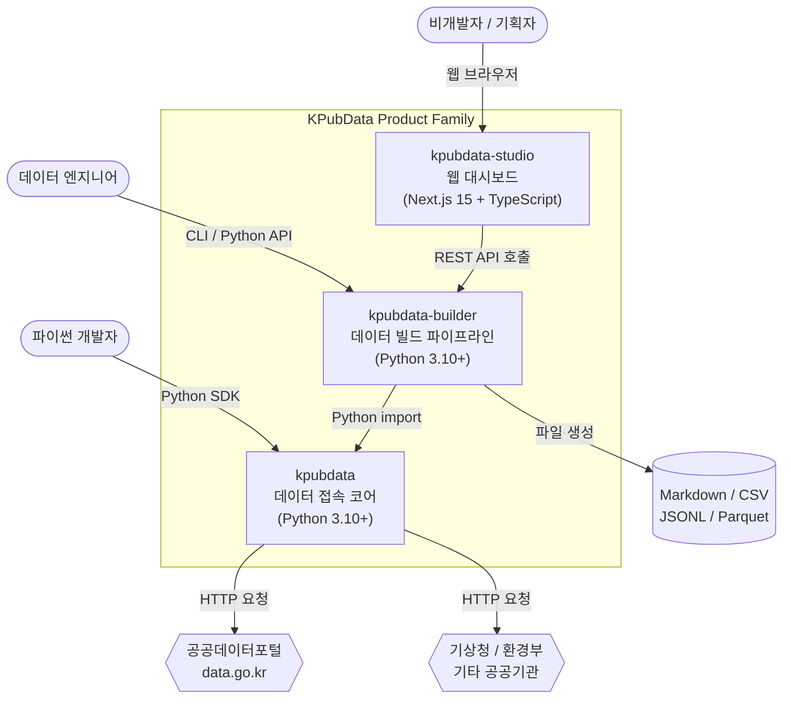
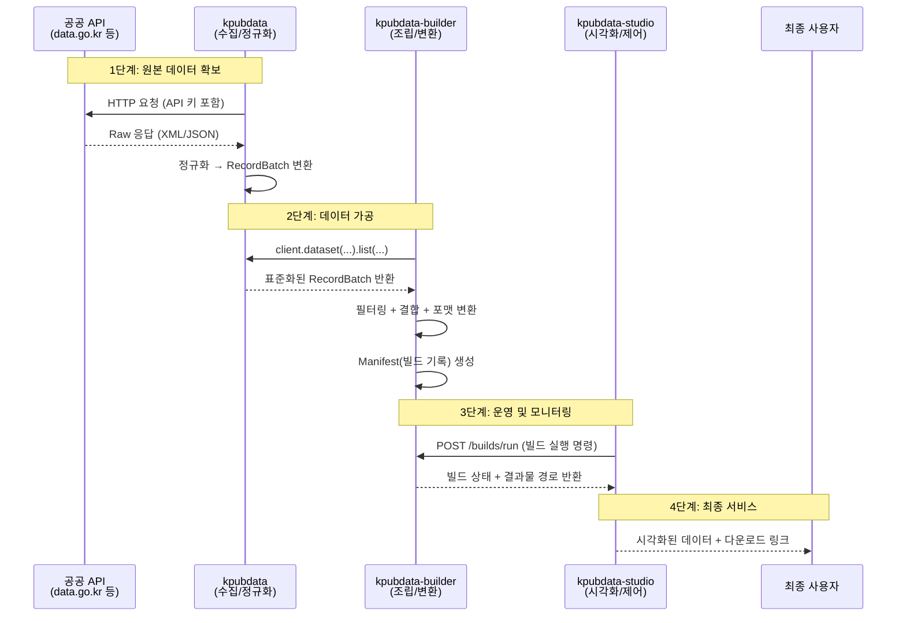
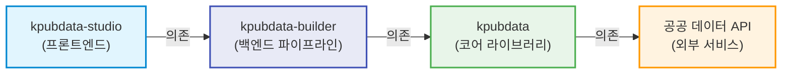
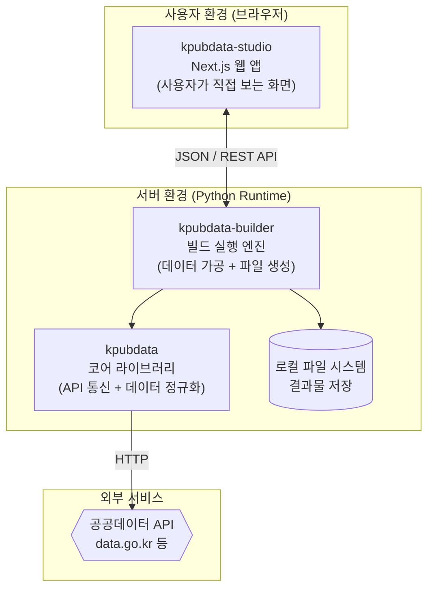
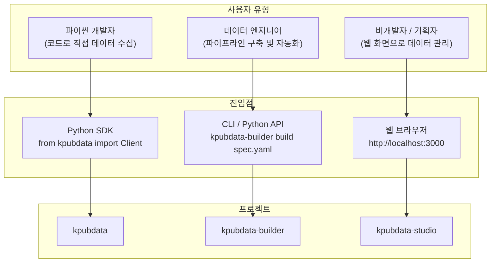

# KPubData Product Family — 전체 시스템 아키텍처

KPubData Product Family(Korea Public Data Product Family)는 한국 공공데이터를 **수집하고, 가공하고, 시각적으로 관리**하는 세 가지 도구의 모임입니다.

각 저장소는 독립적으로 동작할 수 있지만, 함께 사용할 때 공공데이터의 전체 생명주기를 하나의 흐름으로 처리할 수 있습니다.

| 저장소 | 한 줄 역할 | 기술 |
| :--- | :--- | :--- |
| [kpubdata](https://github.com/yeongseon/kpubdata) | 공공데이터를 가져오고 표준화하는 코어 라이브러리 | Python 3.10+ |
| [kpubdata-builder](https://github.com/yeongseon/kpubdata-builder) | 수집된 데이터를 다양한 형식으로 가공하는 빌드 파이프라인 | Python 3.10+ |
| [kpubdata-studio](https://github.com/yeongseon/kpubdata-studio) | 빌드 과정을 시각적으로 관리하는 웹 대시보드 | Next.js 15 + TypeScript |

---

## 0. KPubData Product Family가 뭔가요? (초보자를 위한 비유)

세 프로젝트의 관계를 **음식 공급망**에 비유하면 이해하기 쉽습니다.

### 식재료 공급업체 → 주방 → 레스토랑

- **kpubdata = 식재료 공급업체 (재료 조달 + 품질 표준화)**
  - 전국 각지의 산지(공공기관 [API](https://ko.wikipedia.org/wiki/API))에서 제각각인 모양의 식재료(데이터)를 가져옵니다.
  - 흙을 털고 크기를 맞춰 요리하기 좋은 상태(표준화된 데이터)로 포장합니다.
  - 기존 문서에서 쓰던 비유로는 **"도서관의 똑똑한 사서"** 입니다.

- **kpubdata-builder = 요리사/주방 (재료를 요리로 변환)**
  - 공급받은 재료들을 레시피(빌드 기획서)에 따라 조합하고 양념하여 완성된 요리(데이터셋 파일)를 만듭니다.
  - 같은 레시피로 언제든 같은 요리를 다시 만들 수 있도록 자동화합니다.
  - 기존 문서에서 쓰던 비유로는 **"데이터 출판사"** 입니다.

- **kpubdata-studio = 레스토랑 홀/키오스크 (주문 + 서빙 + 고객 대면)**
  - 손님(사용자)이 메뉴판(데이터셋 목록)을 보고 요리를 주문(빌드 실행)할 수 있는 화면입니다.
  - 주방에서 어떤 요리가 만들어지고 있는지 실시간으로 확인하고, 완성된 요리를 받아볼 수 있습니다.
  - 기존 문서에서 쓰던 비유로는 **"데이터 작업실"** 입니다.

```text
[식재료 공급업체]     [주방]              [레스토랑 홀]
  kpubdata    →   kpubdata-builder  →   kpubdata-studio
  (재료 조달)       (요리 제작)            (주문 + 서빙)
```

---

## 1. 전체 시스템 관계도

세 저장소와 외부 [API](https://ko.wikipedia.org/wiki/API)(프로그램끼리 데이터를 주고받는 규칙), 그리고 최종 사용자 간의 관계입니다. **데이터는 아래에서 위로 흐르고, 제어(명령)는 위에서 아래로 내려갑니다.**



---

## 2. 전체 데이터 흐름

공공기관 서버에 있는 원본 데이터가 최종 사용자에게 전달되기까지의 여정입니다.



### 단계별 상세 설명

1. **원본 데이터 확보** (kpubdata)
   - 각 공공기관의 API에 [HTTP](https://ko.wikipedia.org/wiki/HTTP)(인터넷 통신 규약) 요청을 보내 원본 데이터를 받아옵니다.
   - [XML](https://ko.wikipedia.org/wiki/XML)(태그 형식)이든 [JSON](https://ko.wikipedia.org/wiki/JSON)(중괄호 형식)이든 자동으로 판별하여 파이썬 객체로 변환합니다.
   - 기관마다 다른 에러 코드, 페이지 처리 방식 등을 표준 형태(`RecordBatch`)로 정규화합니다.

2. **데이터 가공** (kpubdata-builder)
   - kpubdata를 파이썬 라이브러리로 불러와(`import`) 데이터를 수집합니다.
   - 빌드 기획서([YAML](https://ko.wikipedia.org/wiki/YAML) — 들여쓰기로 구조를 표현하는 설정 파일)에 정의된 규칙에 따라 데이터를 변환합니다.
   - [Markdown](https://ko.wikipedia.org/wiki/%EB%A7%88%ED%81%AC%EB%8B%A4%EC%9A%B4), [CSV](https://ko.wikipedia.org/wiki/CSV), [JSONL](https://jsonlines.org/), [Parquet](https://parquet.apache.org/) 등 원하는 형식의 파일을 생성합니다.

3. **운영 및 모니터링** (kpubdata-studio)
   - 웹 브라우저를 통해 빌드를 시작하거나 상태를 확인합니다.
   - Builder가 제공하는 [REST API](https://ko.wikipedia.org/wiki/REST)(웹을 통해 데이터를 주고받는 방식)를 호출하여 통신합니다.

4. **최종 서비스** (studio → 사용자)
   - 사용자는 웹 화면에서 빌드 결과물을 미리보기하고, 다운로드할 수 있습니다.

---

## 3. 각 저장소의 역할과 경계

### 역할 비교표

| 구분 | kpubdata (코어) | kpubdata-builder (빌더) | kpubdata-studio (스튜디오) |
| :--- | :--- | :--- | :--- |
| **비유** | 똑똑한 사서 / 식재료 공급업체 | 출판사 / 요리 주방 | 작업실 / 레스토랑 키오스크 |
| **핵심 역할** | 공공 API 연결, 인증, 데이터 정규화 | 데이터 변환, 파일 내보내기, 빌드 이력 관리 | 빌드 모니터링, 설정 UI, 결과 시각화 |
| **주요 산출물** | `RecordBatch` (표준화된 데이터 객체) | 파일 (Markdown, CSV 등) + `manifest.json` | 웹 대시보드 화면 |
| **주요 사용자** | 파이썬 개발자 | 데이터 엔지니어, 분석가 | 비개발자, 기획자, 운영자 |

### 하는 일 / 하지 않는 일

**kpubdata (코어)**
- 하는 일: 공공 API 연결, API 키 인증 처리, XML/JSON 응답 파싱, 데이터 정규화, 에러 표준화, 원본 데이터 접근(`call_raw`)
- 하지 않는 일: 데이터 저장, 복잡한 변환/가공, 파일 생성, 웹 UI 제공

**kpubdata-builder (빌더)**
- 하는 일: 빌드 기획서(BuildSpec) 검증, kpubdata를 통한 데이터 수집, 데이터 결합/필터링, 다양한 형식으로 내보내기, Manifest 생성
- 하지 않는 일: 직접적인 API 통신(kpubdata에 위임), 웹 UI 제공, 사용자 인증/인가

**kpubdata-studio (스튜디오)**
- 하는 일: 빌드 기획서 시각적 편집, 빌드 실행/상태 모니터링, 결과물 미리보기, 게시(Publish) 관리
- 하지 않는 일: 데이터 직접 가공, 원본 API 호출, 빌드 로직 구현(Builder에 위임)

---

## 4. 의존성 방향

세 프로젝트의 의존성은 **항상 한 방향**으로만 흐릅니다. 하위 프로젝트는 상위 프로젝트가 존재하는지 알 필요가 없습니다.



### 의존성 규칙

| 규칙 | 설명 | 비유 |
| :--- | :--- | :--- |
| **Studio → Builder** | Studio는 Builder의 API를 호출할 수 있음 | 레스토랑 홀은 주방에 주문을 넣을 수 있음 |
| **Builder → kpubdata** | Builder는 kpubdata를 파이썬 라이브러리로 import하여 사용 | 주방은 식재료 업체에서 재료를 받아옴 |
| **kpubdata → 공공 API** | kpubdata는 외부 공공기관 서버에 HTTP 요청을 보냄 | 식재료 업체는 산지에서 재료를 수확함 |
| **역방향 금지** | kpubdata는 Builder를, Builder는 Studio를 절대 import하거나 호출하지 않음 | 산지가 요리사에게 "이거 만들어"라고 지시하지 않음 |

---

## 5. 기술 스택 비교

각 프로젝트는 용도에 맞는 최적의 기술을 사용합니다.

| 항목 | kpubdata | kpubdata-builder | kpubdata-studio |
| :--- | :--- | :--- | :--- |
| **언어** | [Python](https://docs.python.org/ko/3/tutorial/) 3.10+ | [Python](https://docs.python.org/ko/3/tutorial/) 3.10+ | [TypeScript](https://www.typescriptlang.org/ko/docs/) 5 |
| **프레임워크** | — (순수 라이브러리) | — (CLI + 라이브러리) | [Next.js](https://nextjs.org/docs) 15 |
| **UI** | 없음 (코드로만 사용) | CLI(명령줄 인터페이스) | 웹 브라우저 ([React](https://ko.react.dev/) + [Tailwind CSS](https://tailwindcss.com/docs)) |
| **빌드 도구** | [hatchling](https://hatch.pypa.io/) | [hatchling](https://hatch.pypa.io/) | Next.js 내장 빌드 |
| **패키지 관리** | [uv](https://github.com/astral-sh/uv) | [uv](https://github.com/astral-sh/uv) | [npm](https://docs.npmjs.com/about-npm) |
| **타입 검사** | [mypy](https://mypy.readthedocs.io/) | [mypy](https://mypy.readthedocs.io/) | TypeScript 내장 (`tsc`) |
| **린터** | [ruff](https://docs.astral.sh/ruff/) | [ruff](https://docs.astral.sh/ruff/) | [ESLint](https://eslint.org/) |
| **테스트** | [pytest](https://docs.pytest.org/) | [pytest](https://docs.pytest.org/) | (v0.2 예정) |

---

## 6. 배포/실행 환경 구분

실제 서비스가 동작할 때, 각 프로젝트가 어디에서 실행되는지를 보여줍니다.



### 환경별 요약

| 환경 | 프로젝트 | 실행 방식 |
| :--- | :--- | :--- |
| **사용자 브라우저** | kpubdata-studio | `npm run dev` → [http://localhost:3000](http://localhost:3000) 접속 |
| **Python 서버/로컬** | kpubdata, kpubdata-builder | `pip install` 후 Python 코드에서 import 또는 CLI 실행 |
| **외부** | 공공 데이터 API | 정부/기관에서 운영하는 서버 (우리가 제어할 수 없음) |

---

## 7. 사용자 유형별 진입점

같은 KPubData 시스템이라도, 사용자의 숙련도와 목적에 따라 다른 도구를 통해 진입합니다.



### 진입점 상세

| 사용자 유형 | 사용 도구 | 진입 방법 | 예시 |
| :--- | :--- | :--- | :--- |
| **파이썬 개발자** | kpubdata | `from kpubdata import Client` | 코드에서 직접 API 데이터 수집 |
| **데이터 엔지니어** | kpubdata-builder | `kpubdata-builder build spec.yaml` | YAML 기획서로 데이터 파이프라인 실행 |
| **비개발자 / 기획자** | kpubdata-studio | 웹 브라우저에서 대시보드 접속 | 클릭 몇 번으로 빌드 실행 및 결과 확인 |

---

## 8. 프로젝트 간 통신 방식

### 8.1 kpubdata-builder → kpubdata (Python import)

빌더는 kpubdata를 하나의 파이썬 라이브러리(부품)로 취급합니다. 별도의 네트워크 통신 없이 코드에서 직접 불러옵니다.

```python
# kpubdata-builder의 executor.py 내부 (개념 예시)
from kpubdata import Client

client = Client.from_env()
ds = client.dataset("datago.village_fcst")
result = ds.list(base_date="20250401", nx="55", ny="127")
# result.items → 표준화된 데이터 목록
```

### 8.2 kpubdata-studio → kpubdata-builder (REST API)

스튜디오는 웹 브라우저에서 동작하므로, 파이썬 코드를 직접 실행할 수 없습니다. 대신 Builder가 제공하는 [REST API](https://ko.wikipedia.org/wiki/REST)(웹 주소를 통해 요청/응답을 주고받는 방식)를 호출합니다.

```text
Studio (브라우저)                    Builder (서버)
     |                                    |
     |--- POST /builds/run ------------->|  "이 기획서로 빌드 시작해줘"
     |                                    |--- kpubdata로 데이터 수집
     |                                    |--- 가공 + 파일 생성
     |<-- 200 OK { status: "done" } ----|  "완료! 결과 여기 있어"
     |                                    |
     |--- GET /builds/123/artifacts ---->|  "결과 파일 목록 보여줘"
     |<-- 200 OK [ file1, file2 ] ------|
```

### 통신 방식 요약

| 연결 | 방식 | 설명 |
| :--- | :--- | :--- |
| **Builder → kpubdata** | Python `import` | 같은 파이썬 환경에서 라이브러리로 직접 호출 |
| **Studio → Builder** | [REST API](https://ko.wikipedia.org/wiki/REST) (HTTP) | 웹 브라우저에서 서버로 JSON 형식의 요청/응답 |
| **kpubdata → 공공 API** | HTTP GET/POST | 외부 서버로 인터넷 통신 |

---

## 9. 버전 로드맵 통합 개요

세 프로젝트는 보조를 맞추어 함께 발전합니다.

| 버전 | kpubdata (코어) | kpubdata-builder (빌더) | kpubdata-studio (스튜디오) |
| :--- | :--- | :--- | :--- |
| **v0.1** | 동기 코어, 주요 5개 API 어댑터, XML/JSON 지원 | BuildSpec 모델, Markdown 내보내기, Manifest 생성 | 정보 구조 설계, Draft 상태 관리, Builder API 연동 |
| **v0.2** | 메타데이터 보강, Pandas 어댑터, 신규 기관 확대 | JSONL/Parquet 내보내기, HuggingFace 레이아웃 | 실시간 미리보기, 데이터 검증 뷰, 결과물 뷰어 |
| **v0.3** | 경량 MCP 어댑터 지원 | Publish 훅, 빌드 이력 관리, CI/CD 연동 | Publish 워크플로우, 전체 대시보드 |

---

## 10. 자주 묻는 질문 (FAQ)

**Q: kpubdata만 따로 쓸 수 있나요?**
A: 네. kpubdata는 독립적인 파이썬 라이브러리입니다. `pip install kpubdata`만으로 코드에서 바로 공공데이터를 수집할 수 있습니다. Builder나 Studio 없이도 완전히 동작합니다.

**Q: Builder 없이 Studio만 쓸 수 있나요?**
A: 아니요. Studio는 Builder의 API를 호출하여 동작하므로, Builder가 반드시 실행되고 있어야 합니다. Studio는 "화면"이고, Builder가 실제 "엔진"입니다.

**Q: 세 프로젝트를 한 컴퓨터에서 동시에 실행해야 하나요?**
A: 개발 환경에서는 한 컴퓨터에서 모두 실행할 수 있습니다. 운영 환경에서는 Builder(Python 서버)와 Studio(Next.js 웹 서버)를 별도 서버에 배포하는 것이 일반적입니다.

**Q: 새로운 공공 API를 추가하려면 어디를 수정하나요?**
A: kpubdata의 `providers/` 디렉토리에 새 어댑터를 추가합니다. Builder와 Studio는 수정할 필요 없이 자동으로 새 데이터셋을 사용할 수 있게 됩니다. 이것이 의존성이 한 방향인 것의 장점입니다.

---

## 📚 관련 문서

### 프로젝트별 아키텍처 문서
| 프로젝트 | 아키텍처 | README |
| :--- | :--- | :--- |
| kpubdata | [ARCHITECTURE.md](../ARCHITECTURE.md) | [README.md](../README.md) |
| kpubdata-builder | [ARCHITECTURE.md](https://github.com/yeongseon/kpubdata-builder/blob/main/ARCHITECTURE.md) | [README.md](https://github.com/yeongseon/kpubdata-builder/blob/main/README.md) |
| kpubdata-studio | [ARCHITECTURE.md](https://github.com/yeongseon/kpubdata-studio/blob/main/ARCHITECTURE.md) | [README.md](https://github.com/yeongseon/kpubdata-studio/blob/main/README.md) |

### 이 저장소(kpubdata) 내 문서
| 문서 | 설명 |
| :--- | :--- |
| [CANONICAL_MODEL.md](../CANONICAL_MODEL.md) | 표준 데이터 모델 정의 |
| [PROVIDER_ADAPTER_CONTRACT.md](../PROVIDER_ADAPTER_CONTRACT.md) | 어댑터 구현 규약 |
| [API_SPEC.md](../API_SPEC.md) | 파이썬 API 명세 |
| [CONTRIBUTING.md](../CONTRIBUTING.md) | 프로젝트 기여 가이드 |

### 참고 학습 자료
| 개념 | 설명 | 링크 |
| :--- | :--- | :--- |
| API | 프로그램끼리 데이터를 주고받는 규칙 | [위키백과](https://ko.wikipedia.org/wiki/API) |
| REST | 웹에서 데이터를 주고받는 설계 원칙 | [위키백과](https://ko.wikipedia.org/wiki/REST) |
| HTTP | 인터넷에서 데이터를 전송하는 통신 규약 | [위키백과](https://ko.wikipedia.org/wiki/HTTP) |
| JSON | 중괄호와 콜론으로 데이터를 표현하는 형식 | [위키백과](https://ko.wikipedia.org/wiki/JSON) |
| XML | 태그로 데이터를 감싸서 표현하는 형식 | [위키백과](https://ko.wikipedia.org/wiki/XML) |
| YAML | 들여쓰기로 구조를 표현하는 설정 파일 형식 | [위키백과](https://ko.wikipedia.org/wiki/YAML) |
| Python | 읽기 쉬운 범용 프로그래밍 언어 | [공식 튜토리얼 (한국어)](https://docs.python.org/ko/3/tutorial/) |
| TypeScript | 자바스크립트에 타입을 추가한 언어 | [공식 문서 (한국어)](https://www.typescriptlang.org/ko/docs/) |
| Next.js | React 기반 웹 애플리케이션 프레임워크 | [공식 문서](https://nextjs.org/docs) |
