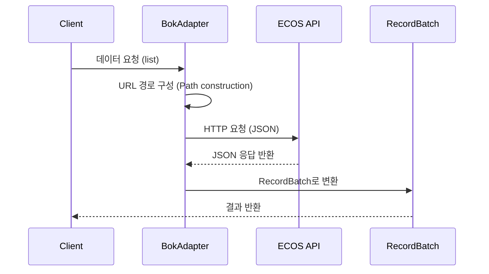

# 한국은행 ECOS (bok)

## 개요

한국은행 경제통계시스템(ECOS)은 우리나라의 주요 경제지표를 조회할 수 있는 오픈 API 서비스입니다. KPubData는 ECOS의 복잡한 URL 경로 기반 파라미터 구조를 추상화하여, 표준화된 인터페이스로 경제 통계 데이터를 쉽게 조회할 수 있게 합니다.



- KPubData provider 이름: `bok`
- API 기반 URL: https://ecos.bok.or.kr/api/

## API 키 발급 방법

1. [한국은행 ECOS 오픈 API 사이트](https://ecos.bok.or.kr/api/)에 접속합니다.
2. 상단 메뉴에서 "인증키 신청"을 클릭합니다.
3. 본인인증 절차를 거쳐 회원가입을 완료합니다.
4. 마이페이지에서 발급된 API 키를 확인합니다.
5. 환경변수에 설정합니다.

```bash
export KPUBDATA_BOK_API_KEY="your-key"
```

## 지원 데이터셋

### base_rate (한국은행 기준금리)

한국은행 금융통화위원회에서 결정하는 정책금리 데이터를 조회합니다.

- 통계 코드: `722Y001`
- 항목 코드: `0101000` (한국은행 기준금리)
- 필수 파라미터: `start_date`, `end_date`
- 날짜 형식: `YYYYMM` (예: `"202401"`)
- frequency: `M` (월별, 기본값), `D` (일별), `A` (연간)

## 실사용 예제

### 기본 조회: 월별 기준금리 출력

```python
from kpubdata import Client

client = Client.from_env()
ds = client.dataset("bok.base_rate")

result = ds.list(start_date="202401", end_date="202412")

for item in result.items:
    print(f"{item['TIME']} — {item['DATA_VALUE']}%")
```

출력 예시:

```
202401 — 3.5%
202402 — 3.5%
202403 — 3.5%
...
202410 — 3.5%
202411 — 3.25%
202412 — 3.0%
```

### 단일 월 조회

```python
result = ds.list(start_date="202406", end_date="202406")

item = result.items[0]
print(f"{item['TIME']}월 기준금리: {item['DATA_VALUE']}%")
# 202406월 기준금리: 3.5%
```

### 기준금리 변동 감지

```python
result = ds.list(start_date="202401", end_date="202412")

rates = [float(item["DATA_VALUE"]) for item in result.items]
unique_rates = set(rates)

if len(unique_rates) == 1:
    print(f"2024년 기준금리 변동 없음: {rates[0]}%")
else:
    print(f"2024년 기준금리 변동 발생: {sorted(unique_rates)}")
```

### 연도별 평균 기준금리 비교

```python
result_2023 = ds.list(start_date="202301", end_date="202312")
result_2024 = ds.list(start_date="202401", end_date="202412")

avg_2023 = sum(float(i["DATA_VALUE"]) for i in result_2023.items) / len(result_2023.items)
avg_2024 = sum(float(i["DATA_VALUE"]) for i in result_2024.items) / len(result_2024.items)

print(f"2023 평균: {avg_2023:.2f}%")
print(f"2024 평균: {avg_2024:.2f}%")
print(f"변동폭: {avg_2024 - avg_2023:+.2f}%p")
```

### 월별 기준금리 표 만들기

```python
result = ds.list(start_date="202401", end_date="202406")

rows = []
for item in result.items:
    period = item["TIME"]
    rate = item["DATA_VALUE"]
    rows.append((period, rate))

print("| 기간   | 기준금리 |")
print("|--------|----------|")
for period, rate in rows:
    print(f"| {period} | {rate}%   |")
```

### call_raw로 원본 응답 확인

표준화된 필드 외에 원본 응답 데이터 전체가 필요한 경우 `call_raw` 메서드를 사용합니다.

```python
raw = ds.call_raw("StatisticSearch", start_date="202401", end_date="202412")

# 원본 응답 구조 확인
print(raw.keys())  # dict_keys(['StatisticSearch'])
```

## 응답 필드 구조

`list()` 호출 시 반환되는 `RecordBatch`의 각 item은 다음 필드를 포함합니다.

| 필드 | 설명 | 예시 |
|---|---|---|
| `STAT_CODE` | 통계 코드 | `"722Y001"` |
| `STAT_NAME` | 통계명 | `"1.3.1. 한국은행 기준금리 및 여수신금리"` |
| `ITEM_CODE1` | 항목 코드 | `"0101000"` |
| `ITEM_NAME1` | 항목명 | `"한국은행 기준금리"` |
| `UNIT_NAME` | 단위 | `"연%"` |
| `TIME` | 기간 (YYYYMM) | `"202401"` |
| `DATA_VALUE` | 데이터 값 (문자열) | `"3.5"` |
| `ITEM_CODE2`~`ITEM_CODE4` | 추가 항목 코드 | `null` |
| `ITEM_NAME2`~`ITEM_NAME4` | 추가 항목명 | `null` |
| `WGT` | 가중치 | `null` |

## BOK ECOS API 특이사항

- URL 경로 기반 파라미터 전달 (쿼리 스트링이 아닌 URL 세그먼트 방식)
- URL 구조: `{base_url}/{api_key}/json/{operation}/{start}/{end}/{stat_code}/{frequency}/{start_date}/{end_date}/{item_code}`
- 페이지네이션: `start_index`와 `end_index` 기반
- 에러 응답: `RESULT.CODE`와 `RESULT.MESSAGE` 필드 포함
- 날짜 형식은 frequency에 따라 달라짐 (월별=`YYYYMM`, 일별=`YYYYMMDD`, 연간=`YYYY`)

## 참고 사항

- 호출 제한: 개인 개발용 키 하루 최대 10,000건
- 응답 형식: JSON
- 통계 코드 확인: [ECOS 통계목록](https://ecos.bok.or.kr/api/)에서 확인

## 실 API 검증 현황

| 테스트 | 검증 내용 | 결과 |
|---|---|---|
| `test_base_rate_returns_record_batch` | list() 기본 호출 및 RecordBatch 반환 | 통과 |
| `test_base_rate_raw_returns_envelope` | call_raw() 원본 응답 구조 | 통과 |
| `test_base_rate_item_has_required_fields` | 응답 필드 존재 여부 | 통과 |
| `test_base_rate_stat_code_is_correct` | 통계 코드 정합성 | 통과 |
| `test_base_rate_total_count_matches_items` | total_count와 items 수 일치 | 통과 |
| `test_base_rate_monthly_count` | 12개월 조회 시 12건 반환 | 통과 |
| `test_base_rate_data_value_is_numeric_string` | DATA_VALUE 숫자 파싱 가능 | 통과 |
| `test_base_rate_time_format` | TIME 필드 YYYYMM 형식 | 통과 |
| `test_base_rate_reasonable_range` | 기준금리 0~20% 범위 | 통과 |
| `test_usage_print_monthly_rates` | 월별 기준금리 출력 | 통과 |
| `test_usage_detect_rate_change` | 금리 변동 감지 | 통과 |
| `test_usage_compare_year_over_year` | 연도별 비교 | 통과 |
| `test_usage_single_month_query` | 단일 월 조회 | 통과 |

## 트러블슈팅

### 날짜 형식 오류 (ERROR-101)
- 현상: `start_date`를 `"20240101"` (YYYYMMDD)로 보내면 에러 발생
- 올바른 형식: `"202401"` (YYYYMM, 월별 데이터이므로)
- 실제 에러 출력:
```python
# 잘못된 예 (YYYYMMDD → 에러 발생)
result = ds.list(start_date="20240101", end_date="20241231")
# ProviderResponseError: BOK ECOS returned error (CODE: ERROR-101)

# 올바른 예 (YYYYMM)
result = ds.list(start_date="202401", end_date="202412")
```

### API 키 오류
- 현상: 잘못된 키 사용 시
```
kpubdata.exceptions.AuthError: 인증키가 유효하지 않습니다.
```

### 호출 한도 초과
- 현상: 일 10,000건 초과 시
```
kpubdata.exceptions.RateLimitError: 일일 호출한도를 초과하였습니다.
```

## 관련 문서

- [한국은행 ECOS Open API](https://ecos.bok.or.kr/api/)
- [SUPPORTED_DATA.md](../../SUPPORTED_DATA.md)
