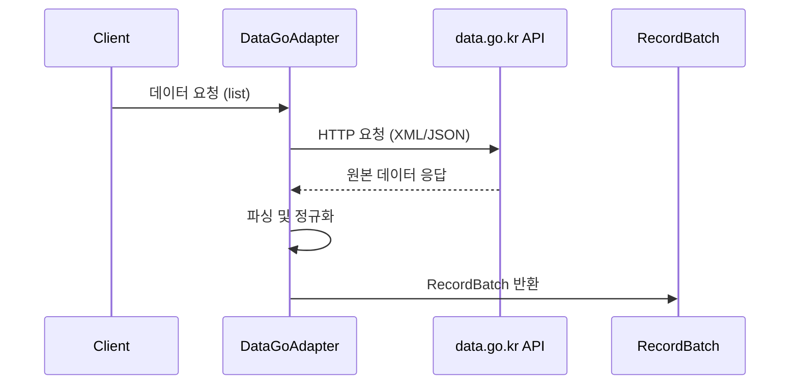

# 공공데이터포털 (datago)

## 개요

공공데이터포털(data.go.kr)은 대한민국 정부에서 운영하는 공공데이터 통합 플랫폼입니다. 기상청, 국토교통부, 한국환경공단 등 수많은 기관의 데이터를 Open API 형태로 제공합니다.



- KPubData provider 이름: `datago`
- API 기반 URL: https://apis.data.go.kr

## API 키 발급 방법

### 1단계: 회원가입

1. [공공데이터포털](https://www.data.go.kr)에 접속합니다.
2. 우측 상단의 "회원가입"을 클릭합니다.
3. 본인인증(휴대폰 또는 아이핀)을 거쳐 가입을 완료합니다.

### 2단계: API 활용신청

**중요: 공공데이터포털은 API별로 개별 활용신청이 필요합니다.** 인증키는 계정당 하나지만, 사용하려는 각 API에 대해 별도로 활용신청을 해야 합니다.

1. [공공데이터포털](https://www.data.go.kr)에 로그인합니다.
2. 상단 검색창에서 사용하려는 API를 검색합니다.
   - 예: "단기예보", "아파트매매 실거래", "대기오염정보" 등
3. 검색 결과에서 원하는 API의 상세 페이지로 이동합니다.
4. **"활용신청"** 버튼을 클릭합니다.
5. 활용목적 선택 화면에서 적절한 항목을 선택합니다.
   - "기타"를 선택한 경우 아래와 같이 작성합니다:

   ```
   한국 공공데이터 통합 조회 오픈소스 Python 라이브러리(KPubData) 개발 및 API 연동 테스트 목적으로 활용합니다.
   ```

6. 신청서를 제출합니다.

### 3단계: 승인 대기

- **자동 승인**: 기상청, 한국환경공단 등 대부분의 API는 신청 즉시 자동 승인됩니다.
- **심의 승인**: 국토교통부 아파트매매 실거래가 등 일부 API는 담당 기관의 심의 후 승인까지 1~2일이 소요될 수 있습니다.

### 4단계: 인증키 확인

1. 승인이 완료되면 "마이페이지"로 이동합니다.
2. **"개인 API인증키"** 섹션에서 발급된 인증키를 확인합니다.
3. 공공데이터포털은 두 종류의 인증키를 제공합니다:
   - **일반 인증키 (Decoding)**: 원본 키. KPubData에서는 이 키를 사용합니다.
   - **Encoding 인증키**: URL 인코딩된 키. 직접 URL을 구성할 때 사용합니다.

### 5단계: 환경변수 설정

```bash
export KPUBDATA_DATAGO_API_KEY="발급받은-일반-인증키"
```

### 6단계: 키 활성화 대기

**중요: API 키는 발급 직후 바로 사용할 수 없습니다.**

- 발급 후 **1~2시간**의 활성화 대기 시간이 필요합니다.
- 이 시간 동안 공공데이터포털 시스템이 각 API 제공기관의 서버와 인증키를 동기화합니다.
- 동기화 완료 전에는 `SERVICE_KEY_IS_NOT_REGISTERED_ERROR` 또는 `401 Unauthorized` 에러가 발생합니다.
- 동기화 시간은 제공기관에 따라 다를 수 있으며, 드물게 2시간 이상 걸리는 경우도 있습니다.

### 7단계: 활성화 확인

키가 활성화되었는지 확인하려면 다음과 같이 테스트합니다:

```bash
# curl로 직접 테스트 (단기예보 API 예시)
curl "http://apis.data.go.kr/1360000/VilageFcstInfoService_2.0/getVilageFcst?serviceKey=YOUR_KEY&dataType=json&numOfRows=1&pageNo=1&base_date=20250401&base_time=0500&nx=55&ny=127"
```

정상 응답이 오면 활성화가 완료된 것입니다. `SERVICE_KEY_IS_NOT_REGISTERED_ERROR` 에러가 나오면 조금 더 기다려야 합니다.

## KPubData에서 신청해야 할 API 목록

현재 KPubData가 지원하는 datago 데이터셋을 모두 사용하려면, 아래 6개 API를 각각 활용신청해야 합니다.

| # | data.go.kr 검색어 | 제공기관 | 승인 방식 |
|---|---|---|---|
| 1 | `단기예보 조회서비스` | 기상청 | 자동 승인 |
| 2 | `초단기실황 조회서비스` | 기상청 | 자동 승인 |
| 3 | `대기오염정보 조회서비스` | 한국환경공단 | 자동 승인 |
| 4 | `경기도 버스도착정보` | 경기도 | 자동 승인 |
| 5 | `병원정보서비스` | 건강보험심사평가원 | 자동 승인 |
| 6 | `아파트매매 실거래 상세 자료` | 국토교통부 | 심의 승인 (1~2일) |

## 지원 데이터셋

### village_fcst (단기예보 조회서비스)

기상청에서 제공하는 단기예보 정보입니다. 3시간 단위의 기온, 강수량, 하늘 상태 등을 조회할 수 있습니다.

- 제공 기관: 기상청
- 주요 파라미터: `base_date` (발표일자), `base_time` (발표시각), `nx` (예보지점 X 좌표), `ny` (예보지점 Y 좌표)

| 파라미터 | 필수 | 설명 | 예시 |
|---|---|---|---|
| base_date | 필수 | 발표일자 (YYYYMMDD) | "20250401" |
| base_time | 필수 | 발표시각 (HHMM) | "0500" |
| nx | 필수 | 예보지점 X좌표 | 55 |
| ny | 필수 | 예보지점 Y좌표 | 127 |

```python
from kpubdata import Client

client = Client.from_env()
ds = client.dataset("datago.village_fcst")

result = ds.list(base_date="20250401", base_time="0500", nx="55", ny="127")
for item in result.items[:5]:
    print(item)
```

### ultra_srt_ncst (초단기실황 조회서비스)

기상청에서 제공하는 실시간 기상 관측 정보입니다. 현재 시점의 기온, 강수량, 습도 등을 확인할 수 있습니다.

- 제공 기관: 기상청
- 주요 파라미터: `base_date`, `base_time`, `nx`, `ny`

| 파라미터 | 필수 | 설명 | 예시 |
|---|---|---|---|
| base_date | 필수 | 발표일자 (YYYYMMDD) | "20250401" |
| base_time | 필수 | 발표시각 (HHMM) | "0600" |
| nx | 필수 | 예보지점 X좌표 | 55 |
| ny | 필수 | 예보지점 Y좌표 | 127 |

```python
ds = client.dataset("datago.ultra_srt_ncst")
result = ds.list(base_date="20250401", base_time="0600", nx="55", ny="127")
```

### air_quality (대기오염정보 조회서비스)

한국환경공단(에어코리아)에서 제공하는 대기질 측정 정보입니다. 미세먼지(PM10), 초미세먼지(PM2.5), 오존 등의 농도를 조회합니다.

- 제공 기관: 한국환경공단
- 주요 파라미터: `sidoName` (시도 명칭), `numOfRows` (한 페이지 결과 수)

| 파라미터 | 필수 | 설명 | 예시 |
|---|---|---|---|
| sidoName | 필수 | 시도명 | "서울" |
| numOfRows | 선택 | 조회건수 | "5" |

```python
ds = client.dataset("datago.air_quality")
raw = ds.call_raw("getCtprvnRltmMesureDnsty", sidoName="서울", numOfRows="5")
```

### bus_arrival (경기도 버스도착정보 조회서비스)

경기도 내 버스 정류소의 실시간 버스 도착 정보를 제공합니다.

- 제공 기관: 경기도
- 주요 파라미터: `stationId` (정류소 아이디)

| 파라미터 | 필수 | 설명 | 예시 |
|---|---|---|---|
| stationId | 필수 | 정류소 ID | "200000078" |

```python
ds = client.dataset("datago.bus_arrival")
raw = ds.call_raw("getBusArrivalList", stationId="200000078")
```

### hospital_info (병원정보서비스)

건강보험심사평가원에서 제공하는 전국 병의원 기본 정보 및 위치 정보입니다.

- 제공 기관: 건강보험심사평가원
- 주요 파라미터: `numOfRows` (조회 건수)

| 파라미터 | 필수 | 설명 | 예시 |
|---|---|---|---|
| numOfRows | 선택 | 조회건수 | "10" |

```python
ds = client.dataset("datago.hospital_info")
raw = ds.call_raw("getHospBasisList", numOfRows="10")
```

### apt_trade (아파트매매 실거래가)

국토교통부에서 제공하는 아파트 매매 실거래가 상세 정보입니다.

- 제공 기관: 국토교통부
- 주요 파라미터: `LAWD_CD` (법정동 코드 앞 5자리), `DEAL_YMD` (계약년월)

| 파라미터 | 필수 | 설명 | 예시 |
|---|---|---|---|
| LAWD_CD | 필수 | 법정동코드 앞5자리 | "11110" |
| DEAL_YMD | 필수 | 계약년월 (YYYYMM) | "202401" |

**참고 (LAWD_CD 법정동 코드):**
- 서울 종로구: 11110
- 서울 강남구: 11680
- 경기도 수원시 장안구: 41111
- 각 지역의 코드는 [행정표준코드관리시스템](https://www.code.go.kr)에서 확인할 수 있습니다.

```python
ds = client.dataset("datago.apt_trade")
result = ds.list(LAWD_CD="11110", DEAL_YMD="202401")

for item in result.items[:5]:
    print(item)
```

## 공공데이터포털 API 특이사항

- **응답 형식**: JSON과 XML을 모두 지원하는 경우가 많으나, KPubData는 내부적으로 JSON 형식을 우선 사용합니다.
- **인증키 처리**: 발급받은 인증키는 인코딩된 상태로 제공될 수 있지만, KPubData가 내부적으로 적절히 처리하므로 발급받은 일반(Decoding) 키를 그대로 사용합니다.
- **정상 응답 판별**: 응답 데이터의 `header` 내 `resultCode`가 `"00"`이면 정상 응답이며, 그 외의 코드는 에러를 의미합니다.
- **일일 호출 제한**: API별로 일일 호출 제한 횟수가 설정되어 있으므로, 마이페이지에서 사용량을 확인할 수 있습니다.
- **프로토콜**: 일부 API는 `http`만 지원하고, 일부는 `https`도 지원합니다.

## 트러블슈팅

### 401 Unauthorized / SERVICE_KEY_IS_NOT_REGISTERED_ERROR

증상: API 키를 발급받았으나 호출 시 401 에러 또는 "SERVICE_KEY_IS_NOT_REGISTERED_ERROR" 메시지가 반환됩니다.

**실제 에러 예시 (Terminal/curl):**
```text
$ curl "http://apis.data.go.kr/..."
HTTP/1.1 401 Unauthorized
Content-Type: text/xml
...
<OpenAPI_ServiceResponse>
    <cmmMsgHeader>
        <errMsg>SERVICE KEY IS NOT REGISTERED.</errMsg>
        <returnAuthMsg>SERVICE_KEY_IS_NOT_REGISTERED_ERROR</returnAuthMsg>
        <returnReasonCode>30</returnReasonCode>
    </cmmMsgHeader>
</OpenAPI_ServiceResponse>
```

**실제 에러 예시 (Python/KPubData):**
```python
Traceback (most recent call last):
  File "example.py", line 8, in <module>
    result = ds.list(base_date="20250401", ...)
  File "kpubdata/core/dataset.py", line 45, in list
    return self.adapter.list(query)
  File "kpubdata/adapters/datago/base.py", line 112, in list
    raise AuthError("SERVICE_KEY_IS_NOT_REGISTERED_ERROR (30)")
kpubdata.exceptions.AuthError: SERVICE_KEY_IS_NOT_REGISTERED_ERROR (30)
```

원인 및 해결:

1. **키 활성화 대기**: 키 발급 후 1~2시간의 동기화 시간이 필요합니다. 시간이 지난 후 다시 시도하세요.
2. **활용신청 미완료**: 해당 API에 대한 활용신청이 승인되었는지 마이페이지에서 확인합니다.
3. **키 종류 확인**: 일반 인증키(Decoding)를 사용하고 있는지 확인합니다. Encoding 키는 URL을 직접 구성할 때 사용하는 것으로, KPubData에서는 일반 키를 사용해야 합니다.

### 에러코드 30: SERVICE_KEY_IS_NOT_REGISTERED_ERROR

인증키가 해당 API에 등록되지 않았거나, 아직 동기화되지 않은 상태입니다.

**XML 응답 예시:**
```xml
<OpenAPI_ServiceResponse>
    <cmmMsgHeader>
        <errMsg>SERVICE KEY IS NOT REGISTERED.</errMsg>
        <returnAuthMsg>SERVICE_KEY_IS_NOT_REGISTERED_ERROR</returnAuthMsg>
        <returnReasonCode>30</returnReasonCode>
    </cmmMsgHeader>
</OpenAPI_ServiceResponse>
```

- 활용신청 완료 여부를 마이페이지에서 확인합니다.
- 발급 직후라면 1~2시간 후 재시도합니다.
- 3시간 이상 지속되면 공공데이터 활용지원센터(1566-0025)에 문의합니다.

### 에러코드 31: SERVICE_KEY_EXPIRED

인증키가 만료되었습니다. 마이페이지에서 키를 갱신합니다.

### 에러코드 32: UNREGISTERED_IP

호출하는 IP가 등록되지 않은 경우입니다. 일부 API는 IP 화이트리스트를 요구합니다.

### SSL/TLS 관련 에러

일부 API에서 `https`로 호출할 때 SSL 에러가 발생할 수 있습니다.

- KPubData의 catalogue.json에 정의된 base_url은 `http`를 사용합니다.
- 로컬 테스트 환경에서 SSL 에러가 발생하면 `http` 프로토콜로 호출되는지 확인합니다.

### 심의 승인 대기 중

국토교통부 등 일부 기관의 API는 자동 승인이 아닌 심의 승인 방식입니다.

- 마이페이지에서 처리상태가 "승인"인지 확인합니다.
- 심의 중인 경우 1~2일(영업일) 기다려야 합니다.
- 반려된 경우 활용 목적을 보다 구체적으로 작성하여 재신청합니다.

## 기여자를 위한 새 데이터셋 추가 가이드

공공데이터포털에는 수천 개의 Open API가 존재합니다. 새로운 datago 데이터셋을 KPubData에 추가하려면 다음 절차를 따릅니다.

### 1. API 선정 및 이슈 등록

1. [data.go.kr](https://www.data.go.kr)에서 추가하려는 API를 검색합니다.
2. API 상세 페이지에서 다음 정보를 확인합니다:
   - **서비스 유형**: REST 인지 확인 (SOAP은 지원 불가)
   - **데이터 포맷**: JSON 또는 XML 지원 여부
   - **End Point**: base URL
   - **오퍼레이션 목록**: 사용 가능한 API 메서드명
3. GitHub에 이슈를 등록합니다 (제목: `feat: datago - [API명] 어댑터 추가`).

### 2. API 키 발급 및 활용신청

1. 위 "API 키 발급 방법" 절차를 따라 해당 API에 대한 활용신청을 완료합니다.
2. 키 활성화까지 1~2시간 대기합니다.
3. curl 또는 브라우저에서 API 호출이 성공하는지 확인합니다.

### 3. Fixture 저장

API의 실제 응답을 fixture 파일로 저장합니다.

```bash
# API를 직접 호출하여 응답을 fixture로 저장
curl "http://apis.data.go.kr/[SERVICE_PATH]/[OPERATION]?serviceKey=YOUR_KEY&..." > tests/fixtures/datago/[dataset_name].json
```

- 저장 위치: `tests/fixtures/datago/[dataset_name].json`
- JSON과 XML 응답 모두 저장하는 것을 권장합니다.

### 4. catalogue.json에 데이터셋 등록

`src/kpubdata/providers/datago/catalogue.json`에 새 데이터셋 항목을 추가합니다.

```json
{
  "dataset_key": "your_dataset",
  "name": "데이터셋 한글명 (English Name)",
  "base_url": "http://apis.data.go.kr/[SERVICE_PATH]",
  "default_operation": "[DEFAULT_OPERATION]",
  "representation": "api_json",
  "service_key_param": "serviceKey",
  "format_param": "resultType",
  "description": "English description of the dataset",
  "operations": ["list", "raw"],
  "query_support": {
    "pagination": "offset",
    "max_page_size": 1000
  }
}
```

주의 사항:
- `format_param`은 API마다 다릅니다 (`resultType`, `dataType`, `returnType`, `_type` 등). API 문서를 확인하세요.
- `base_url`은 API 상세 페이지의 End Point를 참고합니다.

### 5. 테스트 작성

- **unit test**: `tests/unit/adapters/test_datago_[dataset].py`
- **contract test**: `tests/contract/` 디렉토리에 추가
- **integration test**: `tests/integration/test_datago_live.py`에 테스트 추가

### 6. 문서 업데이트

- 이 문서(`docs/providers/datago.md`)의 "지원 데이터셋" 섹션에 새 데이터셋 추가
- `SUPPORTED_DATA.md` 업데이트

### 7. PR 제출

- 브랜치명: `feat/issue-[NUMBER]-[dataset-name]`
- PR에 포함해야 할 것: fixture, catalogue.json 변경, 테스트, 문서 업데이트

## Integration 테스트 실행

datago의 실 API 테스트를 실행하려면:

```bash
# 환경변수 설정
export KPUBDATA_DATAGO_API_KEY="your-key"

# datago integration 테스트만 실행
uv run pytest tests/integration/test_datago_live.py -m integration -ra -v
```

## 실 API 검증 현황

현재 datago 데이터셋은 fixture 기반 테스트 검증 단계입니다. 실 API 검증은 키 활성화 후 진행 예정입니다.

## 관련 문서

- [공공데이터포털 공식 사이트](https://www.data.go.kr)
- [공공데이터 활용지원센터](https://www.data.go.kr/bbs/qna/list.do) (문의: 1566-0025)
- [datago API 기술 참고자료](../datago-api-reference.md)
- [SUPPORTED_DATA.md](../../SUPPORTED_DATA.md)
