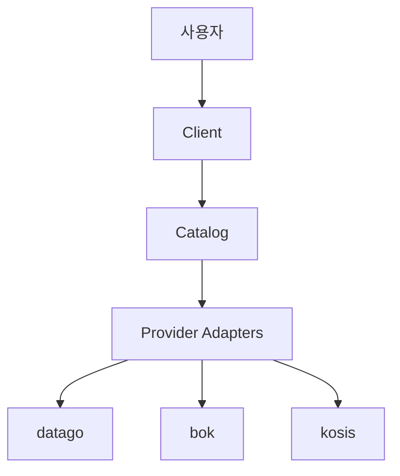

# Provider 가이드

- [공공데이터포털 (datago)](datago.md)
- [한국은행 (BOK)](bok.md)
- [통계청 (KOSIS)](kosis.md)

### Provider 아키텍처

### Provider 요약

| Provider | ID | 데이터셋 수 | 상태 |
|---|---|---|---|
| 공공데이터포털 | `datago` | 6 | 지원 |
| 한국은행 ECOS | `bok` | 1 | 지원 |
| 통계청 KOSIS | `kosis` | 1 | 지원 |

