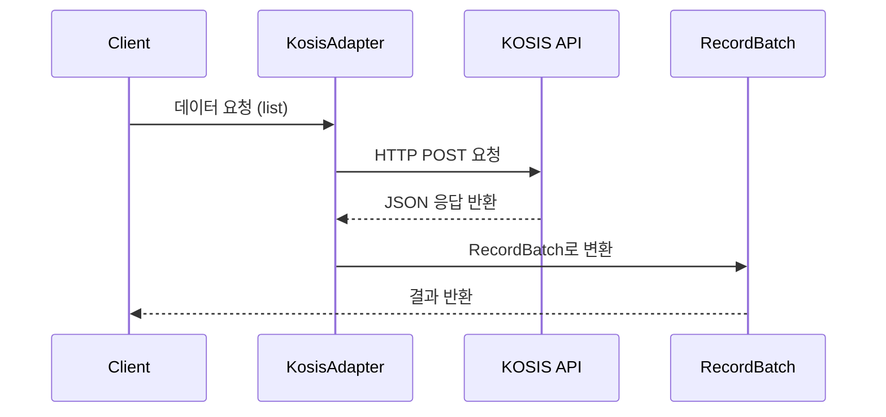

# 통계청 KOSIS (kosis)

## 개요

국가통계포털(KOSIS)은 통계청이 제공하는 대한민국 최대의 통계 서비스입니다. KPubData는 KOSIS Open API의 복잡한 쿼리 파라미터 구조를 추상화하여, 국가 승인 통계 데이터를 표준화된 방식으로 제공합니다.



- KPubData provider 이름: `kosis`
- API 기반 URL: https://kosis.kr/openapi/

## API 키 발급 방법

1. [KOSIS Open API 포털](https://kosis.kr/openapi/index/index.jsp)에 접속합니다.
2. 로그인 또는 회원가입을 완료합니다.
3. 메뉴에서 "활용신청"을 클릭하여 승인을 받습니다.
4. 마이페이지의 인증키 관리에서 발급된 API 키를 확인합니다.
5. 환경변수에 설정합니다.

```bash
export KPUBDATA_KOSIS_API_KEY="your-key"
```

6. 자세한 사항은 [KOSIS 개발자 가이드](https://kosis.kr/openapi/devGuide/devGuide_0203List.do)를 참고하세요.

## 지원 데이터셋

### population_migration (시도별 이동자수)

전국 시도 간 전입 및 전출 인구 이동 현황을 제공합니다. 이 데이터셋은 시도별 이동자수와 순이동자수를 포함하며, 전출지와 전입지 조합에 따른 상세 데이터를 조회할 수 있습니다.

- 통계기관 코드: `101` (통계청)
- 통계표 ID: `DT_1B26003_A01`
- 필수 파라미터: `start_date`, `end_date`
- 날짜 형식: `YYYYMM` (예: `"202401"`)
- 기간 구분: `M` (월별, 기본값)

## 실사용 예제

### 기본 조회: 월별 이동자수 출력

```python
from kpubdata import Client

client = Client.from_env()
ds = client.dataset("kosis.population_migration")

# 2024년 1월 데이터 조회
result = ds.list(start_date="202401", end_date="202401")

for item in result.items[:5]:
    print(f"{item['C1_NM']} -> {item['C2_NM']} ({item['ITM_NM']}): {item['DT']}명")
```

출력 예시:

```
전국 -> 전국 (이동자수): 596969명
전국 -> 서울특별시 (이동자수): 101416명
전국 -> 부산광역시 (이동자수): 34812명
전국 -> 대구광역시 (이동자수): 26868명
전국 -> 인천광역시 (이동자수): 35326명
```

### 전국 월별 총 이동자수 추출

전출지와 전입지가 모두 "전국"이고 항목명이 "이동자수"인 레코드만 필터링합니다.

```python
result = ds.list(start_date="202401", end_date="202412")

for item in result.items:
    if item["C1_NM"] == "전국" and item["C2_NM"] == "전국" and item["ITM_NM"] == "이동자수":
        print(f"{item['PRD_DE']} 전국 이동자수: {item['DT']}명")
```

### 서울 전입/전출 데이터 필터링

전출지(C1_NM)가 "서울특별시"인 데이터를 추출하여 서울에서 다른 지역으로 이동한 현황을 확인합니다.

```python
result = ds.list(start_date="202401", end_date="202401")

seoul_out = [i for i in result.items if i["C1_NM"] == "서울특별시" and i["ITM_NM"] == "이동자수"]
for item in seoul_out[:5]:
    print(f"서울 -> {item['C2_NM']}: {item['DT']}명")
```

### 순이동자수 조회

항목명(ITM_NM)이 "순이동자수"인 데이터를 필터링합니다. 순이동자수는 해당 지역으로의 전입자수에서 전출자수를 뺀 값입니다.

```python
result = ds.list(start_date="202401", end_date="202401")

net_migration = [i for i in result.items if i["ITM_NM"] == "순이동자수" and i["C1_NM"] != "전국"]
for item in net_migration[:5]:
    print(f"{item['C1_NM']} 순이동자수: {item['DT']}명")
```

### 시도별 이동자수 랭킹

전국 데이터를 제외하고 시도별 총 이동자수를 기준으로 내림차순 정렬합니다.

```python
result = ds.list(start_date="202401", end_date="202401")

# 전입지 기준 총 이동자수 (전출지='전국', 전입지!='전국')
rank_data = [i for i in result.items if i["C1_NM"] == "전국" and i["C2_NM"] != "전국" and i["ITM_NM"] == "이동자수"]
sorted_rank = sorted(rank_data, key=lambda x: int(x["DT"]), reverse=True)

for i, item in enumerate(sorted_rank[:5], 1):
    print(f"{i}위: {item['C2_NM']} ({item['DT']}명)")
```

### call_raw 원본 응답 확인

표준화된 필드 외에 원본 응답 데이터 전체가 필요한 경우 `call_raw` 메서드를 사용합니다. KOSIS는 JSON 배열 형태의 원본 데이터를 반환합니다.

```python
raw = ds.call_raw("statisticsParameterData", startPrdDe="202401", endPrdDe="202401")

# 원본 응답은 리스트 형태입니다.
print(type(raw))  # <class 'list'>
print(raw[0].keys())
```

## 응답 필드 구조

`list()` 호출 시 반환되는 `RecordBatch`의 각 item은 다음 22개 필드를 포함합니다.

| 필드 | 설명 | 예시 |
|---|---|---|
| TBL_ID | 통계표 ID | "DT_1B26003_A01" |
| TBL_NM | 통계표명 | "시도별 이동자수" |
| ORG_ID | 통계기관 코드 | "101" |
| C1_OBJ_NM | 분류1 객체명 (전출지) | "행정구역(시도)별" |
| C1_OBJ_NM_ENG | 분류1 객체명(영문) | "By Administrative District" |
| C1_NM | 분류1 이름 (전출지) | "서울특별시" |
| C1_NM_ENG | 분류1 이름(영문) | "Seoul" |
| C2_OBJ_NM | 분류2 객체명 (전입지) | "행정구역(시도)별" |
| C2_OBJ_NM_ENG | 분류2 객체명(영문) | "By Administrative District" |
| C2_NM | 분류2 이름 (전입지) | "경기도" |
| C2_NM_ENG | 분류2 이름(영문) | "Gyeonggi-do" |
| C2 | 분류2 코드 | "41" |
| C1 | 분류1 코드 | "11" |
| ITM_ID | 항목 ID | "T10" |
| ITM_NM | 항목명 | "이동자수" |
| ITM_NM_ENG | 항목명(영문) | "Movers" |
| DT | 데이터 값 | "596969" |
| PRD_DE | 기간 (YYYYMM) | "202401" |
| PRD_SE | 기간 구분 | "M" |
| UNIT_NM | 단위 | "명" |
| UNIT_NM_ENG | 단위(영문) | "Person" |
| LST_CHN_DE | 최종 변경일 | "20240220" |

## KOSIS API 특이사항

- 파라미터 전달 방식: Query string 기반으로 전달합니다.
- 고정 기본 파라미터: apiKey, format(json), jsonVD(Y), orgId, tblId 등을 사용합니다.
- 대량 데이터 응답: 시도별 이동자수 데이터셋의 경우, 단일 월 조회 시에도 시도 간 모든 조합(전국 포함 약 18x18)과 항목(이동자수, 순이동자수)이 결합되어 약 7,776건의 대량 데이터가 반환될 수 있습니다.
- 기간 구분 속성: prdSe 파라미터로 기간 단위를 구분합니다. (M: 월, Q: 분기, A: 연)
- 에러 처리: 응답 데이터에 "err" 코드가 포함되거나 "errMsg" 메시지가 있을 경우 예외를 발생시킵니다.
- 데이터 구조: 정상 응답 시 사전(dict) 객체들을 담은 리스트(array) 형식으로 데이터를 반환합니다.

## 트러블슈팅

### API 키 만료 에러 (실제 출력)
- **현상**: 에러코드 12 ("인증KEY의 기간이 만료되었습니다") 발생
- **원인**: KOSIS API 키는 보안을 위해 일정 기간이 지나면 자동 만료됩니다.
- 실제 Python 에러 출력:
```python
result = ds.list(start_date="202401", end_date="202401")
# kpubdata.exceptions.AuthError: 인증KEY의 기간이 만료되었습니다 (provider_code: 12)
```
- **해결**: [KOSIS 마이페이지]의 인증키 관리 메뉴에서 해당 키의 "연장" 버튼을 클릭하면 즉시 다시 사용할 수 있습니다.

### 잘못된 통계표 ID
```python
# 존재하지 않는 tblId를 사용한 경우
# kpubdata.exceptions.InvalidRequestError: 해당 자료가 없습니다 (provider_code: 10)
```

### 대량 데이터 처리
- **현상**: 단일 월 조회임에도 응답 속도가 느리거나 데이터 양이 많음
- **원인**: KOSIS는 요청한 기간의 모든 분류 조합을 한 번에 반환합니다. 시도별 이동자수는 시도x시도 전체 조합을 포함하기 때문입니다.
- **해결**: `RecordBatch`의 필터 기능을 사용하거나, 파이썬 리스트 컴프리헨션을 통해 필요한 지역(예: C1_NM="전국")만 먼저 추출하여 사용하세요.

## 참고 사항

- 응답 데이터 형식은 JSON을 기본으로 합니다.
- API별로 일일 호출 횟수 제한이 존재합니다.
- 특정 통계표를 조회하려면 KOSIS 통계목록에서 통계표 ID와 기관 ID를 미리 확인해야 합니다.

## 실 API 검증 현황

| 테스트 | 검증 내용 | 결과 |
|---|---|---|
| test_population_migration_returns_record_batch | list() 기본 호출 및 RecordBatch 반환 | 통과 |
| test_population_migration_raw_returns_list | call_raw() 원본 응답 구조 (리스트 반환) | 통과 |
| test_item_has_required_fields | 응답 필드 존재 여부 | 통과 |
| test_tbl_id_is_correct | 통계표 ID 정합성 (DT_1B26003_A01) | 통과 |
| test_org_id_is_correct | 통계기관 코드 정합성 (101) | 통과 |
| test_total_count_matches_items | total_count와 items 수 일치 | 통과 |
| test_multi_month_returns_more_data | 다월 조회 시 데이터 증가 | 통과 |
| test_dt_is_numeric_string | DT 값 숫자 파싱 가능 | 통과 |
| test_prd_de_format | PRD_DE 필드 YYYYMM 형식 | 통과 |
| test_unit_is_person | 단위 "명" 확인 | 통과 |
| test_usage_nationwide_monthly_migration | 전국 월별 이동자수 추출 | 통과 |
| test_usage_seoul_migration | 서울 이동 데이터 필터링 | 통과 |
| test_usage_net_migration | 순이동자수 데이터 추출 | 통과 |
| test_usage_region_ranking | 시도별 이동자수 랭킹 | 통과 |

## 관련 문서

- [KOSIS Open API 공식 홈페이지](https://kosis.kr/openapi/index/index.jsp)
- [KOSIS 개발자 가이드](https://kosis.kr/openapi/devGuide/devGuide_0203List.do)
- [SUPPORTED_DATA.md](../../SUPPORTED_DATA.md)
