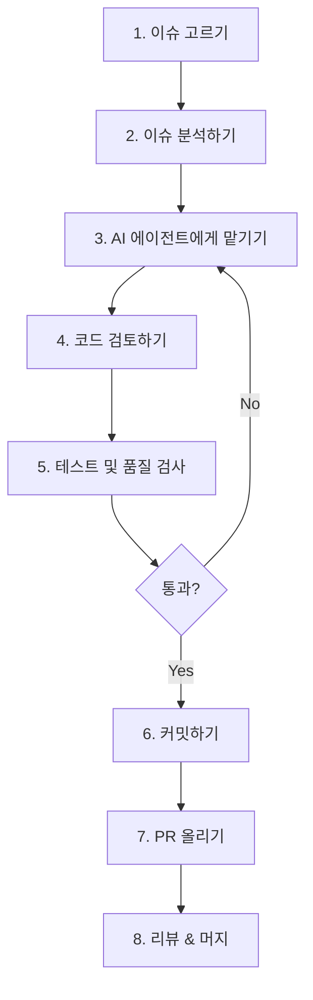
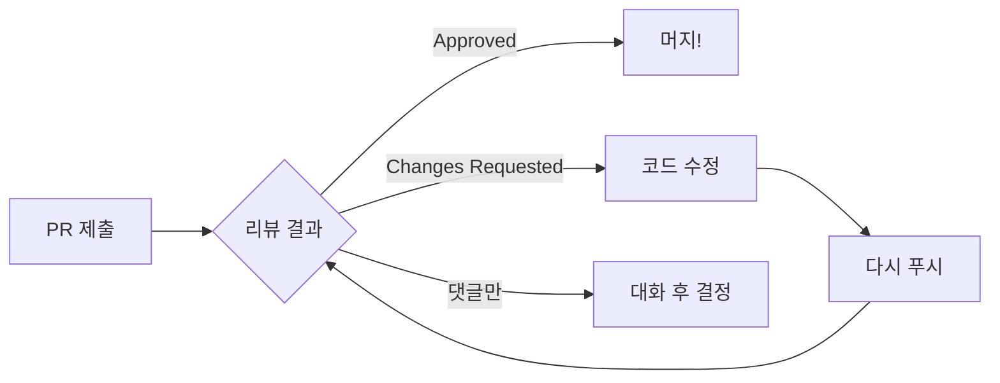
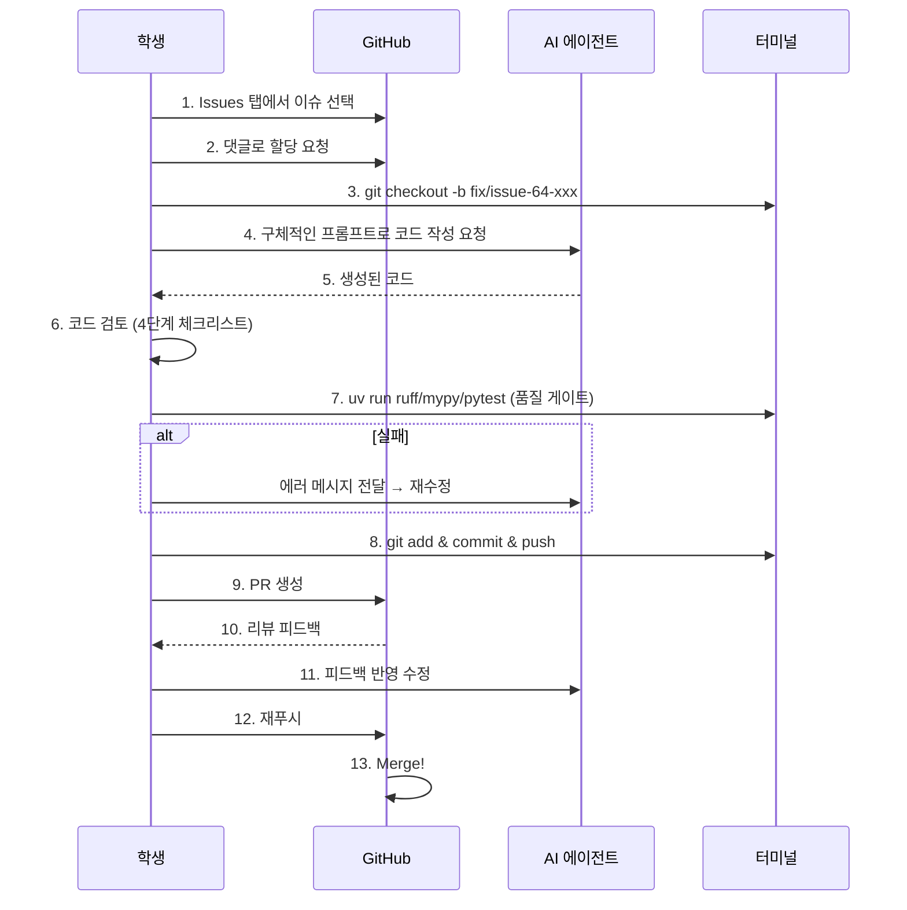

# AI 코딩 에이전트와 함께하는 오픈소스 기여 튜토리얼

이 문서는 대학교 2학년 정도의 기초 프로그래밍 지식을 가진 학생들을 위한 실전 가이드예요. GitHub에서 실제 이슈를 골라, AI 코딩 에이전트(GitHub Copilot, Cursor, Windsurf 등)의 도움을 받아 코드를 작성하고, PR(Pull Request)을 보내서 머지(Merge)되기까지의 **전체 과정**을 한 단계씩 따라가 볼게요.

> 이 튜토리얼은 실제 이슈 **[#64](https://github.com/yeongseon/kpubdata/issues/64)**를 예시로 사용해요. 따라 하면서 실제 기여까지 할 수 있어요!



---

## 0단계: 시작하기 전에

본격적으로 시작하기 전에 몇 가지 준비물이 필요해요.

| 준비물 | 설명 | 확인 방법 |
|:---|:---|:---|
| Git | 코드 버전 관리 도구 | `git --version` |
| Python 3.10+ | 이 프로젝트의 언어 | `python --version` |
| uv | 빠른 Python 패키지 관리 도구 | `uv --version` |
| AI 코딩 도구 | GitHub Copilot, Cursor, Windsurf 중 하나 | 에디터에서 설치 확인 |
| GitHub 계정 | 코드 기여를 위해 필수 | [github.com](https://github.com) |

개발 환경 설정(Fork, Clone, uv sync 등)은 [CONTRIBUTING.md](../CONTRIBUTING.md)의 **"2. 개발 환경 설정"** 섹션에 자세히 나와 있으니 먼저 완료해 주세요.

환경 설정이 끝나면 아래 명령어 4개가 모두 성공하는지 확인하세요:

```bash
uv sync --extra dev    # 패키지 설치
uv run pytest          # 테스트 통과
uv run ruff check .    # 코드 스타일
uv run mypy src        # 타입 체크
```

> 이 4개 명령어는 앞으로 계속 반복해서 쓰게 돼요. 외워두면 편해요!

---

## 1단계: 이슈 고르기

### 어디서 찾나요?

프로젝트의 [Issues 탭](https://github.com/yeongseon/kpubdata/issues)으로 가세요. 이슈 목록이 보일 거예요. 이때 **라벨(Label)**이 중요해요:

| 라벨 | 의미 | 초보자 추천 |
|:---|:---|:---|
| `good first issue` | 처음 기여하는 사람에게 적합 | 강력 추천 |
| `difficulty:beginner` | 간단한 수정 작업 | 추천 |
| `difficulty:intermediate` | 중간 난이도 | 경험 쌓은 후 도전 |
| `type:docs` | 문서 관련 작업 | 코드 없이 시작 가능 |
| `type:feature` | 기능 구현 | 이슈에 따라 다름 |

### 이번 튜토리얼에서 사용할 이슈

우리는 **[#64 — transport/decode.py 예외 경계 정리](https://github.com/yeongseon/kpubdata/issues/64)**를 함께 해결할 거예요.

- **한 줄 요약**: `decode.py`에서 발생하는 `ValueError`를 프로젝트 전용 에러인 `ParseError`로 바꾸는 작업이에요.
- **난이도**: `difficulty:beginner` — 3개 파일만 수정하면 돼요.
- **왜 하는 거예요?**: 파이썬 기본 에러(`ValueError`)를 쓰면 "이 에러가 우리 프로젝트에서 온 건지, 다른 라이브러리에서 온 건지" 구분이 안 돼요. 프로젝트 전용 에러로 바꾸면 디버깅이 훨씬 쉬워져요.

### 다른 초보자 추천 이슈

| 이슈 | 제목 | 난이도 | 유형 |
|:---|:---|:---|:---|
| [#65](https://github.com/yeongseon/kpubdata/issues/65) | 미완성 adapter(seoul, airkorea) public export 정리 | beginner | 코드 정리 |
| [#59](https://github.com/yeongseon/kpubdata/issues/59) | More examples and documentation | beginner | 문서/예제 |

### 이슈 할당받기

마음에 드는 이슈를 찾았다면, 이슈 댓글에 아래처럼 남겨서 할당을 요청하세요:

```
I'd like to work on this issue. Could you assign it to me?
```

---

## 2단계: 이슈 분석하기

AI에게 바로 던지기 전에, **우리가 먼저 이해해야** 해요. 이해 없이 AI에게 맡기면 엉뚱한 결과가 나와요.

### 이슈 읽기 체크리스트

이슈 #64를 예시로 하나씩 확인해 볼게요:

- [x] **왜 하는 건가?** → `ValueError`가 stdlib 예외라 프로젝트 에러 계층(`PublicDataError`)과 분리되어 있어요.
- [x] **어떤 파일을 수정하나?** → 3곳이에요:
  1. `src/kpubdata/transport/decode.py` — `ValueError` → `ParseError`로 교체
  2. `src/kpubdata/providers/datago/adapter.py` — 예외 처리 로직 정리
  3. `tests/unit/transport/test_decode*.py` — 테스트 기대값 수정
- [x] **완료 조건이 뭔가?** → 이슈 하단의 체크리스트를 확인하세요.
- [x] **관련 규칙이 있나?** → [AGENTS.md](../AGENTS.md)에서 `Any` 타입 금지, `type: ignore` 금지 등을 확인하세요.

### 관련 파일 미리 읽기

수정할 파일들을 에디터에서 열어서 훑어보세요. "지금 코드가 어떻게 생겼는지" 파악하는 게 목적이에요.

```bash
# 수정 대상 파일들 열기 (VS Code 기준)
code src/kpubdata/transport/decode.py
code src/kpubdata/providers/datago/adapter.py
code tests/unit/transport/
```

> 코드를 완벽히 이해할 필요는 없어요. "아, ValueError가 여기서 발생하는구나" 정도만 파악하면 충분해요.

### 작업 브랜치 만들기

분석이 끝났으면, 코드를 수정하기 전에 반드시 **새 브랜치**를 만들어야 해요. `main` 브랜치에서 직접 작업하면 안 돼요!

```bash
# 최신 코드 가져오기
git checkout main
git pull upstream main

# 작업 브랜치 만들기 (이슈 번호를 포함해요)
git checkout -b fix/issue-64-valueerror-to-parseerror
```

> 브랜치 이름 규칙: `fix/issue-<번호>-<짧은설명>` 또는 `feat/issue-<번호>-<짧은설명>`이에요. 자세한 규칙은 [CONTRIBUTING.md](../CONTRIBUTING.md)의 **"3-3. 브랜치 이름 규칙"**을 참고하세요.

---

## 3단계: AI 에이전트에게 맡기기

이제 AI의 도움을 받을 차례예요. **프롬프트(Prompt)를 어떻게 쓰느냐**에 따라 결과물 품질이 완전히 달라져요. 이슈 #64를 예시로 나쁜 프롬프트부터 좋은 프롬프트까지 비교해 볼게요.

### 나쁜 프롬프트 — "그냥 해줘"

```
이슈 #64 해결해줘.
```

이러면 AI는 이슈 번호만 보고 아무것도 모른 채 추측해야 해요. 엉뚱한 파일을 고치거나, 프로젝트 규칙을 무시한 코드가 나올 확률이 높아요.

### 보통 프롬프트 — "뭘 하는지만 알려줌"

```
src/kpubdata/transport/decode.py 파일에서 ValueError를 ParseError로 바꿔줘.
```

방향은 맞지만 부족해요:
- `ParseError`가 어디에 정의되어 있는지 안 알려줬어요
- 테스트 코드도 같이 수정해야 하는데 빠졌어요
- 어댑터 쪽 영향도 빠졌어요

### 좋은 프롬프트 — "맥락 + 범위 + 제약조건"

```
KPubData 프로젝트의 이슈 #64를 해결하고 싶어.

## 배경
transport/decode.py가 stdlib 예외인 ValueError를 던지고 있어서,
프로젝트 예외 계층(PublicDataError)과 일관성이 없어.

## 수정 범위
1. src/kpubdata/transport/decode.py
   - decode_json()의 ValueError → ParseError로 교체
   - decode_xml()의 ValueError → ParseError로 교체
   - ParseError는 kpubdata.exceptions에서 import
   - ImportError(xmltodict 미설치)는 그대로 유지

2. src/kpubdata/providers/datago/adapter.py
   - _request_and_decode()에서 except (ImportError, ValueError)를
     except ImportError로 변경 (ParseError는 이미 canonical이므로)
   - ImportError는 ConfigError로 매핑

3. tests/unit/transport/ 아래 테스트 파일
   - ValueError를 기대하는 부분 → ParseError를 기대하도록 변경

## 제약조건
- Any 타입 사용 금지
- type: ignore 사용 금지
- 기존 코드 스타일(들여쓰기, import 순서 등)을 유지할 것
- 코드와 변수명은 영어로 작성
```

### 더 나은 프롬프트 — "참고 파일도 같이 줌"

AI에게 관련 파일의 현재 내용을 함께 주면 정확도가 더 올라가요:

```
아래는 현재 decode.py의 코드야. 여기서 ValueError를 ParseError로 바꿔줘.
ParseError는 kpubdata.exceptions 모듈에 이미 정의되어 있어.

[decode.py 내용 붙여넣기]

주의사항:
- decode_xml()의 ImportError는 건드리지 마.
- from __future__ import annotations를 파일 상단에 유지해.
```

> **프롬프트 작성 핵심 공식**: `배경(왜?) + 범위(어디서 뭘?) + 제약조건(하지 말 것) + 참고자료(현재 코드)`

---

## 4단계: AI가 생성한 코드 검토하기

AI가 코드를 생성했다고 해서 바로 저장하면 안 돼요. **반드시 직접 검토**해야 해요. AI도 실수를 하거든요.

### 검토 체크리스트

| 항목 | 확인할 것 | #64 예시 |
|:---|:---|:---|
| 범위 초과 | 시키지 않은 파일을 수정하지 않았나? | decode.py, adapter.py, 테스트 파일만 수정했나? |
| `Any` 타입 | `typing.Any`가 쓰이지 않았나? | import나 타입 힌트에 Any 없는지 확인 |
| `type: ignore` | 타입 에러를 억지로 무시하지 않았나? | 주석으로 `# type: ignore` 없는지 확인 |
| import 경로 | ParseError를 올바른 모듈에서 import했나? | `from kpubdata.exceptions import ParseError` |
| 기존 스타일 | 들여쓰기, 줄 간격이 기존 코드와 같은가? | 주변 코드와 비교 |
| 에러 메시지 | 에러 메시지가 자연스러운 영어인가? | `"Failed to decode JSON"` 같은 형태 |
| 테스트 일관성 | 테스트가 새로운 예외를 올바르게 기대하나? | `pytest.raises(ParseError)` |

### AI가 자주 하는 실수들

> **빈 `except` 블록**: `except Exception: pass`처럼 에러를 삼켜버리면 버그를 찾기 어려워져요.

> **과도한 수정**: "이왕 고치는 김에" 하면서 관련 없는 코드까지 리팩토링하는 경우가 있어요. 이슈 범위 밖의 수정은 되돌리세요.

> **없는 모듈 import**: 프로젝트에 존재하지 않는 클래스나 함수를 import하는 경우가 있어요. 실제로 파일이 존재하는지 확인하세요.

---

## 5단계: 테스트 및 품질 검사

코드 검토가 끝났으면 **품질 게이트(Quality Gates)** 4개를 모두 통과해야 해요. 하나라도 실패하면 PR이 승인될 수 없어요.

```bash
# 1. 코드 스타일 검사 — 사용하지 않는 import, 잘못된 들여쓰기 등을 잡아줘요
uv run ruff check .

# 2. 코드 포맷팅 검사 — 줄 간격, 따옴표 스타일 등이 규칙에 맞는지 확인해요
uv run ruff format --check .

# 3. 타입 검사 — 함수 인자/반환 타입이 올바른지 확인해요
uv run mypy src

# 4. 테스트 실행 — 모든 기능이 정상 작동하는지 확인해요
uv run pytest
```

### 실패했을 때 대처법

**ruff 실패 시:**
```bash
# 자동으로 고칠 수 있는 문제는 자동 수정
uv run ruff check . --fix
uv run ruff format .
```

**mypy 실패 시:**
에러 메시지를 AI에게 보여주세요:
```
mypy에서 아래 에러가 났어. 어떻게 수정해야 해?
---
src/kpubdata/transport/decode.py:15: error: Missing return statement  [return]
```

**pytest 실패 시:**
실패한 테스트만 집중해서 다시 돌려보세요:
```bash
# 특정 테스트 파일만 실행
uv run pytest tests/unit/transport/test_decode.py -v

# 특정 테스트 함수만 실행
uv run pytest -k "test_decode_json_invalid" -v
```

> **테스트를 삭제하면 안 돼요!** 테스트가 실패한다고 테스트 코드를 지우는 건 "시험 문제가 어려우니까 문제를 찢어버리자"와 같아요. 코드를 고쳐서 테스트를 통과시키세요.

---

## 6단계: 커밋하기

4개 품질 게이트를 모두 통과했다면, 변경 사항을 Git에 기록(커밋)해요.

### 커밋 메시지 형식

이 프로젝트는 [Conventional Commits](https://www.conventionalcommits.org/) 스타일을 사용해요:

```
<타입>: <영어로 된 짧은 설명>
```

| 타입 | 의미 | 예시 |
|:---|:---|:---|
| `feat` | 새 기능 추가 | `feat: add air quality adapter` |
| `fix` | 버그 수정 | `fix: change ValueError to ParseError in decode.py` |
| `docs` | 문서 수정 | `docs: update API spec` |
| `test` | 테스트 추가/수정 | `test: update decode tests for ParseError` |
| `refactor` | 코드 구조 개선 | `refactor: simplify transport layer` |

### 이슈 #64 커밋 예시

```bash
# 변경 파일 확인
git status

# 변경 내용 확인 (꼭 한번 더 보세요!)
git diff

# 스테이징 및 커밋
git add src/kpubdata/transport/decode.py
git add src/kpubdata/providers/datago/adapter.py
git add tests/unit/transport/
git commit -m "fix: replace ValueError with ParseError in decode module"
```

> `git add .`으로 전부 추가해도 되지만, 수정한 파일만 정확히 추가하는 습관을 들이면 실수를 줄일 수 있어요.

> 커밋 메시지는 **반드시 영어**로 작성해요. 이 프로젝트의 언어 정책이에요.

---

## 7단계: PR 올리기

이제 여러분의 코드를 프로젝트에 합쳐달라고 요청(Pull Request)할 시간이에요!

### 브랜치 푸시

```bash
git push origin fix/issue-64-valueerror-to-parseerror
```

### GitHub에서 PR 생성

GitHub 웹사이트에 가면 노란색 배너로 **"Compare & pull request"** 버튼이 보여요. 클릭하고 아래 양식을 채워주세요.

**PR 제목:**
```
[#64] Replace ValueError with ParseError in decode module
```

**PR 본문 템플릿:**
```markdown
## 변경 사항
- `transport/decode.py`에서 `ValueError` → `ParseError`로 교체
- `datago/adapter.py`에서 불필요한 예외 래핑 제거
- 관련 테스트 코드 업데이트

## 관련 이슈
Closes #64

## 체크리스트
- [x] `uv run pytest` 통과
- [x] `uv run ruff check .` 경고 없음
- [x] `uv run ruff format --check .` 통과
- [x] `uv run mypy src` 에러 없음
```

> 본문에 `Closes #64`를 적으면, PR이 머지될 때 이슈가 자동으로 닫혀요.

---

## 8단계: 리뷰 대응 및 머지

PR을 올리면 메인테이너(프로젝트 관리자)가 코드를 리뷰해요. 보통 며칠 안에 피드백이 와요.

### 리뷰 결과 유형



### 변경 요청(Changes Requested)을 받았을 때

당황하지 마세요! 리뷰 코멘트는 "너 잘못했어"가 아니라 "같이 더 좋은 코드 만들자"예요.

1. 리뷰어의 코멘트를 읽고 이해해요
2. AI 에이전트에게 피드백 내용을 전달하며 수정을 요청해요:
   ```
   리뷰에서 아래 피드백을 받았어. 이에 맞게 수정해줘:
   "ParseError 메시지에 원본 데이터 포맷(json/xml)을 포함해주세요."
   ```
3. 수정 후 품질 게이트 4개를 다시 돌리고
4. 커밋 & 푸시하면 PR에 자동으로 반영돼요

```bash
# 수정 후 추가 커밋
git add .
git commit -m "fix: include format type in ParseError message"
git push origin fix/issue-64-valueerror-to-parseerror
```

### 승인(Approved) & 머지(Merge)

리뷰어가 승인하면 메인테이너가 머지 버튼을 눌러요. 여러분의 코드가 `main` 브랜치에 합쳐지는 순간이에요!

> 머지된 후에는 로컬 브랜치를 정리해 주세요:
> ```bash
> git checkout main
> git pull upstream main
> git branch -d fix/issue-64-valueerror-to-parseerror
> ```

---

## 부록: 자주 묻는 질문

### AI 관련

**Q: AI가 이상한 코드를 계속 생성해요.**
A: 프롬프트를 더 구체적으로 써보세요. 특히 **수정할 파일의 현재 코드를 복사해서 함께 주면** 정확도가 확 올라가요. 또한 `AGENTS.md`의 규칙을 프롬프트에 명시해 주세요.

**Q: AI가 만든 코드를 그대로 써도 되나요?**
A: 안 돼요! 4단계(코드 검토)를 반드시 거쳐야 해요. AI가 생성한 코드는 "초안"이지 "완성본"이 아니에요. 여러분이 코드의 모든 줄을 이해하고 있어야 리뷰에서 설명할 수 있어요.

**Q: 어떤 AI 도구가 제일 좋아요?**
A: 도구마다 장단점이 있어서 "이게 최고"라고 하긴 어려워요. GitHub Copilot은 GitHub 학생 인증으로 무료로 쓸 수 있고, Cursor는 코드베이스 전체를 맥락으로 줄 수 있어서 편해요. 하나를 골라서 익숙해지는 게 중요해요.

### Git 관련

**Q: 브랜치를 만드는 걸 깜빡하고 `main`에서 작업했어요.**
A: 아직 커밋 안 했다면 `git stash` → `git checkout -b fix/issue-64-xxx` → `git stash pop`으로 옮길 수 있어요. 이미 커밋했다면 메인테이너에게 물어보세요.

**Q: `git push`가 안 돼요.**
A: Fork한 본인 레포에 push하고 있는지 확인하세요. `git remote -v`로 `origin`이 본인 계정의 URL인지 확인해 보세요.

### 테스트 관련

**Q: `uv run pytest` 결과가 너무 길어서 못 읽겠어요.**
A: 관련 테스트만 돌려보세요:
```bash
# 파일 하나만
uv run pytest tests/unit/transport/test_decode.py -v

# 함수 이름 키워드로
uv run pytest -k "test_decode" -v
```

**Q: 제가 수정하지 않은 테스트가 실패해요.**
A: 먼저 `main` 브랜치에서도 실패하는지 확인하세요. `main`에서도 실패한다면 이미 깨져 있던 테스트이므로, PR 본문에 "이 테스트는 main에서도 실패합니다"라고 메모해 두면 돼요.

**Q: 제가 작성한 코드가 다른 기능을 망가뜨린 것 같아요.**
A: `git diff`로 어떤 부분이 바뀌었는지 확인하고, 해결이 어려우면 PR 댓글에 솔직하게 도움을 요청하세요. 오픈소스에서 "잘 모르겠어요"라고 말하는 건 전혀 부끄러운 일이 아니에요.

---

## 전체 프로세스 한눈에 보기



---

## 관련 문서

| 문서 | 설명 |
|:---|:---|
| [CONTRIBUTING.md](../CONTRIBUTING.md) | 개발 환경 구축 및 기여 규칙 |
| [AGENTS.md](../AGENTS.md) | AI 에이전트 코딩 규칙 및 금지 사항 |
| [ARCHITECTURE.md](../ARCHITECTURE.md) | 시스템 전체 구조 이해하기 |
| [API_SPEC.md](../API_SPEC.md) | 파이썬 API 명세 |
