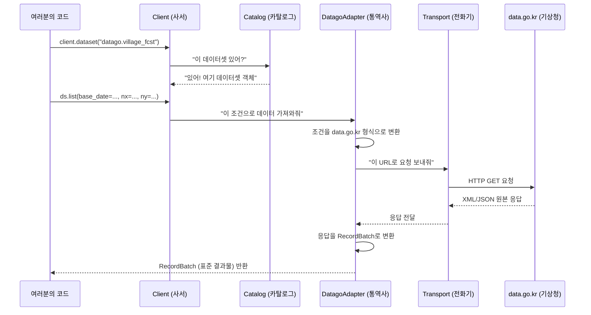

# KPubData 초보자 튜토리얼

> 🎯 이 튜토리얼은 파이썬 기초를 아는 대학교 2학년 학생이, KPubData를 사용해서 한국 공공데이터를 직접 가져오는 과정을 한 단계씩 따라하는 문서입니다.

## 이 튜토리얼에서 배우는 것

1. ✅ KPubData가 무엇이고 왜 필요한지 이해하기
2. ✅ 개발 환경을 세팅하고 KPubData를 설치하기
3. ✅ 공공데이터포털에서 API 키를 발급받기
4. ✅ 파이썬 코드로 실제 공공데이터를 가져오기
5. ✅ 내부에서 어떤 일이 일어나는지 이해하기

**예상 소요 시간:** 약 30~40분

---

## 사전 준비물

시작하기 전에 다음이 필요합니다:

| 준비물 | 설명 | 확인 방법 |
|---|---|---|
| Python 3.10 이상 | 파이썬 프로그래밍 언어 | 터미널에 `python --version` 입력 |
| pip | 파이썬 패키지 설치 도구 (보통 Python과 함께 설치됨) | `pip --version` 입력 |
| 인터넷 연결 | API 호출과 패키지 설치에 필요 | — |
| 공공데이터포털 계정 | API 키를 발급받기 위해 필요 (아래에서 안내) | — |

> 💡 **파이썬이 설치되어 있지 않다면**: [python.org](https://www.python.org/downloads/)에서 다운로드하세요.

---

## 1단계: KPubData가 뭔가요? (5분)

한국에는 기상청, 환경부, 교통부 등 여러 기관이 **공공데이터**를 제공합니다. 이 데이터는 무료로 사용할 수 있지만, 문제가 있습니다:

```
기상청 API:  GET /getVilageFcst?serviceKey=xxx&base_date=20250401&nx=55&ny=127
환경부 API:  GET /getCtprvnRltmMesureDnsty?serviceKey=xxx&sidoName=서울
서울시 API:  GET /1234567890/json/RealTimeStationArrival/1/5/서울
```

보이시나요? **기관마다 URL도 다르고, 변수 이름도 다르고, 응답 형식도 다릅니다.**

KPubData는 이 문제를 해결합니다. 어떤 기관이든 **동일한 방식**으로 데이터를 가져올 수 있게 해줍니다:

```python
# KPubData를 쓰면: 어떤 기관이든 같은 방식!
client = Client.from_env()
ds = client.dataset("datago.village_fcst")   # 기상청 날씨
result = ds.list(base_date="20250401", nx="55", ny="127")

ds = client.dataset("datago.air_quality")    # 환경부 미세먼지
result = ds.list(sidoName="서울")
```

> 🏛️ **비유**: 외국어 책이 가득한 도서관에서, 사서(Client)에게 "날씨 책 주세요"라고 한국어로 말하면, 사서가 알아서 통역사(Adapter)를 불러 외국어 책을 한국어로 번역해서 가져다 주는 것입니다.

---

## 2단계: 공공데이터포털 API 키 발급받기 (10분)

공공데이터를 가져오려면 **API 키**가 필요합니다. API 키는 "나는 이 데이터를 사용할 자격이 있는 사람입니다"라는 **출입증** 같은 것입니다.

### 2-1. 회원가입

1. [공공데이터포털(data.go.kr)](https://www.data.go.kr)에 접속합니다
2. 우측 상단의 **회원가입** 버튼을 클릭합니다
3. 일반 회원으로 가입합니다 (이메일 인증 필요)

### 2-2. API 활용 신청

1. 로그인 후, 상단 검색창에 **"기상청 단기예보"**를 검색합니다
2. 검색 결과에서 **"기상청_단기예보 ((구)_동네예보) 조회서비스"**를 클릭합니다
3. **"활용신청"** 버튼을 클릭합니다
4. 활용 목적을 간단히 적고 (예: "학습 및 연구") 신청합니다

### 2-3. API 키 확인

1. 상단 메뉴에서 **마이페이지** → **데이터 활용** → **Open API** 탭으로 이동합니다
2. 신청한 서비스 목록에서 **"일반 인증키 (Encoding)"** 값을 복사합니다

> ⏰ **참고**: 신청 후 API 키가 활성화되기까지 최대 1~2시간이 걸릴 수 있습니다.

---

## 3단계: KPubData 설치하기 (5분)

터미널(명령 프롬프트)을 열고, 아래 명령어를 입력합니다.

```bash
pip install kpubdata
```

> 💡 **`pip install`이 뭔가요?**
> `pip`은 파이썬의 패키지 설치 도구입니다. `pip install kpubdata`는 "kpubdata라는 패키지를 인터넷에서 다운받아 설치해줘"라는 뜻입니다. 스마트폰의 앱 스토어에서 앱을 설치하는 것과 비슷합니다.

설치가 잘 되었는지 확인합니다:

```bash
python -c "import kpubdata; print('설치 성공!')"
```

`설치 성공!`이 출력되면 OK입니다.

---

## 4단계: API 키를 환경 변수로 설정하기 (3분)

2단계에서 복사한 API 키를 **환경 변수**로 설정합니다.

> 💡 **환경 변수가 뭔가요?**
> 환경 변수는 운영체제에 저장하는 설정값입니다. 코드 안에 API 키를 직접 적으면 실수로 공개될 위험이 있어서, 별도의 안전한 저장소(환경 변수)에 보관합니다. 비밀번호를 포스트잇에 적어 모니터에 붙이는 대신 금고에 넣는 것과 같습니다.

**macOS / Linux:**

```bash
export KPUBDATA_DATAGO_API_KEY="여기에_복사한_API키를_붙여넣기"
```

**Windows (PowerShell):**

```powershell
$env:KPUBDATA_DATAGO_API_KEY = "여기에_복사한_API키를_붙여넣기"
```

> ⚠️ 따옴표(`"`) 안에 API 키를 넣어야 합니다. 앞뒤 공백이 들어가지 않게 주의하세요.

---

## 5단계: 첫 번째 데이터 가져오기! (10분)

파이썬 파일을 하나 만들어 봅시다. `my_first_query.py` 라는 이름으로 저장합니다.

```python
# my_first_query.py
# KPubData로 기상청 날씨 데이터를 가져오는 첫 번째 코드입니다.

# 1. kpubdata에서 Client 클래스를 가져옵니다
#    → 'from A import B'는 "A 패키지에서 B를 꺼내 쓰겠다"는 뜻입니다
from kpubdata import Client

# 2. 클라이언트를 생성합니다 (환경 변수에서 API 키를 자동으로 읽어옴)
#    → 도서관에 들어가서 사서에게 출입증을 보여주는 단계입니다
client = Client.from_env()

# 3. 사용 가능한 데이터셋 목록을 확인합니다
#    → 도서관 카탈로그에서 어떤 책이 있는지 둘러보는 단계입니다
print("=== 사용 가능한 데이터셋 ===")
for ds in client.datasets.list():
    print(f"  {ds.id} — {ds.name}")

# 4. '동네예보' 데이터셋을 선택합니다
#    → "기상청 단기예보 책을 주세요"라고 사서에게 요청하는 단계입니다
ds = client.dataset("datago.village_fcst")

# 5. 데이터를 조회합니다 (서울 종로구 기준)
#    → "2025년 4월 1일 새벽 5시 발표 예보를 보여주세요"라고 요청합니다
#    nx=55, ny=127은 서울 종로구의 격자 좌표입니다
result = ds.list(
    base_date="20250401",
    base_time="0500",
    nx="55",
    ny="127",
)

# 6. 결과를 출력합니다
print(f"\n=== 조회 결과: 총 {result.total_count}건 ===")
for item in result.items:
    print(item)
```

실행합니다:

```bash
python my_first_query.py
```

### 예상 출력

```
=== 사용 가능한 데이터셋 ===
  datago.village_fcst — 단기예보 조회서비스
  datago.ultra_srt_ncst — 초단기실황 조회서비스
  datago.air_quality — 대기오염정보 조회서비스
  datago.bus_arrival — 경기도 버스도착정보 조회서비스
  datago.hospital_info — 병원정보서비스

=== 조회 결과: 총 N건 ===
{'baseDate': '20250401', 'baseTime': '0500', 'category': 'TMP', 'fcstValue': '8', ...}
{'baseDate': '20250401', 'baseTime': '0500', 'category': 'REH', 'fcstValue': '70', ...}
...
```

> 🎉 **축하합니다!** 방금 파이썬으로 한국 공공데이터를 가져오는 데 성공했습니다!

---

## 6단계: 내부 동작 살펴보기 (10분)

방금 코드가 실행될 때, 내부에서는 이런 일이 일어났습니다:



**단계별 설명:**

1. **`Client.from_env()`** — 환경 변수에서 API 키를 읽어 사서(Client)를 생성합니다.
2. **`client.dataset("datago.village_fcst")`** — 사서가 카탈로그에서 "datago 기관의 village_fcst 데이터셋"을 찾아옵니다.
3. **`ds.list(...)`** — 사서가 datago 전문 통역사(DatagoAdapter)에게 데이터 조회를 맡깁니다.
4. **통역사 내부** — 우리가 보낸 `base_date`, `nx`, `ny` 같은 조건을 data.go.kr API가 이해하는 형식으로 바꿉니다.
5. **Transport** — 변환된 요청을 실제 인터넷을 통해 data.go.kr 서버에 보냅니다.
6. **응답 변환** — data.go.kr에서 돌아온 XML/JSON 응답을 KPubData 표준 형태(RecordBatch)로 정리합니다.
7. **결과 반환** — 깔끔하게 정리된 RecordBatch가 여러분의 코드로 돌아옵니다.

> 핵심: 여러분은 `ds.list()`만 호출했지만, 내부에서는 **URL 생성 → HTTP 요청 → 응답 파싱 → 데이터 정규화**가 자동으로 일어났습니다.

---

## 문제 해결 (Troubleshooting)

### ❌ "KPUBDATA_DATAGO_API_KEY not found" 에러

API 키가 환경 변수에 설정되지 않았습니다. 4단계의 `export` 명령을 다시 실행하세요.

```bash
# 환경 변수가 설정되어 있는지 확인
echo $KPUBDATA_DATAGO_API_KEY
```

아무것도 출력되지 않으면 설정이 안 된 것입니다.

### ❌ "SERVICE_KEY_IS_NOT_REGISTERED_ERROR" 에러

API 키가 아직 활성화되지 않았습니다. 신청 후 1~2시간 뒤에 다시 시도하세요.

### ❌ "Connection Error" / "Timeout" 에러

인터넷 연결을 확인하세요. 공공데이터포털 서버가 일시적으로 느릴 수도 있습니다. 잠시 후 다시 시도하세요.

### ❌ "Rate limit exceeded" 에러

짧은 시간에 너무 많은 요청을 보냈습니다. 1~2분 기다린 후 다시 시도하세요. 일일 호출 제한(보통 1,000회/일)도 있으니 주의하세요.

### ❌ "ModuleNotFoundError: No module named 'kpubdata'" 에러

KPubData가 설치되지 않았습니다. `pip install kpubdata`를 다시 실행하세요. 가상환경을 사용 중이라면, 올바른 가상환경이 활성화되어 있는지 확인하세요.

---

## 다음 단계

튜토리얼을 완료했습니다! 다음으로 할 수 있는 일들입니다:

### 📖 더 읽어보기
- [용어집(glossary.md)](../glossary.md) — 프로젝트에서 사용하는 용어를 쉽게 정리한 문서
- [ARCHITECTURE.md](../../ARCHITECTURE.md) — 시스템 전체 구조를 이해하고 싶다면
- [API_SPEC.md](../../API_SPEC.md) — 더 많은 API 사용법을 알고 싶다면

### 🛠️ 직접 기여해보기
- [CONTRIBUTING.md](../../CONTRIBUTING.md) — 개발 환경 설정 및 기여 방법
- [Good First Issues](https://github.com/yeongseon/kpubdata/issues?q=is%3Aissue+is%3Aopen+label%3A%22good+first+issue%22) — 초보자가 도전할 수 있는 이슈 목록

### 🧪 다른 데이터셋도 시도해보기

```python
# 대기오염(미세먼지) 데이터 가져오기
ds = client.dataset("datago.air_quality")
result = ds.list(sidoName="서울")
for item in result.items:
    print(item)

# 원본 API를 직접 호출해보기 (call_raw 비상구)
raw = ds.call_raw("getCtprvnRltmMesureDnsty", sidoName="서울", numOfRows="3")
print(raw)
```
